# LuoBI

## 项目介ç»

**BI（商业智能）：**æ•°æ®å¯è§†åŒ–，报表å¯è§†åŒ–系统

**主æµBI：**

- 帆软BI https://www.finebi.com
- å°é©¬BI https://bi.zhls.qq.com
- PowerBI https://powerbi.microsoft.com/zh-cn 

**传统BI：**

https://chartcube.alipay.com

1. 需è¦äººå·¥ä¸Šä¼ æ•°æ®
2. 需è¦äººå·¥é€‰æ‹©æ•°æ®çš„行和列进行分æ（数æ®åˆ†æ师）
3. 需è¦äººå·¥é€‰æ‹©å›¾è¡¨ç±»å‹ï¼ˆæ•°æ®åˆ†æ师）
4. 生æˆå›¾è¡¨ï¼ˆä¿å­˜é…置）

**智能BIå¹³å°ï¼š**

1. 用户（数æ®åˆ†æ者）åªéœ€è¦å¯¼å…¥åŸå§‹æ•°æ®ï¼Œè¾“入想è¦åˆ†æ的目标（比如â€å¸®æˆ‘分æ以下网站的用户å¢é•¿è¶‹åŠ¿â€œï¼‰ï¼Œå°±èƒ½åˆ©ç”¨AI自动生æˆä¸€ä¸ªç¬¦åˆè¦æ±‚的图表以åŠç»“论
2. ä¸ä¼šæ•°æ®åˆ†æ的用户，也能通过输入目标快速完æˆæ•°æ®åˆ†æ，大幅节约人力æˆæœ¬

## 需求分æ

1. 智能分æ：用户输入目标，åŸå§‹æ•°æ®å’Œå…¶ä»–å‚数（如图表类å‹ï¼‰ï¼Œå¯ä»¥è‡ªåŠ¨ç”Ÿæˆå›¾è¡¨å’Œç»“论
2. 图表管ç†
3. 图表生æˆçš„异步化（消æ¯é˜Ÿåˆ— ）
4. å¯¹æ¥ AI 

## æ¶æ„图


## 技术选择

**å‰ç«¯ï¼š**

- React
- Ant Design Pro
- Umi
- ECharts å¯è§†åŒ–å¼€å‘库
- umi openapi 代ç ç”Ÿæˆï¼ˆè‡ªåŠ¨ç”Ÿæˆå端调用代ç ï¼‰

**å端：**

- Spring Boot（万用 Java å端项目模æ¿ï¼‰
- MySQL
- MyBatis Plus
- RabbitMQ
- AI 能力（Open AI æ¥å£å¼€å‘/ 使用ç°æˆçš„ AI æ¥å£ï¼‰
- EasyExcel（Excel 的上传和数æ®çš„解æ）
- Swagger + Knife4j
- Hutool

## 计划

**åˆå§‹åŒ–**

- å‰ç«¯
- å端

**å端**

- æ•°æ®åº“表设计
- 自动生æˆå¢åˆ æ”¹æŸ¥ä»£ç 
- 图表管ç†
- 智能图表分æ
- 系统优化
  - 安全性
  - æ•°æ®å­˜å‚¨
  - é™æµ
  - 异步化

- 分布å¼æ¶ˆæ¯é˜Ÿåˆ—

**å‰ç«¯**

- 自动生æˆå端调用代ç 
- 修改requestErrorConfig

- 登录注册页é¢
- 智能图表分æ页é¢
- 个人图表页é¢

## åˆå§‹åŒ–

### å‰ç«¯

#### åˆå§‹åŒ–

https://pro.ant.design/

1. 创建项目

```sh
# 使用 npm，
npm i @ant-design/pro-cli -g
pro create luobi-frontend
```


2. 安装ä¾èµ–

```
yarn
```


3. å»é™¤å›½é™…化


[🛠[BUG\] 执行删除国际化命令报错 · Issue #10452 · ant-design/ant-design-pro (github.com)](https://github.com/ant-design/ant-design-pro/issues/10452)


```sh
yarn add eslint-config-prettier --dev yarn add eslint-plugin-unicorn --dev 
```


å†æ¬¡æ‰§è¡Œå»é™¤å›½é™…化就能æˆåŠŸäº†


#### 结æ„介ç»

- .husky：æ交代ç æ—¶ï¼Œæ£€æŸ¥æ˜¯å¦è§„范
- config
  - config.ts：核心é…置文件
  - defaultSettings.ts：主页页é¢çš„æ’版和颜色等设置
  - openapi.json：åªæ˜¯ç¤ºä¾‹æ•°æ®ï¼Œæ— ç”¨å¯åˆ é™¤
  - proxy.ts：代ç†
  - routes.ts：路由
- mock：模拟数æ®ï¼Œæ— ç”¨å¯åˆ é™¤
- public
  - icons：图标logo，无用å¯åˆ é™¤
  - scripts：ä¸çŸ¥é“
  - CNAME：ä¸ç”¨ç®¡
  - favicon.ico：网站左上角å°å›¾æ ‡ https://www.iconfont.cn
  - logo.svg：替æ¢æˆè‡ªå·±çš„logohttps://www.iconfont.cn
  - pro_icon.svg：无用删除
- src
  - .umi：带点的是éšè—文件，框æ¶è‡ªåŠ¨ç”Ÿæˆçš„，ä¸ç”¨ç®¡
  - components：需è¦å¼€å‘的组件
  - locales：国际化，无用å¯åˆ é™¤
  - pages：需è¦å¼€å‘的页é¢
    - User
      - Login
        - __snapshots__：多余å¯åˆ é™¤
        - login.test.tsx：多余å¯åˆ é™¤
    - TableList：暂时未用到，删除
  - services
    - ant-design-pro：有很多框æ¶è‡ªå®šä¹‰çš„函数和类å‹ï¼Œä¸ç”¨åˆ ï¼Œå¯èƒ½ä¼šå¼•èµ·è¿é”效应
    - luobi：我们自己使用openapi生æˆçš„函数和类å‹
    - swagger：无用å¯åˆ é™¤
  - access.ts：æ§åˆ¶é¡µé¢è®¿é—®
  - app.tsx：整个框æ¶çš„å…¥å£æ–‡ä»¶
  - global.less：全局样å¼
  - global.tsx：全局的js文件，ä¸è¦åˆ æ”¹
  - manifest.json：开å‘app或H5网页时指定的é…置：比如声æ˜é¡¹ç›®çš„å称，图标的尺寸，打包时用。å¯åˆ 
  - requestErrorConfig：å‰ç«¯å‘请求的一些é…置，比如请求å“应拦截器，请求å‰ç¼€
  - service-workers.js：为了优化离线H5页é¢çš„体验
  - typings.d.ts：ä¸çŸ¥é“，ä¸èƒ½åˆ 
- tests：测试文件，无用å¯åˆ é™¤
- types：无用å¯åˆ é™¤
- .editorconfigã€.eslintrc.jsã€.prettierrc.js：用æ¥ä¿è¯å‰ç«¯ä»£ç è§„范
- jest.config.ts：å•å…ƒæµ‹è¯•æ¡†æ¶ï¼Œä¸ç”¨UI测试å¯åˆ é™¤
- jsconfig.json：æ§åˆ¶ä»£ç è¯­æ³•
- README.md：项目的介ç»æ–‡æ¡£

#### 替æ¢logo

**favicon.ico：**网站左上角å°å›¾æ ‡ https://www.iconfont.cn


png 转favicon https://www.gaituba.com/favicon


**logo.svg：**替æ¢æˆè‡ªå·±çš„logohttps://www.iconfont.cn

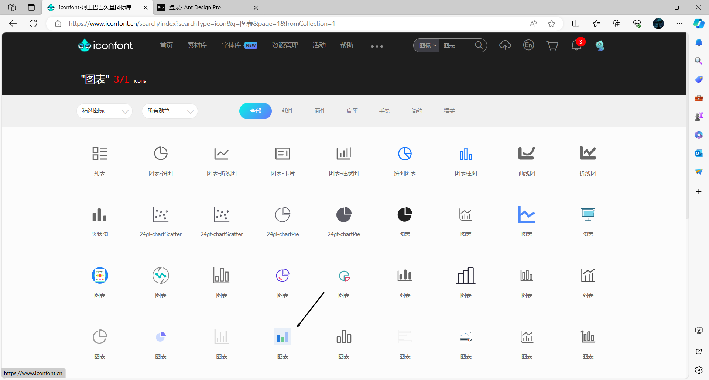


#### prettierç¾åŒ–é…ç½®


#### 替æ¢ç½‘站标题

å…¨å±€æ›¿æ¢ Ant Design Pro å’Œ Ant Design


#### 替æ¢åº•éƒ¨çš„版æƒä¿¡æ¯

ç›´æ¥æœç´¢åº•éƒ¨å…³é”®å­—，å»å¯¹åº”文件修改


### å端

1. 使用å端项目模æ¿

å¤åˆ¶æ¨¡æ¿ï¼Œä¿®æ”¹ç›®å½•å为项目å

2. è¿æ¥æ•°æ®åº“

   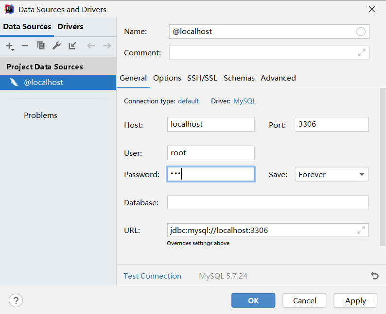

3. 修改数æ®åº“å


4. 修改项目å


5. å¼€å¯åˆ†å¸ƒå¼session


6. 修改端å£


7. å¯åŠ¨å¹¶è®¿é—®æ¥å£æ–‡æ¡£

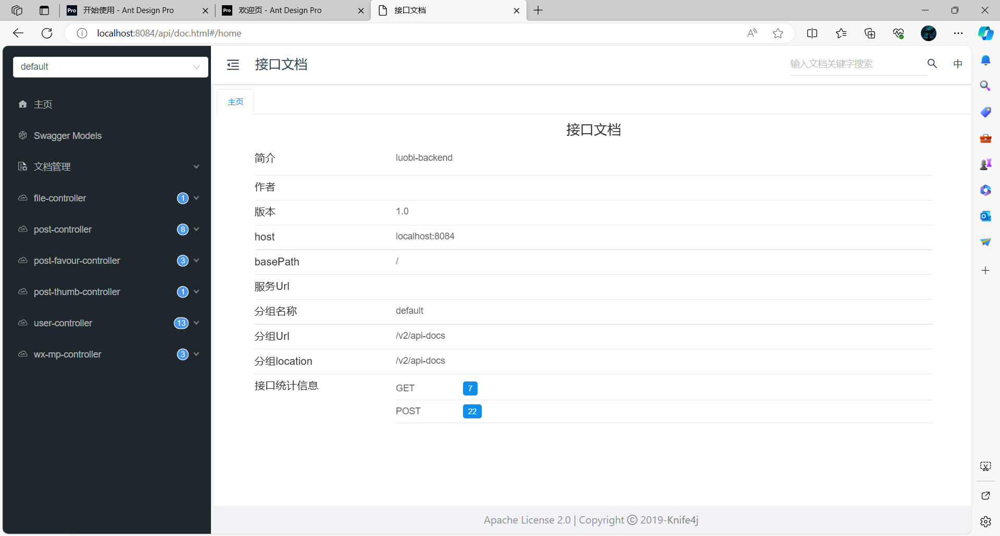

## å端

### æ•°æ®åº“表设计

**用户表：**

```sql
create table if not exists user
(
    id           bigint auto_increment comment 'id' primary key,
    userAccount  varchar(256)                           not null comment 'è´¦å·',
    userPassword varchar(512)                           not null comment '密ç ',
    userName     varchar(256)                           null comment '用户昵称',
    userAvatar   varchar(1024)                          null comment '用户头åƒ',
    userProfile  varchar(512)                           null comment '用户简介',
    userRole     varchar(256) default 'user'            not null comment '用户角色：user/admin/ban',
    gender       tinyint                                null comment '性别',
    createTime   datetime     default CURRENT_TIMESTAMP not null comment '创建时间',
    updateTime   datetime     default CURRENT_TIMESTAMP not null on update CURRENT_TIMESTAMP comment '更新时间',
    isDelete     tinyint      default 0                 not null comment '是å¦åˆ é™¤',
    index idx_userAccount (userAccount)
) comment '用户' collate = utf8mb4_unicode_ci;
```

**图表信æ¯è¡¨ï¼š**

```sql
create table if not exists chart
(
    id          bigint auto_increment comment 'id' primary key,
    goal        text                                   null comment '分æ目标',
    rawData     text                                   null comment 'åŸå§‹æ•°æ®',
    chartType   varchar(128)                           null comment '图表类å‹',
    chartName   varchar(128)                           null comment '图表å称',
    genChart    text                                   null comment 'AI生æˆçš„图表数æ®',
    genSummary  text                                   null comment 'AI生æˆçš„分æ总结',
    userId      bigint                                 null comment '创建人id',
    status      varchar(128) default 'wait'            not null comment 'wait,succeeded,failed,running',
    execMessage text                                   null comment '执行信æ¯',
    createTime  datetime     default CURRENT_TIMESTAMP not null comment '创建时间',
    updateTime  datetime     default CURRENT_TIMESTAMP not null on update CURRENT_TIMESTAMP comment '更新时间',
    isDelete    tinyint      default 0                 not null comment '是å¦åˆ é™¤'
) comment '图表信æ¯' collate = utf8mb4_unicode_ci;
```

### 自动生æˆå¢åˆ æ”¹æŸ¥ä»£ç 

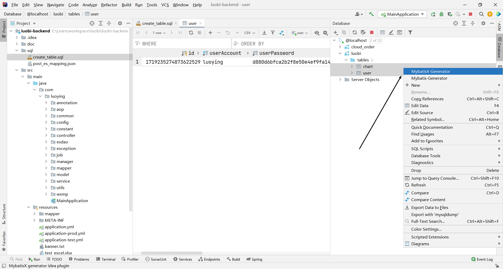

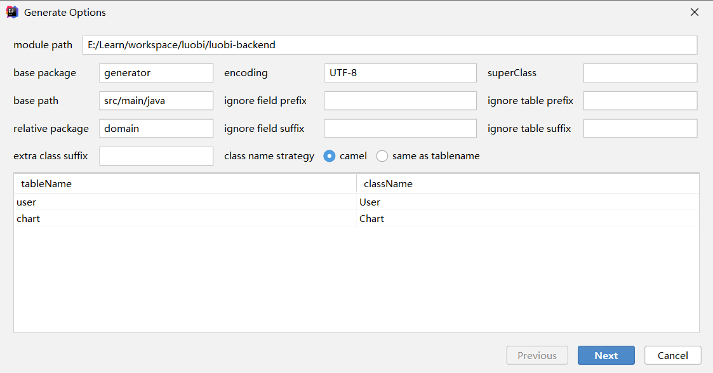


1. 生æˆçš„UserServiceå’ŒUserServiceImplä¸ç”¨æ›¿æ¢åŸæ¥çš„

2. 修改字段的注解

   

   

   

   

3. 删æ‰UserServiceå’ŒUserServiceImplå’ŒUserController中用ä¸åˆ°çš„方法

   

   

   

4. 删æ‰å¾®ä¿¡å…¬ä¼—å·å¼€å‘包

   

5. 删æ‰WxMPController

   

### 图表管ç†

1. å¤åˆ¶PostController修改æˆChartController

   

   

     

2. 创建关äºChartçš„DTOç±»

   

3. 剪è£ChartController并为ChartServiceæä¾›getQueryWrapper方法

   ```java
   /**
    * @author è½æ¨±çš„æ‚”æ¨
    * @description 针对表ã€chart(图表信æ¯è¡¨)】的数æ®åº“æ“作Serviceå®ç°
    * @createDate 2023-10-31 14:16:29
    */
   @Service
   public class ChartServiceImpl extends ServiceImpl<ChartMapper, Chart>
           implements ChartService {
   
       /**
        * è·å–查询包装类
        *
        * @param chartQueryRequest
        * @return
        */
       @Override
       public QueryWrapper<Chart> getQueryWrapper(ChartQueryRequest chartQueryRequest) {
           QueryWrapper<Chart> queryWrapper = new QueryWrapper<>();
           if (chartQueryRequest == null) {
               return queryWrapper;
           }
           Long id = chartQueryRequest.getId();
           Long userId = chartQueryRequest.getUserId();
           String goal = chartQueryRequest.getGoal();
           String chartType = chartQueryRequest.getChartType();
           String chartName = chartQueryRequest.getChartName();
           String sortField = chartQueryRequest.getSortField();
           String sortOrder = chartQueryRequest.getSortOrder();
           // 拼æ¥æŸ¥è¯¢æ¡ä»¶
           queryWrapper.eq(id != null && id > 0, "id", id);
           queryWrapper.eq(ObjectUtils.isNotEmpty(userId), "userId", userId);
           queryWrapper.like(StringUtils.isNotBlank(goal), "goal", goal);
           queryWrapper.like(StringUtils.isNotBlank(chartType), "chartType", chartType);
           queryWrapper.like(StringUtils.isNotBlank(chartName), "chartName", chartName);
           queryWrapper.eq("isDelete", false);
           queryWrapper.orderBy(SqlUtils.validSortField(sortField), sortOrder.equals(CommonConstant.SORT_ORDER_ASC),
                   sortField);
           return queryWrapper;
       }
   }
   ```


### 智能图表分æ

#### **AI调用的几ç§æ–¹å¼**

**1ã€ç›´æ¥è°ƒç”¨ OpenAI 或者其他 AI åŸå§‹å¤§æ¨¡å‹å®˜ç½‘çš„æ¥å£**

官方文档：https://platform.openai.com/docs/api-reference

优点：ä¸ç»å°è£…，最çµæ´»ï¼Œæœ€åŸå§‹

缺点：è¦é’±

使用方å¼ï¼š

1）在请求头中指定OPENAI_API_KEY

```
Authorization: Bearer OPENAI_API_KEY
```

2）找到è¦ä½¿ç”¨çš„æ¥å£ https://platform.openai.com/docs/api-reference/chat/create

3）按照æ¥å£æ–‡æ¡£çš„示例，æ„造 HTTP 请求

```
curl https://api.openai.com/v1/chat/completions \
  -H "Content-Type: application/json" \
  -H "Authorization: Bearer $OPENAI_API_KEY" \
  -d '{
    "model": "gpt-3.5-turbo",
    "messages": [
      {
        "role": "system",
        "content": "You are a helpful assistant."
      },
      {
        "role": "user",
        "content": "Hello!"
      }
    ]
  }'

```

```java
import cn.hutool.http.HttpRequest;
import cn.hutool.json.JSONUtil;

import java.util.*;

public class OpenAIAPI {
    public static void main(String[] args) {
        String url = "https://api.openai.com/v1/chat/completions";

        LinkedHashMap<String,Object> map =new LinkedHashMap<>();
        List<LinkedHashMap<String,Object>> messageList =new ArrayList<>();

        LinkedHashMap<String,Object> messageMap =new LinkedHashMap<>();
        messageMap.put("role","system");
        messageMap.put("content","You are a helpful assistant.");

        messageList.add(messageMap);

        map.put("model","gpt-3.5-turbo");
        map.put("message",messageList);

        String requestBody = JSONUtil.toJsonStr(map);
        HttpRequest.post(url)
                .header("Authorization","Bearer OPENAI_API_KEY")
                .header("Content-Type","application/json")
                .body(requestBody)
                .execute()
                .body();
    }
}
```

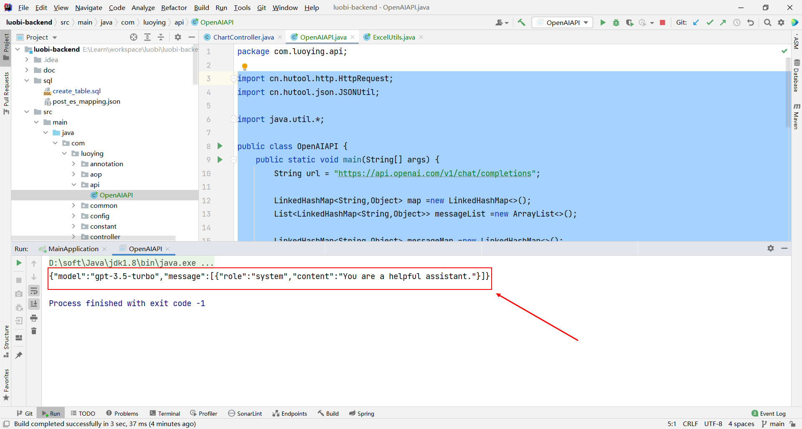

**2ã€ä½¿ç”¨äº‘æœåŠ¡å•†æ供的，å°è£…åçš„ AI æ¥å£**

比如：Azure云

优点：本地能用

缺点：è¦é’±

**3ã€åˆ©ç”¨é±¼èªæ˜ AI æ供的开放 SDK** https://github.com/liyupi/yucongming-java-sdk

优点：目å‰ä¸è¦é’±ï¼Œæœ‰å¾ˆå¤šç°æˆçš„模å‹

缺点：ä¸å¤Ÿçµæ´»

1）引入ä¾èµ–

```xml
<dependency>
    <groupId>com.yucongming</groupId>
    <artifactId>yucongming-java-sdk</artifactId>
    <version>0.0.3</version>
</dependency>
```

2）修改é…ç½®

```yml
yuapi:
  client:
    access-key: c34re67to6v7yu2qf4nzawr8ultmy0a2
    secret-key: i6cnztxw6scfmrtykndjd5apitqcrejv
```

3）调用æ¥å£

```java
@Component
public class AIManager {
    @Resource
    private YuCongMingClient yuCongMingClient;

    /**
     *
     * @param modelId
     * @param message
     * @return
     */
    public String doChat(long modelId,String message){
        DevChatRequest devChatRequest = new DevChatRequest();
        devChatRequest.setModelId(modelId);
        devChatRequest.setMessage(message);
        BaseResponse<DevChatResponse> response = yuCongMingClient.doChat(devChatRequest);
        if (response==null){
            throw new BusinessException(ErrorCode.SYSTEM_ERROR,"AIå“应错误");
        }
        return response.getData().getContent();
    }
}
```

#### 业务æµç¨‹

1. 校验å‚æ•°
2. å‹ç¼©åŸå§‹æ•°æ®ï¼šAIæ¥å£æ™®é都有输入字数é™åˆ¶ï¼Œå°½å¯èƒ½å‹ç¼©æ•°æ®ï¼Œèƒ½å¤Ÿå¤šä¼ ä¸€äº›æ•°æ®
3. æ„造用户请求（分æ目标，图表å称，图表类å‹ï¼Œcsvæ•°æ®ï¼‰
4. 调用鱼èªæ˜SDK，得到å“应（图表信æ¯ï¼Œç»“论文本）
5. ä»AIå“应结æœä¸­ï¼Œå–出需è¦çš„æ•°æ®ï¼ˆå›¾è¡¨ä¿¡æ¯ï¼šEcharts V5 çš„ options é…置对象js代ç ï¼›ç»“论文本）
6. ä¿å­˜åˆ°æ•°æ®åº“
7. è¿”å›å›¾è¡¨ä¿¡æ¯ï¼Œç»“论文本，图表IDç»™å‰ç«¯

**模å‹é¢„设**

```
你是一个数æ®åˆ†æ师和å‰ç«¯å¼€å‘专家，æ¥ä¸‹æ¥æˆ‘会按照以下固定格å¼ç»™ä½ æ供内容：
分æ需求：
{æ•°æ®åˆ†æ的需求或者目标}
åŸå§‹æ•°æ®ï¼š
{csvæ ¼å¼çš„åŸå§‹æ•°æ®ï¼Œç”¨,作为分隔符}
请根æ®è¿™ä¸¤éƒ¨åˆ†å†…容，按照以下指定格å¼ç”Ÿæˆå†…容（此外ä¸è¦è¾“出任何多余的开头ã€ç»“å°¾ã€æ³¨é‡Šï¼‰
ã€ã€ã€ã€ã€
{å‰ç«¯ Echarts V5 çš„ option é…置对象json代ç ï¼Œåˆç†åœ°å°†æ•°æ®è¿›è¡Œå¯è§†åŒ–，ä¸è¦ç”Ÿæˆä»»ä½•å¤šä½™çš„内容，比如注释}
ã€ã€ã€ã€ã€
{æ˜ç¡®çš„æ•°æ®åˆ†æ结论ã€è¶Šè¯¦ç»†è¶Šå¥½ï¼Œä¸è¦ç”Ÿæˆå¤šä½™çš„注释}
```


```java
@Data
public class GenChartRequest implements Serializable {

    /**
     * 分æ目标
     */
    private String goal;

    /**
     * 图表类å‹
     */
    private String chartType;

    /**
     * 图表å称
     */
    private String chartName;

    private static final long serialVersionUID = 1L;
}
```

```java
/**
 * BIçš„è¿”å›ç»“æœ
 */
@Data
public class BIResponse {
    private String genChart;

    private String genSummary;

    private Long chartId;
}
```

```java
@Slf4j
public class ExcelUtils {
    public static String excelToCsv(MultipartFile multipartFile) {
        /*File file = null;
        try {
            file = ResourceUtils.getFile("classpath:网站数æ®.xlsx");
        } catch (FileNotFoundException e) {
            e.printStackTrace();
        }*/
        // 1. ä»æ–‡ä»¶è¯»å–出数æ®
        List<Map<Integer, String>> list = null;
        try {
            list = EasyExcel.read(multipartFile.getInputStream())
                    .excelType(ExcelTypeEnum.XLSX)
                    .sheet()
                    .headRowNumber(0)
                    .doReadSync();
        } catch (IOException e) {
            log.error("表格处ç†é”™è¯¯",e);
        }
        if (CollectionUtil.isEmpty(list)) {
            return "";
        }
        // 2. 转æ¢ä¸ºcsv
        StringBuilder stringBuilder = new StringBuilder();
        // 2.1 读å–表头
        LinkedHashMap<Integer, String> headerMap = (LinkedHashMap) list.get(0);
        List<String> headerList =headerMap.values().stream().filter(ObjectUtils::isNotEmpty).collect(Collectors.toList());
        stringBuilder.append(StringUtils.join(headerList, ",")).append("\n");
        // 2.1 读å–æ•°æ®è¡Œ
        for (int i = 1; i < list.size(); i++) {
            LinkedHashMap<Integer, String> dataMap = (LinkedHashMap) list.get(i);
            List<String> dataList = dataMap.values().stream().filter(ObjectUtils::isNotEmpty).collect(Collectors.toList());
            stringBuilder.append(StringUtils.join(dataList, ",")).append("\n");
        }
        return stringBuilder.toString();
    }
}
```

```java
@Service
public class AIManager {
    @Resource
    private YuCongMingClient yuCongMingClient;

    /**
     *
     * @param modelId
     * @param message
     * @return
     */
    public String doChat(long modelId,String message){
        DevChatRequest devChatRequest = new DevChatRequest();
        devChatRequest.setModelId(modelId);
        devChatRequest.setMessage(message);
        BaseResponse<DevChatResponse> response = yuCongMingClient.doChat(devChatRequest);
        if (response==null){
            throw new BusinessException(ErrorCode.SYSTEM_ERROR,"AIå“应错误");
        }
        return response.getData().getContent();
    }
}
```

```java
/**
 * 智能分æ
 *
 * @param multipartFile
 * @param genChartRequest
 * @param request
 * @return
 */
@PostMapping("/gen")
public BaseResponse<BIResponse> genChartByAI(@RequestPart("file") MultipartFile multipartFile,
                                             GenChartRequest genChartRequest, HttpServletRequest request) {
    String goal = genChartRequest.getGoal();
    String chartType = genChartRequest.getChartType();
    String chartName = genChartRequest.getChartName();
    // 拼æ¥åˆ†æ目标
    if (StringUtils.isNotBlank(chartType)) {
        goal = goal + "，请使用" + chartType;
    }
    // 校验å‚æ•°
    ThrowUtils.throwIf(StringUtils.isBlank(goal), ErrorCode.PARAMS_ERROR, "分æ目标为空");
    ThrowUtils.throwIf(StringUtils.isNotBlank(chartName) && chartName.length() > 128, ErrorCode.PARAMS_ERROR, "图表å称过长");
    // è·å–登录用户
    User loginUser = userService.getLoginUser(request);
    // å‹ç¼©åŸå§‹æ•°æ®
    String data = ExcelUtils.excelToCsv(multipartFile);
    // æ„造用户请求（分æ目标，图表å称，图表类å‹ï¼Œcsvæ•°æ®ï¼‰
    StringBuilder userInput = new StringBuilder();
    userInput.append("分æ需求：").append("\n");
    userInput.append(goal).append("\n");
    userInput.append("åŸå§‹æ•°æ®ï¼š").append("\n");
    userInput.append(data).append("\n");
    // 调用鱼èªæ˜SDK，得到å“应
    long biModelId = 1719916921023344642L;
    String answer = aiManager.doChat(biModelId, userInput.toString());
    // ä»AIå“应结æœä¸­ï¼Œå–出需è¦çš„æ•°æ®
    String[] splits = answer.split("ã€ã€ã€ã€ã€");
    if (splits.length < 3) {
        throw new BusinessException(ErrorCode.SYSTEM_ERROR, "AI生æˆé”™è¯¯");
    }
    String genChart = splits[1].trim();
    String genSummary = splits[2].trim();
    // æ’入数æ®åº“
    Chart chart = new Chart();
    chart.setGoal(goal);
    chart.setRawData(data);
    chart.setChartType(chartType);
    chart.setChartName(chartName);
    chart.setGenChart(genChart);
    chart.setGenSummary(genSummary);
    chart.setUserId(loginUser.getId());
    boolean save = chartService.save(chart);
    ThrowUtils.throwIf(!save, ErrorCode.SYSTEM_ERROR, "图表ä¿å­˜å¤±è´¥");
    // è¿”å›ç»™å‰ç«¯
    BIResponse biResponse = new BIResponse();
    biResponse.setGenChart(genChart);
    biResponse.setGenSummary(genSummary);
    biResponse.setChartId(chart.getId());
    return ResultUtils.success(biResponse);
}
```


### 系统优化

#### 安全性

**问题：**如æœç”¨æˆ·ä¸Šä¼ ä¸€ä¸ªè¶…大的文件æ€ä¹ˆåŠï¼Ÿæ¯”如1000G

**解决：**åªè¦æ¶‰åŠåˆ°ç”¨æˆ·è‡ªä¸»ä¸Šä¼ çš„æ“作，一定è¦æ ¡éªŒæ–‡ä»¶

- 文件的大å°
- 文件的åç¼€
- 文件的内容（æˆæœ¬é«˜ä¸€äº›ï¼‰
- 文件的åˆæ³•æ€§ï¼ˆä¸èƒ½æœ‰æ•æ„Ÿçš„内容，建议用第三方的审核功能，ä¸è¦è‡ªå·±å†™ï¼‰

```java
// 校验文件
long size = multipartFile.getSize();
String originalFilename = multipartFile.getOriginalFilename();
// 校验文件大å°
final long ONE_MB = 1024 * 1024L;
ThrowUtils.throwIf(size > ONE_MB, ErrorCode.PARAMS_ERROR, "文件大å°è¶…过 1M");
// 校验文件åç¼€
String suffix = FileUtil.getSuffix(originalFilename);
final List<String> validFileSuffix = Arrays.asList("xlsx");
ThrowUtils.throwIf(!validFileSuffix.contains(suffix), ErrorCode.PARAMS_ERROR, "文件åç¼€ä¸ç¬¦åˆè¦æ±‚");
```

**扩展点：**

æ¥å…¥è…¾è®¯äº‘的图片万象数æ®å®¡æ ¸ï¼ˆCOS对象存储的审核功能）


#### æ•°æ®å­˜å‚¨

**ç°çŠ¶ï¼š**我们把æ¯ä¸ªå›¾è¡¨çš„åŸå§‹æ•°æ®å­˜æ”¾åœ¨äº†åŒä¸€ä¸ªæ•°æ®è¡¨ï¼ˆchart表）的字段里

**问题：**

1. 如æœç”¨æˆ·æ—¥ç›Šå¢å¤šï¼Œé‚£ä¹ˆå›¾è¡¨æ•°ä¹Ÿä¼šå¢å¤šï¼Œå†å¦‚æœç”¨æˆ·ä¸Šä¼ çš„图表åŸå§‹æ•°æ®é‡å¾ˆå¤§ï¼Œå°±ä¼šé€ æˆå•è¡¨ä½“积很大，查询也会å˜æ…¢
2. å¯¹äº BI å¹³å°ï¼Œç”¨æˆ·æ˜¯æœ‰æŸ¥çœ‹åŸå§‹æ•°æ®ï¼Œå¯¹åŸå§‹æ•°æ®è¿›è¡Œç®€å•æŸ¥è¯¢çš„需求的。ç°åœ¨å¦‚æœæŠŠæ‰€æœ‰æ•°æ®å­˜æ”¾åœ¨ä¸€ä¸ªå­—段中，查询时，åªèƒ½å–这个字段的所有数æ®

**解决：**

1. 把æ¯ä¸ªå›¾è¡¨å¯¹åº”çš„åŸå§‹æ•°æ®å•ç‹¬ä¿å­˜ä¸ºä¸€ä¸ªæ–°çš„æ•°æ®è¡¨ï¼Œè€Œä¸æ˜¯éƒ½å­˜åœ¨ä¸€ä¸ªå­—段里


**好处：**

1. 存储时，分开存储，互ä¸å½±å“（也能å¢åŠ å®‰å…¨æ€§ï¼Œé˜²æ­¢æ¶æ„用户上传大文件，影å“其他用户体验）
2. 查询时，å¯ä»¥ä½¿ç”¨sql语å¥çµæ´»å–出需è¦çš„字段，查询性能更快

**å®ç°ï¼š**

分开存储：

1. 存储图表信æ¯æ—¶ï¼Œä¸æŠŠå›¾è¡¨æ•°æ®å­˜å‚¨åœ¨ä¸€ä¸ªå­—段，而是新建一个 chart_{图表id} çš„æ•°æ®è¡¨

通过图表id，数æ®åˆ—å，数æ®ç±»å‹ç­‰å­—段，生æˆä»¥ä¸‹sql语å¥ï¼Œå¹¶ä¸”执行å³å¯

```sql
create table chart_1720380873253691394
(
    日期  varchar(128) null,
    用户数 int          null
);
```

分开查询：

1. 以å‰ç›´æ¥æŸ¥è¯¢å›¾è¡¨ï¼Œå–chartData字段；ç°åœ¨æ”¹ä¸ºè¯»å–chart_{图表id}çš„æ•°æ®è¡¨

```sql
select * from chart_1720380873253691394
```

**具体å®ç°ï¼šMybatis的动æ€SQL**

1ã€æƒ³æ¸…楚哪些是需è¦åŠ¨æ€æ›¿æ¢çš„，比如查询的数æ®è¡¨åchart_1720380873253691394 

2ã€åœ¨mapper.xml中定义sql语å¥

该方å¼æœ€çµæ´»ï¼Œä½†éœ€è¦å°å¿ƒsql注入

```sql
<select id="queryChartData" parameterType="string" resultType="map">
    ${querySql}
</select>
```

3ã€åœ¨mapper类中添加方法

```java
public interface ChartMapper extends BaseMapper<Chart> {
    List<Map<String, Object>> queryChartData(@Param("querySql") String querySql);
}
```

4ã€æµ‹è¯•è°ƒç”¨

```java
@SpringBootTest
class ChartMapperTest {
    @Resource
    private ChartMapper chartMapper;

    @Test
    void queryChartData() {
        long chartId = 1720380873253691394L;
        String querySql = String.format("select * from chart_%s", chartId);
        List<Map<String, Object>> resultData = chartMapper.queryChartData(querySql);
        System.out.println(resultData);

    }
}
```

5ã€ç»“æœ


**分库分表：**

1. 水平分表 （根æ®ä¸€å®šçš„规则，把一张表的数æ®åˆ’分到ä¸åŒçš„物ç†å­˜å‚¨ä½ç½®ä¸Šï¼‰
2. å‚直分库 （根æ®ä¸šåŠ¡ï¼Œæ¯”如订å•æ•°æ®åº“，商å“æ•°æ®åº“）

#### é™æµ

**问题：**使用系统是需è¦æ¶ˆè€—æˆæœ¬çš„，用户有å¯èƒ½ç–¯ç‹‚刷é‡ï¼Œè®©ä½ ç ´äº§

**解决：**

1ã€é™åˆ¶ç”¨æˆ·è°ƒç”¨æ€»æ¬¡æ•°ï¼Œæ§åˆ¶æˆæœ¬

2ã€ç”¨æˆ·åœ¨çŸ­æ—¶é—´å†…疯狂使用，导致æœåŠ¡å™¨èµ„æºè¢«å æ»¡ï¼Œå…¶ä»–用户无法使用 => é™æµï¼Œé™åˆ¶å•ä½æ—¶é—´å†…请求数

**æ€è€ƒé™æµé˜ˆå€¼ï¼š**

1. å‚考正常用户的使用频ç‡ï¼Œæ¯”如å•ä¸ªç”¨æˆ·æ¯ç§’åªèƒ½è°ƒç”¨ä¸€æ¬¡

**é™æµçš„几ç§ç®—法：**[é¢è¯•å¿…备：4ç§ç»å…¸é™æµç®—法讲解 - æ˜é‡‘ (juejin.cn)](https://juejin.cn/post/6967742960540581918)

**1ã€å›ºå®šçª—å£é™æµ**

å•ä½æ—¶é—´å†…å…许部分æ“作：比如1å°æ—¶åªå…许10个用户æ“作

优点：简å•

缺点：å¯èƒ½å‡ºç°æµé‡çªåˆºï¼Œæ¯”如å‰59分钟没有一个æ“作，第59分钟æ¥äº†10个æ“作，第1å°æ—¶01分钟æ¥äº†10个æ“作。相当äº2分钟执行了20个æ“作，æœåŠ¡å™¨å¯èƒ½æ‰¿å—ä¸ä½å°±å´©äº†

**2ã€æ»‘动窗å£é™æµ**

å•ä½æ—¶é—´å†…å…许部分æ“作，但是这个å•ä½æ—¶é—´æ˜¯æ»‘动的，需è¦æŒ‡å®šä¸€ä¸ªæ»‘动å•ä½ï¼Œå³å¤šå°‘å•ä½æ—¶é—´æ»‘动一次

比如滑动å•ä½ï¼š1min

0h      1h         2h

过了1min

1min  - 1h1min

优点：能够解决上述æµé‡çªåˆºé—®é¢˜ï¼Œå› ä¸ºç¬¬59分钟时，é™æµçª—å£æ˜¯59分 -  1å°æ—¶59分，这个窗å£å†…åªèƒ½æ¥å—10次请求，åªè¦è¿˜åœ¨è¿™ä¸ªçª—å£å†…，更多的æ“作就会被拒ç»

缺点：å®ç°ç›¸å¯¹å¤æ‚，é™æµæ•ˆæœå’Œæ»‘动å•ä½æœ‰å…³ï¼Œæ»‘动å•ä½è¶Šå°ï¼Œé™æµæ•ˆæœè¶Šå¥½ï¼Œä½†å¾€å¾€å¾ˆéš¾é€‰å–到一个åˆé€‚的滑动å•ä½

**3ã€æ¼æ¡¶é™æµ**（æ¨è）

以固定的速ç‡å¤„ç†è¯·æ±‚，当请求通满了，拒ç»è¯·æ±‚

å‡è®¾æ¡¶çš„容é‡æ˜¯10，æ¯ç§’能处ç†10个请求，æ¯0.1秒固定处ç†ä¸€æ¬¡è¯·æ±‚，如æœ1秒内æ¥äº†10个请求，å¯ä»¥å¤„ç†å®Œã€‚但1秒内æ¥äº†11个请求，最å哪个请求会溢出桶，被拒ç»

优点：能够一定程度上应对æµé‡çªåˆºï¼Œå›ºå®šé€Ÿç‡å¤„ç†è¯·æ±‚，ä¿è¯æœåŠ¡å™¨çš„安全

缺点：没有åŠæ³•è¿…速处ç†	一批请求，åªèƒ½ä¸€ä¸ªä¸€ä¸ªæŒ‰é¡ºåºæ¥å¤„ç†

**4ã€ä»¤ç‰Œæ¡¶é™æµ**（æ¨è）

管ç†å‘˜ç”Ÿæˆä¸€æ‰¹ä»¤ç‰Œï¼Œæ¯ç§’生æˆ10个令牌；用户æ“作å‰ï¼Œå…ˆå»æ‹¿åˆ°ä¸€ä¸ªä»¤ç‰Œï¼Œæœ‰ä»¤ç‰Œçš„人就有资格执行æ“作，能åŒæ—¶æ‰§è¡Œæ“作。拿ä¸åˆ°ä»¤ç‰Œå°±ç­‰ç€

优点：能够并å‘处ç†åŒæ—¶çš„请求

需è¦è€ƒè™‘的问题：还是存在时间å•ä½é€‰å–问题

**é™æµç²’度：**

1. 针对æŸä¸ªæ–¹æ³•é™æµï¼Œå³å•ä½æ—¶é—´å†…最多å…许åŒæ—¶ xx 个æ“作使用该方法
2. 针对æŸä¸ªç”¨æˆ·é™æµï¼Œå³å•ä½æ—¶é—´å†…最多执行 xx 个æ“作
3. 针对æŸä¸ªç”¨æˆ·æŸä¸ªæ–¹æ³•é™æµï¼Œ

**é™æµå®ç°ï¼š**

**1ã€æœ¬åœ°é™æµï¼ˆå•æœºé™æµï¼‰**

一般适用äºåªæœ‰ä¸€ä¸ªæœåŠ¡å™¨çš„项目（å•ä½“项目），如æœæœ‰å¤šå°æœåŠ¡å™¨ï¼Œä¼šå­˜åœ¨æœåŠ¡å™¨ä¹‹é—´ç»Ÿè®¡æ•°æ®ä¸ä¸€è‡´çš„问题，比如调用次数ä¸ä¸€è‡´

第三方库：Guava RateLimiter


**2ã€åˆ†å¸ƒå¼é™æµï¼ˆå¤šæœºé™æµï¼Œå¾®æœåŠ¡é¡¹ç›®ï¼‰**

1ã€æŠŠç”¨æˆ·ä½¿ç”¨é¢‘ç‡ç­‰æ•°æ®æ”¾åˆ°ä¸€ä¸ªé›†ä¸­å­˜å‚¨å»ç»Ÿè®¡ï¼Œæ¯”如使用Redis，这样无论用户请求è½åˆ°å“ªå°æœåŠ¡å™¨ï¼Œéƒ½å·²é›†ä¸­å­˜å‚¨ä¸­çš„æ•°æ®ä¸ºå‡†(Redisson)

2ã€åœ¨ç½‘关集中进行é™æµå’Œç»Ÿè®¡ï¼ˆSentinel，Spring Cloud Gateway)

**Redissoné™æµå®ç°**     https://github.com/redisson/redisson#quick-start

Redisson内置了一个é™æµå·¥å…·ç±»ï¼Œå¯ä»¥å¸®åŠ©ä½ åˆ©ç”¨Redisæ¥å­˜å‚¨ï¼Œç»Ÿè®¡

1. 引入ä¾èµ–

```xml
<dependency>
   <groupId>org.redisson</groupId>
   <artifactId>redisson</artifactId>
   <version>3.24.3</version>
</dependency>  
```

2. 创建客户端

```java
@Configuration
@ConfigurationProperties(prefix = "spring.redis")
@Data
public class RedissonConfig {
    private Integer dataBase;
    private String host;
    private Integer port;
    private String password;

    @Bean
    public RedissonClient redissonClient() {
        Config config = new Config();
        config.useSingleServer()
                .setDatabase(dataBase)
                .setAddress("redis://"+host+":"+port)
                .setPassword(password);
        RedissonClient redisson = Redisson.create(config);
        return redisson;
    }
}
```

3. RedisLimiterManager

   什么是Manager?专门æä¾›RedisLimiter é™æµåŸºç¡€æœåŠ¡çš„（æ供了通用的能力）

```java
@Service
public class RedisLimiterManager {
    @Resource
    private RedissonClient redissonClient;

    /**
     * é™æµæ“作
     * @param key 区分ä¸åŒçš„é™æµå™¨ï¼Œæ¯”如ä¸åŒçš„用户Id，应该分别统计
     */
    public void doRateLimit(String key){
        RRateLimiter rateLimiter = redissonClient.getRateLimiter(key);
        rateLimiter.trySetRate(RateType.OVERALL,2, 1,RateIntervalUnit.SECONDS);
        //æ¯å½“一个æ“作æ¥äº†å，请求一个令牌
        boolean canOp = rateLimiter.tryAcquire(1);
        if(!canOp) {
            throw new BusinessException(ErrorCode.TOO_MANY_REQUEST);
        }
    }
}
```

看ä¸åˆ°æ–¹æ³•å‚æ•°æ€ä¹ˆåŠï¼Ÿ


1ã€çœ‹æ–‡æ¡£

2ã€ä¸‹è½½æºç ï¼šç‚¹è¿›ä»»æ„一个包的代ç ï¼Œç‚¹å‡»download source下载


4. 测试调用

```java
@SpringBootTest
class RedisLimiterManagerTest {
    @Resource
    private RedisLimiterManager redisLimiterManager;

    @Test
    void doRateLimit() {
        String userId = "1";
        //一秒请求5次	
        for (int i = 0; i < 5; i++) {
            redisLimiterManager.doRateLimit(userId);
            System.out.println("æˆåŠŸ");
        }
    }
}
```


```java
@SpringBootTest
class RedisLimiterManagerTest {
    @Resource
    private RedisLimiterManager redisLimiterManager;

    @Test
    void doRateLimit() throws InterruptedException {
        String userId = "1";
        for (int i = 0; i < 2; i++) {
            redisLimiterManager.doRateLimit(userId);
            System.out.println("æˆåŠŸ");
        }
        Thread.sleep(1000);
        for (int i = 0; i < 5; i++) {
            redisLimiterManager.doRateLimit(userId);
            System.out.println("æˆåŠŸ");
        }
    }
}
```


5. 应用

```java
// é™æµ,æ¯ä¸ªç”¨æˆ·ä¸€ä¸ªé™æµå™¨
redisLimiterManager.doRateLimit("genChartByAI_"+loginUser.getId().toString());
```

#### 异步化

**应用场景：**调用的æœåŠ¡å¤„ç†èƒ½åŠ›æœ‰é™ï¼Œæˆ–者处ç†æ—¶é—´æ¯”较长，就应该考虑异步化。

**问题分æ：**

1. 用户等待AI生æˆçš„时间有点长
2. æœåŠ¡å™¨å¯èƒ½ä¼šæœ‰å¾ˆå¤šè¯·æ±‚需è¦å¤„ç†ï¼Œå¯¼è‡´ç³»ç»Ÿèµ„æºç´§å¼ ï¼Œä¸¥é‡æ—¶å¯¼è‡´æœåŠ¡å™¨å®•æœºæˆ–者无法处ç†æ–°çš„请求
3. 第三方æœåŠ¡ï¼ˆAI能力）的处ç†èƒ½åŠ›æ˜¯æœ‰é™çš„，比如æ¯3秒处ç†1个请求，过多的请求会导致AI处ç†ä¸è¿‡æ¥ï¼Œä¸¥é‡æ—¶ AI å¯èƒ½ä¼šæ‹’ç»ä¸ºåå°ç³»ç»Ÿæä¾›æœåŠ¡

**异步：**ä¸ç”¨ç­‰ä¸€ä»¶äº‹åšå®Œï¼Œå°±å¯ä»¥åšå¦ä¸€ä»¶äº‹ã€‚等第一件事åšå®Œï¼Œå¯ä»¥æ”¶åˆ°ä¸€ä¸ªé€šçŸ¥ï¼Œå‘Šè¯‰ä½ è¿™ä»¶äº‹åšå®Œäº†ï¼Œä½ å¯ä»¥å†è¿›è¡Œå续处ç†ã€‚

**业务æµç¨‹åˆ†æ：**

1ã€æ ‡å‡†å¼‚步化的业务æµç¨‹

1. 当用户è¦è¿›è¡Œè€—时很长的æ“作时，点击æ交å，ä¸éœ€è¦åœ¨ç•Œé¢å¹²ç­‰ï¼Œè€Œæ˜¯åº”该把这个任务ä¿å­˜åˆ°æ•°æ®åº“，然å添加到任务队列中

2. 添加任务到任务队列时，会有以下情况

   a.有空闲线程，立刻进行该任务

   b.没有空闲线程且任务队列没有满，加入任务队列

   c.没有空闲线程且任务队列已ç»æ»¡

   ​	i . æ‹’ç»ä»»åŠ¡

   ​	ii . 在有空闲线程或者空闲队列ä½ç½®æ—¶ï¼Œä»æ•°æ®åº“中把任务æ出，å†å»æ‰§è¡Œ

3. 程åºï¼ˆçº¿ç¨‹ï¼‰ä»ä»»åŠ¡é˜Ÿåˆ—å–出任务ä¾æ¬¡æ‰§è¡Œï¼Œæ¯å®Œæˆä¸€ä»¶äº‹æƒ…è¦ä¿®æ”¹ä¸€ä¸‹ä»»åŠ¡çš„状æ€ã€‚

4. 用户å¯ä»¥æŸ¥è¯¢ä»»åŠ¡çš„执行状æ€ï¼Œæˆ–者在任务执行æˆåŠŸæˆ–失败时能够得到通知（å‘邮件，系统消æ¯æ示，短信），ä»è€Œä¼˜åŒ–体验

5. 如æœè¦æ‰§è¡Œçš„任务é常å¤æ‚，包å«å¾ˆå¤šç¯èŠ‚，在æ¯ä¸€ä¸ªç¯èŠ‚完æˆæ—¶ï¼Œè¦åœ¨ç¨‹åºï¼ˆæ•°æ®åº“）记录一下该ç¯èŠ‚的执行状æ€ã€‚ä»è€Œç»™ç”¨æˆ·å±•ç¤ºä»»åŠ¡è¿›åº¦

2ã€æœ¬é¡¹ç›®å¼‚步化的业务æµç¨‹

1. 用户点击智能分æ页的æ交按钮，先把图表立刻ä¿å­˜åˆ°æ•°æ®åº“中
2. 用户å¯ä»¥åœ¨ä¸ªäººå›¾è¡¨é¡µé¢æŸ¥çœ‹æ‰€æœ‰å›¾è¡¨ï¼ˆå·²ç”Ÿæˆï¼Œç”Ÿæˆä¸­ï¼Œç”Ÿæˆå¤±è´¥ï¼‰çš„ä¿¡æ¯å’ŒçŠ¶æ€
3. 用户å¯ä»¥ä¿®æ”¹ç”Ÿæˆå¤±è´¥çš„图表信æ¯ï¼Œç„¶å点击é‡æ–°ç”Ÿæˆ

**问题：**

1. 任务队列的最大容é‡åº”该设置为多少？
2. 程åºæ€ä¹ˆä»ä»»åŠ¡é˜Ÿåˆ—中å–出任务å»æ‰§è¡Œï¼Ÿ
3. 任务队列的æµç¨‹æ€ä¹ˆå®ç°
4. æ€ä¹ˆä¿è¯ç¨‹åºæœ€å¤šåŒæ—¶æ‰§è¡Œx个任务

##### **线程池**

`为什么需è¦çº¿ç¨‹æ± ï¼Ÿ`

1. 线程的管ç†æ¯”较å¤æ‚（比如什么时候新å¢çº¿ç¨‹ï¼Œä»€ä¹ˆæ—¶å€™å‡å°‘空闲线程）
2. 任务存å–比较å¤æ‚（什么时侯比较å¤æ‚，什么时候拒ç»ä»»åŠ¡ï¼Œæ€ä¹ˆä¿è¯å„个线程ä¸æŠ¢åˆ°ç”¨ä¸€ä¸ªä»»åŠ¡ï¼‰

`线程池作用：`帮助你轻æ¾ç®¡ç†çº¿ç¨‹ï¼Œå调任务的执行过程

`线程池å®ç°ï¼š`

1. 在Spring中，å¯ä»¥ç”¨ ThreadPoolTaskExecutor ，é…åˆ @Async 注解æ¥å®ç°ï¼ˆä¸å¤ªå»ºè®®ï¼‰
2. 在Java中，å¯ä»¥ä½¿ç”¨ JUC 并å‘编程包中的 ThreadPoolExecutor æ¥å®ç°é常çµæ´»åœ°è‡ªå®šä¹‰çº¿ç¨‹æ± 

`线程池å‚数：`

```java
public ThreadPoolExecutor(int corePoolSize,
                          int maximumPoolSize,
                          long keepAliveTime,
                          TimeUnit unit,
                          BlockingQueue<Runnable> workQueue,
                          ThreadFactory threadFactory,
                          RejectedExecutionHandler handler) 
```

corePoolSize（核心线程数 ）：正常情况下，我们的系统应该能åŒæ—¶å·¥ä½œçš„线程数（éšæ—¶å°±ç»ªçš„状æ€ï¼‰
maximumPoolSize（最大线程数 ）：æé™æƒ…况下，我们的线程池最多有多少个线程？
keepAliveTime（空闲线程存活时间）：é核心线程在没有任务的情况下，过多久è¦åˆ é™¤ï¼ˆç†è§£ä¸ºå¼€é™¤ä¸´æ—¶å·¥ï¼‰ï¼Œä»è€Œé‡Šæ”¾æ— ç”¨çš„线程资æºã€‚
TimeUnit unit（空闲线程存活时间的å•ä½ï¼‰ï¼šåˆ†é’Ÿã€ç§’
workQueue（工作队列）：用äºå­˜æ”¾ç»™çº¿ç¨‹æ‰§è¡Œçš„任务，存在一个队列的长度（一定è¦è®¾ç½®ï¼Œä¸è¦è¯´é˜Ÿåˆ—长度无é™ï¼Œå› ä¸ºä¹Ÿä¼šå ç”¨èµ„æºï¼‰
threadFactory（线程工å‚）：æ§åˆ¶æ¯ä¸ªçº¿ç¨‹çš„生æˆã€çº¿ç¨‹çš„å±æ€§ï¼ˆæ¯”如线程å）
RejectedExecutionHandler（拒ç»ç­–略）：任务队列满的时候，我们采å–什么æªæ–½ï¼Œæ¯”如抛异常ã€ä¸æŠ›å¼‚常ã€è‡ªå®šä¹‰ç­–ç•¥

资æºéš”离策略：比如é‡è¦çš„任务（VIP 任务）一个队列，普通任务一个队列，ä¿è¯è¿™ä¸¤ä¸ªé˜Ÿåˆ—互ä¸å¹²æ‰°ã€‚

`线程池工作机制`

1. 刚开始没有任何的线程，也没有任何的任务

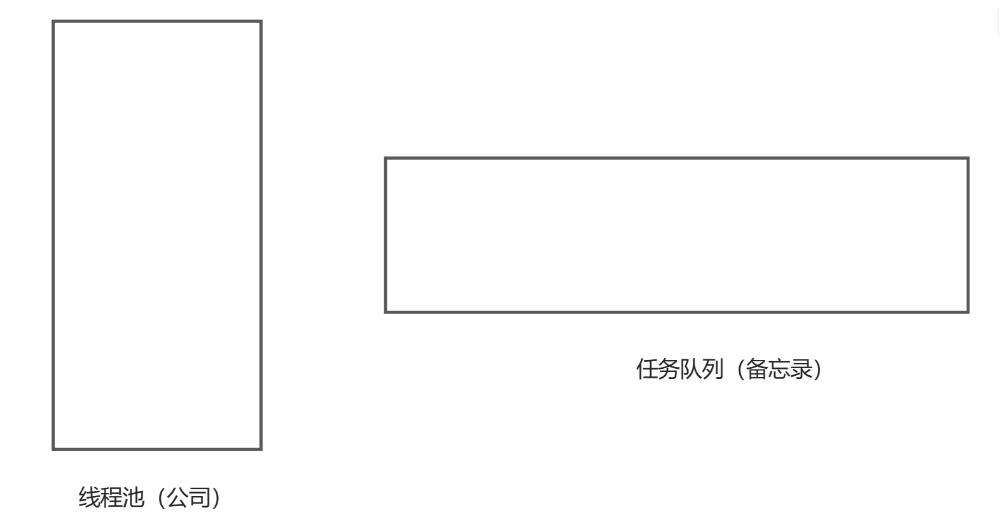

2. æ¥äº†ä¸€ä¸ªä»»åŠ¡ï¼Œå‘ç°æˆ‘们的员工还没有达到正å¼å‘˜å·¥æ•°ï¼ˆcorePoolSize = 2），æ¥ä¸€ä¸ªå‘˜å·¥ç›´æ¥å¤„ç†è¿™ä¸ªä»»åŠ¡


3. åˆæ¥äº†ä¸€ä¸ªä»»åŠ¡ï¼Œå‘ç°æˆ‘们的员工还没有达到正å¼å‘˜å·¥æ•°ï¼ˆcorePoolSize = 2），å†æ¥ä¸€ä¸ªå‘˜å·¥ç›´æ¥å¤„ç†è¿™ä¸ªä»»åŠ¡


4. åˆæ¥äº†ä¸€ä¸ªä»»åŠ¡ï¼Œä½†æ˜¯æˆ‘们正å¼å‘˜å·¥æ•°å·²ç»æ»¡äº†ï¼ˆå½“å‰çº¿ç¨‹æ•° = corePoolSize = 2），任务放到队列（最大长度 workQueue.size = 2）里等待，而ä¸æ˜¯å†åŠ æ–°å‘˜å·¥ã€‚

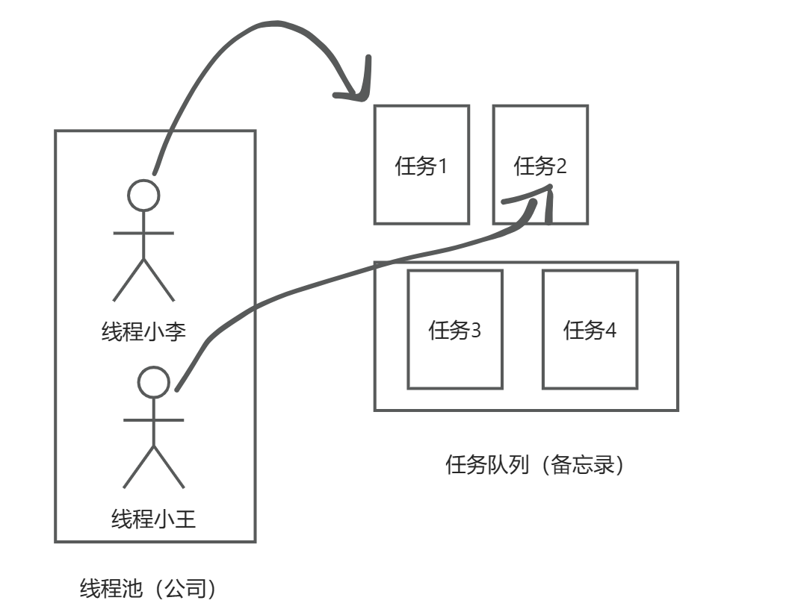

5. åˆæ¥äº†ä¸€ä¸ªä»»åŠ¡ï¼Œä½†æ˜¯æˆ‘们的任务队列已ç»æ»¡äº†ï¼ˆå½“å‰çº¿ç¨‹æ•° > corePoolSize = 2，已有任务数 = 最大长度 workQueue.size = 2），新å¢çº¿ç¨‹ï¼ˆmaximumPoolSize = 4）æ¥å¤„ç†æ–°ä»»åŠ¡ï¼Œè€Œä¸æ˜¯ä¸¢å¼ƒä»»åŠ¡


6. å·²ç»åˆ°äº†ä»»åŠ¡ 7，但是我们的任务队列已ç»æ»¡äº†ã€ä¸´æ—¶å·¥ä¹Ÿæ‹›æ»¡äº†ï¼ˆå½“å‰çº¿ç¨‹æ•° = maximumPoolSize = 4，已有任务数 = 最大长度 workQueue.size = 2），调用 RejectedExecutionHandler æ‹’ç»ç­–ç•¥æ¥å¤„ç†å¤šä½™çš„任务。

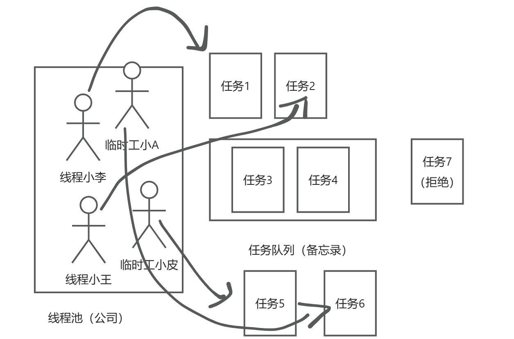

7. 如æœå½“å‰çº¿ç¨‹æ•°è¶…过 corePoolSize（正å¼å‘˜å·¥æ•°ï¼‰ï¼Œåˆæ²¡æœ‰æ–°çš„任务给他，那么等 keepAliveTime 时间达到å，就å¯ä»¥æŠŠè¿™ä¸ªçº¿ç¨‹é‡Šæ”¾ã€‚

`线程池å‚数如何设置？`

结åˆå®é™…情况（å®é™…业务场景和系统资æºï¼‰æ¥æµ‹è¯•è°ƒæ•´ï¼Œä¸æ–­ä¼˜åŒ–。 

å›å½’到我们的业务，è¦è€ƒè™‘系统最脆弱的ç¯èŠ‚（木桶效应）在哪？

ç°æœ‰æ¡ä»¶ï¼šå‡è®¾AI能力的并å‘是åªå…许 4 个线程åŒæ—¶å»æ‰§è¡Œï¼Œåªå…许20个任务æ’队

corePoolSize（核心线程数 => æ­£å¼å‘˜å·¥æ•°ï¼‰ï¼šæ­£å¸¸æƒ…况下，å¯ä»¥è®¾ç½®ä¸º 2 - 4 
maximumPoolSize：设置为æé™æƒ…况，设置为 <= 4
keepAliveTime（空闲线程存活时间）：一般设置为秒级或者分钟级
TimeUnit unit（空闲线程存活时间的å•ä½ï¼‰ï¼šåˆ†é’Ÿã€ç§’
workQueue（工作队列）：结åˆå®é™…请况å»è®¾ç½®ï¼Œå¯ä»¥è®¾ç½®ä¸º 20
threadFactory（线程工å‚）：æ§åˆ¶æ¯ä¸ªçº¿ç¨‹çš„生æˆã€çº¿ç¨‹çš„å±æ€§ï¼ˆæ¯”如线程å）
RejectedExecutionHandler（拒ç»ç­–略）：抛异常，标记数æ®åº“的任务状æ€ä¸º “任务满了已拒ç»â€

一般情况下，任务分为 IO 密集å‹å’Œè®¡ç®—密集å‹ä¸¤ç§ã€‚
计算密集å‹ï¼šåƒ CPU，比如音视频处ç†ã€å›¾åƒå¤„ç†ã€æ•°å­¦è®¡ç®—等，一般是设置 corePoolSize 为 CPU 的核数 + 1（空余线程），å¯ä»¥è®©æ¯ä¸ªçº¿ç¨‹éƒ½èƒ½åˆ©ç”¨å¥½ CPU çš„æ¯ä¸ªæ ¸ï¼Œè€Œä¸”线程之间ä¸ç”¨é¢‘ç¹åˆ‡æ¢ï¼ˆå‡å°‘打æ¶ã€å‡å°‘开销）
IO 密集å‹ï¼šåƒå¸¦å®½/内存/硬盘的读写资æºï¼ŒcorePoolSize å¯ä»¥è®¾ç½®å¤§ä¸€ç‚¹ï¼Œä¸€èˆ¬ç»éªŒå€¼æ˜¯ 2n å·¦å³ï¼Œä½†æ˜¯å»ºè®®ä»¥ IO 的能力为主。

考虑导入百万数æ®åˆ°æ•°æ®åº“，å±äº IO 密集å‹ä»»åŠ¡ã€è¿˜æ˜¯è®¡ç®—密集å‹ä»»åŠ¡ï¼Ÿ

`自定义线程池`

```java
@Configuration
public class ThreadPoolExecutorConfig {


    @Bean
    public ThreadPoolExecutor threadPoolExecutor() {
        ThreadFactory threadFactory = new ThreadFactory() {
            private int count = 1;

            @Override
            public Thread newThread(@NotNull Runnable r) {
                Thread thread = new Thread(r);
                thread.setName("线程" + count);
                count++;
                return thread;
            }
        };
        return new ThreadPoolExecutor(2, 4, 100, TimeUnit.SECONDS,
                new ArrayBlockingQueue<>(4), threadFactory, new ThreadPoolExecutor.AbortPolicy());
    }
}
```

`æ交任务&查看线程池信æ¯`

```java
/**
 * 任务队列模拟
 */
@RestController
@RequestMapping("/queue")
@Slf4j
@Profile({"dev","local"})
public class QueueController {
    @Resource
    private ThreadPoolExecutor threadPoolExecutor;
    
    //æ交任务
    @GetMapping("/add")
    public void add(String name) {
        CompletableFuture.runAsync(() -> {
            System.out.println("任务执行中：" + name+",执行人："+Thread.currentThread().getName());
            try {
                Thread.sleep(600000);
            } catch (InterruptedException e) {
                e.printStackTrace();
            }
        }, threadPoolExecutor);
    }
    
    //查看线程池信æ¯
    @GetMapping("/get")
    public Map<String, Object> get(){
        Map<String,Object> map = new HashMap<>();
        int size = threadPoolExecutor.getQueue().size();
        long taskCount = threadPoolExecutor.getTaskCount();
        long completedTaskCount = threadPoolExecutor.getCompletedTaskCount();
        long activeCount = threadPoolExecutor.getActiveCount();
        map.put("队列长度",size);
        map.put("任务总数",taskCount);
        map.put("å·²æˆåŠŸæ‰§è¡Œçš„任务数",taskCount);
        map.put("正在工作的线程数",activeCount);
        return map;
    }
}
```

使用æ¥å£æ–‡æ¡£æ交任务&查看线程池信æ¯æ¥ç†è§£çº¿ç¨‹æ± çš„工作机制

##### å¼€å‘

`å®ç°å·¥ä½œæµç¨‹`

1. ç»™chart表新å¢ä»»åŠ¡çŠ¶æ€å­—段（比如æ’队中，已完æˆï¼Œæ‰§è¡Œä¸­ï¼Œå¤±è´¥ï¼‰ã€æ‰§è¡Œä¿¡æ¯å­—段（å¯ä»¥è®°å½•ä»»åŠ¡å¤±è´¥çš„åŸå› ç­‰ï¼‰

```sql
create table if not exists chart
(
    id          bigint auto_increment comment 'id' primary key,
    goal        text                                   null comment '分æ目标',
    rawData     text                                   null comment 'åŸå§‹æ•°æ®',
    chartType   varchar(128)                           null comment '图表类å‹',
    chartName   varchar(128)                           null comment '图表å称',
    genChart    text                                   null comment 'AI生æˆçš„图表数æ®',
    genSummary  text                                   null comment 'AI生æˆçš„分æ总结',
    userId      bigint                                 null comment '创建人id',
    status      varchar(128) default 'wait'            not null comment 'wait,succeeded,failed,running',
    execMessage text                                   null comment '执行信æ¯',
    createTime  datetime     default CURRENT_TIMESTAMP not null comment '创建时间',
    updateTime  datetime     default CURRENT_TIMESTAMP not null on update CURRENT_TIMESTAMP comment '更新时间',
    isDelete    tinyint      default 0                 not null comment '是å¦åˆ é™¤'
) comment '图表信æ¯' collate = utf8mb4_unicode_ci;
```

2. 用户点击智能分æ页的æ交按钮，先把图表立刻ä¿å­˜åˆ°æ•°æ®åº“中，然åæ交任务

3. 任务：先修改图表的任务状æ€ä¸ºâ€œæ‰§è¡Œä¸­â€ï¼›ç­‰æ‰§è¡ŒæˆåŠŸå，修改为“已完æˆâ€ï¼Œä¿å­˜æ‰§è¡Œç»“æœï¼›æ‰§è¡Œå¤±è´¥å，修改为失败，记录失败信æ¯

```java
/**
 * 智能分æ（异步）
 *
 * @param multipartFile
 * @param genChartRequest
 * @param request
 * @return
 */
@PostMapping("/gen")
public BaseResponse<BIResponse> genChartByAI(@RequestPart("file") MultipartFile multipartFile,
                                             GenChartRequest genChartRequest, HttpServletRequest request) {
    String goal = genChartRequest.getGoal();
    String chartType = genChartRequest.getChartType();
    String chartName = genChartRequest.getChartName();
    // 拼æ¥åˆ†æ目标
    if (StringUtils.isNotBlank(chartType)) {
        goal = goal + "，请使用" + chartType;
    }
    // 校验å‚æ•°
    ThrowUtils.throwIf(StringUtils.isBlank(goal), ErrorCode.PARAMS_ERROR, "分æ目标为空");
    ThrowUtils.throwIf(StringUtils.isNotBlank(chartName) && chartName.length() > 128, ErrorCode.PARAMS_ERROR, "图表å称过长");
    // 校验文件
    long size = multipartFile.getSize();
    String originalFilename = multipartFile.getOriginalFilename();
    // 校验文件大å°
    final long ONE_MB = 1024 * 1024L;
    ThrowUtils.throwIf(size > ONE_MB, ErrorCode.PARAMS_ERROR, "文件大å°è¶…过 1M");
    // 校验文件åç¼€
    String suffix = FileUtil.getSuffix(originalFilename);
    final List<String> validFileSuffix = Arrays.asList("xlsx");
    ThrowUtils.throwIf(!validFileSuffix.contains(suffix), ErrorCode.PARAMS_ERROR, "文件åç¼€ä¸ç¬¦åˆè¦æ±‚");
    // è·å–登录用户
    User loginUser = userService.getLoginUser(request);
    // é™æµ,æ¯ä¸ªç”¨æˆ·ä¸€ä¸ªé™æµå™¨
    redisLimiterManager.doRateLimit("genChartByAI_" + loginUser.getId().toString());
    // å‹ç¼©åŸå§‹æ•°æ®
    String data = ExcelUtils.excelToCsv(multipartFile);
    // æ„造用户请求（分æ目标，图表å称，图表类å‹ï¼Œcsvæ•°æ®ï¼‰
    StringBuilder userInput = new StringBuilder();
    userInput.append("分æ需求：").append("\n");
    userInput.append(goal).append("\n");
    userInput.append("åŸå§‹æ•°æ®ï¼š").append("\n");
    userInput.append(data).append("\n");
    // æ’入数æ®åº“
    Chart chart = new Chart();
    chart.setGoal(goal);
    chart.setRawData(data);
    chart.setChartType(chartType);
    chart.setChartName(chartName);
    chart.setUserId(loginUser.getId());
    chart.setStatus("wait");
    boolean save = chartService.save(chart);
    ThrowUtils.throwIf(!save, ErrorCode.SYSTEM_ERROR, "图表ä¿å­˜å¤±è´¥");
    //todo 处ç†ä»»åŠ¡é˜Ÿåˆ—满了å，抛异常的情况
    CompletableFuture.runAsync(() -> {
        //先修改图表的任务状æ€ä¸ºâ€œæ‰§è¡Œä¸­â€ï¼›ç­‰æ‰§è¡ŒæˆåŠŸå，修改为“已完æˆâ€ï¼Œä¿å­˜æ‰§è¡Œç»“æœï¼›æ‰§è¡Œå¤±è´¥å，修改为失败，记录失败信æ¯
        //修改任务状æ€ä¸ºæ‰§è¡Œä¸­ï¼Œå‡å°‘é‡å¤æ‰§è¡Œçš„é£é™©ã€åŒæ—¶è®©ç”¨æˆ·çŸ¥æ™“执行状æ€
        Chart updateChart = new Chart();
        updateChart.setId(chart.getId());
        updateChart.setStatus("running");
        boolean result = chartService.updateById(updateChart);
        if (!result) {
            handleChartUpdateError(chart.getId(),"更新图表执行中状æ€å¤±è´¥");
            return;
        }
        // 调用鱼èªæ˜SDK，得到å“应
        long biModelId = 1719916921023344642L;
        String answer = aiManager.doChat(biModelId, userInput.toString());
        // ä»AIå“应结æœä¸­ï¼Œå–出需è¦çš„æ•°æ®
        String[] splits = answer.split("ã€ã€ã€ã€ã€");
        if (splits.length < 3) {
            handleChartUpdateError(chart.getId(),"AI生æˆé”™è¯¯");
            return;
        }
        String genChart = splits[1].trim();
        String genSummary = splits[2].trim();
        //执行æˆåŠŸ
        Chart updateChartResult = new Chart();
        updateChartResult.setId(chart.getId());
        //todo 建议定义状æ€ä¸ºæšä¸¾å€¼
        updateChartResult.setStatus("succeeded");
        updateChartResult.setGenChart(genChart);
        updateChartResult.setGenSummary(genSummary);
        result = chartService.updateById(updateChartResult);
        if (!result) {
            handleChartUpdateError(chart.getId(),"更新图表已完æˆçŠ¶æ€å¤±è´¥");
            return;
        }
    },threadPoolExecutor);
    // è¿”å›ç»™å‰ç«¯
    BIResponse biResponse = new BIResponse();
    biResponse.setChartId(chart.getId());
    return ResultUtils.success(biResponse);
}
private void handleChartUpdateError(long chartId, String execMessage) {
    Chart updateChart = new Chart();
    updateChart.setId(chartId);
    updateChart.setStatus("failed");
    updateChart.setExecMessage(execMessage);
    boolean result = chartService.updateById(updateChart);
    if (!result) {
        log.error("更新图表失败状æ€å¤±è´¥ï¼Œ" + chartId + "，" + execMessage);
    }
}
```

4. 用户å¯ä»¥åœ¨ä¸ªäººå›¾è¡¨é¡µé¢æŸ¥çœ‹æ‰€æœ‰å›¾è¡¨ï¼ˆå·²ç”Ÿæˆï¼Œç”Ÿæˆä¸­ï¼Œç”Ÿæˆå¤±è´¥ï¼‰çš„ä¿¡æ¯å’ŒçŠ¶æ€ï¼ˆä¿®æ”¹ä¸ªäººå›¾è¡¨é¡µé¢ï¼‰

5. 用户å¯ä»¥ä¿®æ”¹ç”Ÿæˆå¤±è´¥çš„图表信æ¯ï¼Œç„¶å点击é‡æ–°ç”Ÿæˆï¼ˆæš‚未完æˆï¼‰

##### 优化点

1. guava retrying é‡è¯•
2. æå‰è€ƒè™‘到AI生æˆé”™è¯¯çš„情况，在å端进行异常处ç†ï¼ˆæ¯”如AI生æˆäº†å¤šä½™çš„内容，æå–正确的内容）
3. 如æœè¯´ä»»åŠ¡æ ¹æœ¬æ²¡æ交到队列中（或者队列满了），å¯ä»¥ä½¿ç”¨å®šæ—¶ä»»åŠ¡æŠŠå¤±è´¥çŠ¶æ€çš„图表放到队列中	
4. 建议给任务的执行å¢åŠ ä¸€ä¸ªè¶…时时间，超时å自动标记为失败 
5. åå‘å‹åŠ›https://zhuanlan.zhihu.com/p/404993753 判断第三方æœåŠ¡çš„状æ€æ¥é€‰æ‹©å½“å‰ç³»ç»Ÿçš„策略（比如根æ®AIæœåŠ¡çš„当å‰ä»»åŠ¡é˜Ÿåˆ—æ¥æ§åˆ¶æˆ‘们系统的核心线程数），最大化利用系统资æº
6. 个人图表页é¢å¢åŠ ä¸€ä¸ªåˆ·æ–°æŒ‰é’®æˆ–定时自动刷新，ä¿è¯è·å–到图表的最新状æ€ï¼ˆå‰ç«¯è½®è¯¢ï¼‰
7. 任务执行æˆåŠŸæˆ–失败给用户å‘é€æ¶ˆæ¯é€šçŸ¥


### 分布å¼æ¶ˆæ¯é˜Ÿåˆ—

#### 分æ系统ç°çŠ¶çš„ä¸è¶³

> å•æœºç³»ç»Ÿçš„问题

**1ã€æ— æ³•é›†ä¸­é™åˆ¶ï¼Œåªèƒ½å•æœºé™åˆ¶**

å·²ç»ç»è¿‡äº†åŒæ­¥åˆ°å¼‚步的改造。目å‰çš„异步是通过本地的线程池å®ç°çš„。

å‡å¦‚AIæœåŠ¡é™åˆ¶åªèƒ½æœ‰2个用户åŒæ—¶ä½¿ç”¨ï¼Œå¯ä»¥è®¾ç½®çº¿ç¨‹æ± æ ¸å¿ƒçº¿ç¨‹æ•°ä¸º2æ¥å®ç°

å‡è®¾ç³»ç»Ÿç”¨é‡å¢å¤§ï¼Œæ”¹ä¸ºåˆ†å¸ƒå¼ï¼Œå¤šå°æœåŠ¡å™¨ï¼Œæ¯ä¸ªæœåŠ¡å™¨éƒ½è¦æœ‰2个线程，就å¯èƒ½æœ‰2N个线程


解决方案：在一个集中的地方å»ç®¡ç†ä¸‹å‘任务（比如集中存储当å‰æ­£åœ¨æ‰§è¡Œçš„任务数）


**2ã€ä»»åŠ¡æ”¾åœ¨å†…存中（ArrayBlockingQueue）执行的，å¯èƒ½ä¼šä¸¢å¤±**

虽然å¯ä»¥äººå·¥ä»æ•°æ®åº“æ出æ¥å†é‡è¯•ï¼Œä½†æ˜¯éœ€è¦é¢å¤–å¼€å‘（比如定时任务），这ç§é‡è¯•çš„场景是é常典å‹çš„，其å®æ˜¯ä¸éœ€è¦å¼€å‘者过äºå…³å¿ƒã€æˆ–者自己å®ç°çš„


解决方案：把任务放在一个å¯ä»¥æŒä¹…化存储的硬盘中


**3ã€å¦‚æœéšç€ç³»ç»ŸåŠŸèƒ½å¢å¤šï¼Œé•¿è€—时任务也越æ¥è¶Šå¤šï¼Œç³»ç»Ÿå°±ä¼šè¶Šæ¥è¶Šå¤æ‚（比如è¦å¼€å¤šä¸ªçº¿ç¨‹æ± ï¼Œèµ„æºå¯èƒ½ä¼šå‡ºç°æŠ¢å ï¼‰**

æœåŠ¡æ‹†åˆ†ï¼ˆåº”用解耦）：å¯ä»¥æŠŠé•¿è€—时，消耗很多的任务å•ç‹¬æŠ½æˆä¸€ä¸ªç¨‹åºï¼Œä¸è¦å½±å“主页务


解决方案：å¯ä»¥æœ‰ä¸€ä¸ªä¸­é—´äººï¼Œè®©ä¸­é—´äººå¸®æˆ‘们å»è¿æ¥ä¸¤ä¸ªç³»ç»Ÿï¼ˆæ¯”如核心系统和智能分æ业务）


#### 中间件

è¿æ¥å¤šä¸ªç³»ç»Ÿï¼Œå¸®åŠ©å¤šä¸ªç³»ç»Ÿç´§å¯†å作的技术（组件）

比如：Redisã€æ¶ˆæ¯é˜Ÿåˆ—，分布å¼å­˜å‚¨ Etcd


#### 消æ¯é˜Ÿåˆ—

存放消æ¯çš„队列，å¯ä»¥ç†è§£ä¸ºç‰¹æ®Šçš„æ•°æ®åº“

关键è¯ï¼šå­˜å‚¨ï¼Œæ¶ˆæ¯ï¼Œé˜Ÿåˆ—

存储：存数æ®

消æ¯ï¼šæŸç§æ•°æ®ç»“æ„，比如字符串，对象，二进制数æ®ï¼Œjson等等

队列：先进先出的数æ®ç»“æ„

应用场景（作用）：在多个ä¸åŒçš„系统，应用之间å®ç°æ¶ˆæ¯çš„传输。ä¸éœ€è¦è€ƒè™‘应用的编程语言ã€ç³»ç»Ÿã€æ¡†æ¶ç­‰ã€‚

​	比如å¯ä»¥è®©Java应用å‘消æ¯ï¼Œphp应用收消æ¯ï¼Œè¿™æ ·å°±ä¸ç”¨æŠŠæ‰€æœ‰ä»£ç å†™åˆ°åŒä¸€ä¸ªé¡¹ç›®é‡Œï¼ˆåº”用解耦）

##### 消æ¯é˜Ÿåˆ—的模å‹

生产者：Producer

消费者：Comsumer

消æ¯ï¼šMessage

消æ¯é˜Ÿåˆ—：Queue

为什么ä¸ç›´æ¥ä¼ è¾“，è¦ç”¨æ¶ˆæ¯é˜Ÿåˆ—？

使用消æ¯é˜Ÿåˆ—，生产者ä¸ç”¨å…³å¿ƒæ¶ˆè´¹è€…è¦ä¸è¦æ¶ˆè´¹ï¼Œä»€ä¹ˆæ—¶å€™æ¶ˆè´¹ï¼Œåªéœ€è¦æŠŠäº§å“给消æ¯é˜Ÿåˆ—，生æˆè€…的工作就完æˆäº†ã€‚

消费者什么时候有空就å»æ¶ˆè´¹ï¼Œè¿™æ ·ç”Ÿäº§è€…和消费者就å®ç°ç±»è§£è€¦ï¼Œäº’ä¸å½±å“。

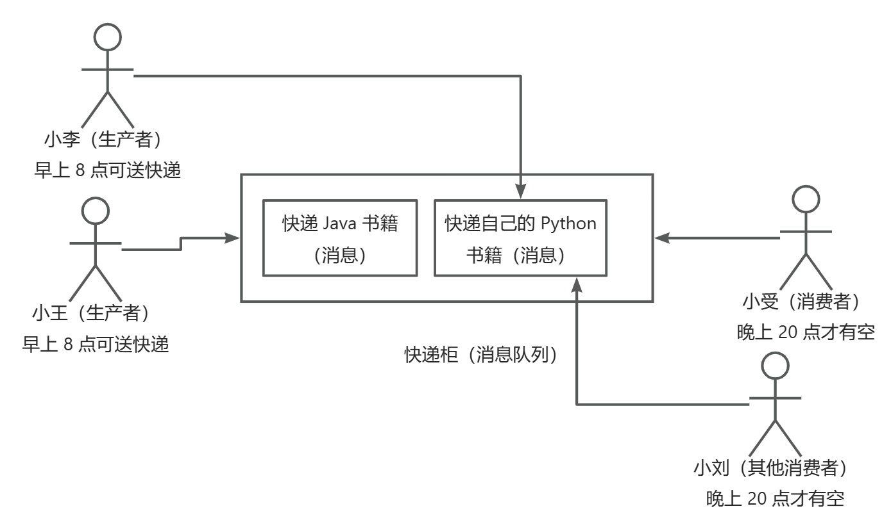

##### 为什么è¦ç”¨æ¶ˆæ¯é˜Ÿåˆ—？

1）异步处ç†
生产者å‘é€å®Œæ¶ˆæ¯ä¹‹å，å¯ä»¥ç»§ç»­å»å¿™åˆ«çš„，消费者想什么时候消费都å¯ä»¥ï¼Œä¸ä¼šäº§ç”Ÿé˜»å¡ã€‚
2）削峰填谷
先把用户的请求放到消æ¯é˜Ÿåˆ—中，消费者（å®é™…执行æ“作的应用）å¯ä»¥æŒ‰ç…§è‡ªå·±çš„需求，慢慢å»å–。
åŸæœ¬ï¼š12 点时æ¥äº† 10 万个请求，åŸæœ¬æƒ…况下，10万个请求都在系统内部立刻处ç†ï¼Œå¾ˆå¿«ç³»ç»Ÿå‹åŠ›è¿‡å¤§å°±å®•æœºäº†ã€‚
ç°åœ¨ï¼šæŠŠè¿™ 10万个请求放到消æ¯é˜Ÿåˆ—中，处ç†ç³»ç»Ÿä»¥è‡ªå·±çš„æ’定速ç‡ï¼ˆæ¯”如æ¯ç§’ 1 个）慢慢执行，ä»è€Œä¿æŠ¤ç³»ç»Ÿã€ç¨³å®šå¤„ç†ã€‚

分布å¼æ¶ˆæ¯é˜Ÿåˆ—的优势
1ã€æ•°æ®æŒä¹…化：它å¯ä»¥æŠŠæ¶ˆæ¯é›†ä¸­å­˜å‚¨åˆ°ç¡¬ç›˜é‡Œï¼ŒæœåŠ¡å™¨é‡å¯å°±ä¸ä¼šä¸¢å¤±
2ã€å¯æ‰©å±•æ€§ï¼šå¯ä»¥æ ¹æ®éœ€æ±‚，éšæ—¶å¢åŠ ï¼ˆæˆ–å‡å°‘）节点，继续ä¿æŒç¨³å®šçš„æœåŠ¡
3ã€åº”用解耦：å¯ä»¥è¿æ¥å„个ä¸åŒè¯­è¨€ã€æ¡†æ¶å¼€å‘的系统，让这些系统能够çµæ´»ä¼ è¾“读å–æ•°æ®

应用解耦的优点：

以å‰ï¼ŒæŠŠæ‰€æœ‰åŠŸèƒ½æ”¾åˆ°åŒä¸€ä¸ªé¡¹ç›®ä¸­ï¼Œè°ƒç”¨å¤šä¸ªå­åŠŸèƒ½æ—¶ï¼Œä¸€ä¸ªç¯èŠ‚错，系统就整体出错：

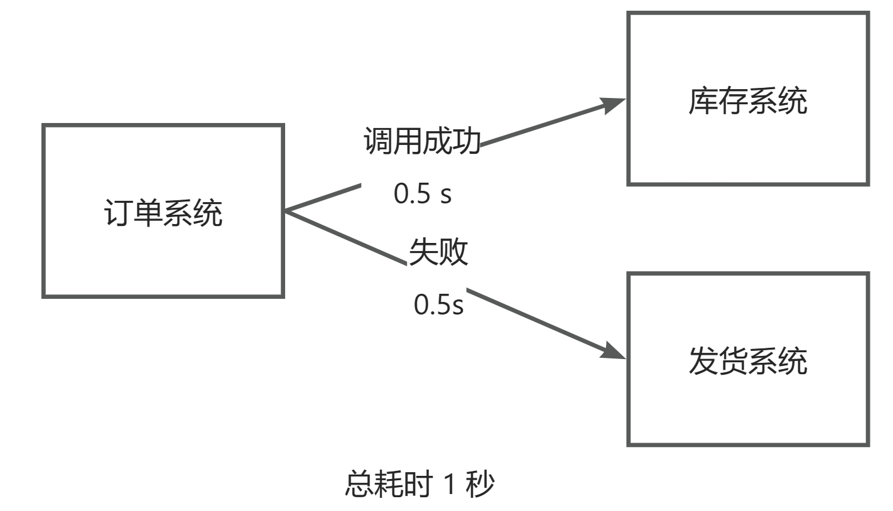

使用消æ¯é˜Ÿåˆ—进行解耦：

1. 一个系统挂了，ä¸å½±å“å¦ä¸€ä¸ªç³»ç»Ÿ
2. 系统挂了并æ¢å¤å，ä»ç„¶å¯ä»¥å–出消æ¯ï¼Œç»§ç»­æ‰§è¡Œä¸šåŠ¡é€»è¾‘
3. åªè¦å‘é€æ¶ˆæ¯åˆ°é˜Ÿåˆ—，就å¯ä»¥ç«‹åˆ»è¿”å›ï¼Œä¸ç”¨åŒæ­¥è°ƒç”¨æ‰€æœ‰ç³»ç»Ÿï¼Œæ€§èƒ½æ›´é«˜

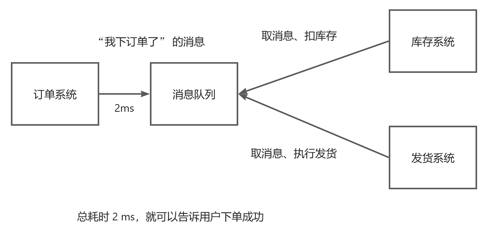

4ã€å‘布订阅

如æœä¸€ä¸ªé常大的系统è¦ç»™å…¶ä»–å­ç³»ç»Ÿå‘é€é€šçŸ¥ï¼Œæœ€ç®€å•ç›´æ¥çš„æ–¹å¼æ˜¯å¤§ç³»ç»Ÿç›´æ¥ä¾æ¬¡è°ƒç”¨å°ç³»ç»Ÿï¼š
问题：

1. æ¯æ¬¡å‘通知都è¦è°ƒç”¨å¾ˆå¤šç³»ç»Ÿï¼Œå¾ˆéº»çƒ¦ã€æœ‰å¯èƒ½å¤±è´¥
2. 新出ç°çš„项目（或者说大项目感知ä¸åˆ°çš„项目）无法得到通知

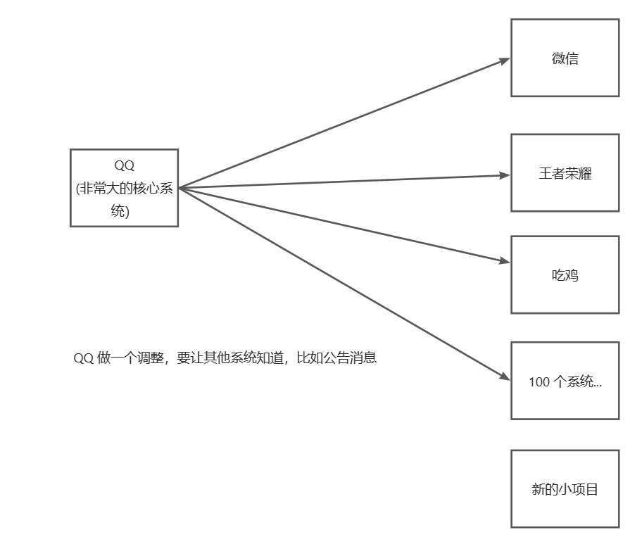

解决方案：大的核心系统始终往一个地方（消æ¯é˜Ÿåˆ—）å»å‘消æ¯ï¼Œå…¶ä»–的系统都å»è®¢é˜…这个消æ¯é˜Ÿåˆ—（读å–这个消æ¯é˜Ÿåˆ—中的消æ¯ï¼‰

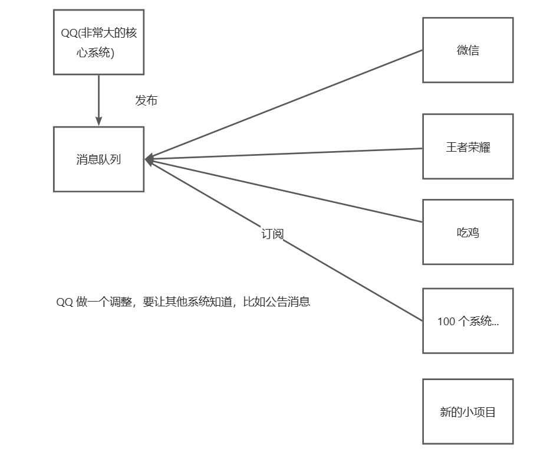

##### 应用场景

1. 耗时的场景（异步）
2. 高并å‘场景（异步ã€å‰Šå³°å¡«è°·ï¼‰
3. 分布å¼ç³»ç»Ÿå作（尤其是跨团队ã€è·¨ä¸šåŠ¡å作，应用解耦）
4. 强稳定性的场景（比如金è业务，æŒä¹…化ã€å¯é æ€§ã€å‰Šå³°å¡«è°·ï¼‰

##### 消æ¯é˜Ÿåˆ—的缺点
è¦ç»™ç³»ç»Ÿå¼•å…¥é¢å¤–的中间件，系统会更å¤æ‚ã€é¢å¤–维护中间件ã€é¢å¤–的费用（部署）æˆæœ¬
消æ¯é˜Ÿåˆ—：消æ¯ä¸¢å¤±ã€é¡ºåºæ€§ã€é‡å¤æ¶ˆè´¹ã€æ•°æ®çš„一致性（分布å¼ç³»ç»Ÿå°±è¦è€ƒè™‘）


####  主æµåˆ†å¸ƒå¼æ¶ˆæ¯é˜Ÿåˆ—选å‹
**主æµæŠ€æœ¯**

1. activemq
2. rabbitmq
3. kafka
4. rocketmq
5. zeromq
6. pulsar（云åŸç”Ÿï¼‰
7. Apache InLong（Tube）

**技术对比**
技术选å‹æŒ‡æ ‡ï¼š

- ååé‡ï¼šIOã€å¹¶å‘
- 时效性：类似延迟，消æ¯çš„å‘é€ã€åˆ°è¾¾æ—¶é—´
- å¯ç”¨æ€§ï¼šç³»ç»Ÿå¯ç”¨çš„比ç‡ï¼ˆæ¯”如 1 å¹´ 365 天宕机 1s，å¯ç”¨ç‡å¤§æ¦‚ X 个 9）
- å¯é æ€§ï¼šæ¶ˆæ¯ä¸ä¸¢å¤±ï¼ˆæ¯”如ä¸ä¸¢å¤±è®¢å•ï¼‰ã€åŠŸèƒ½æ­£å¸¸å®Œæˆ 

| 技术å称 | ååé‡ | 时效性         | å¯ç”¨æ€§ | å¯é æ€§ | 优势                                                       | 应用场景                                                     |
| -------- | :----: | -------------- | ------ | ------ | ---------------------------------------------------------- | ------------------------------------------------------------ |
| activemq |  万级  | 高             | 高     | 高     | 简å•æ˜“å­¦                                                   | 中å°å‹ä¼ä¸šã€é¡¹ç›®                                             |
| rabbitmq |  万级  | æ高（微秒）   | 高     | 高     | 生æ€å¥½ï¼ˆåŸºæœ¬ä»€ä¹ˆè¯­è¨€éƒ½æ”¯æŒï¼‰ã€æ—¶æ•ˆæ€§é«˜ã€æ˜“å­¦               | 适åˆç»å¤§å¤šæ•°åˆ†å¸ƒå¼çš„应用，这也是先学他的åŸå›                  |
| kafka    | å万级 | 高（毫秒以内） | æ高   | æ高   | ååé‡å¤§ã€å¯é æ€§ã€å¯ç”¨æ€§ï¼Œå¼ºå¤§çš„æ•°æ®æµå¤„ç†èƒ½åŠ›             | é€‚ç”¨äº å¤§è§„æ¨¡å¤„ç†æ•°æ®çš„场景，比如æ„建日志收集系统ã€å®æ—¶æ•°æ®æµä¼ è¾“ã€äº‹ä»¶æµæ”¶é›†ä¼ è¾“ |
| rocketmq | å万级 | 高（ms）       | æ高   | æ高   | ååé‡å¤§ã€å¯é æ€§ã€å¯ç”¨æ€§ï¼Œå¯æ‰©å±•æ€§                         | é€‚ç”¨äº é‡‘è ã€ç”µå•†ç­‰å¯¹å¯é æ€§è¦æ±‚è¾ƒé«˜çš„åœºæ™¯ï¼Œé€‚åˆ å¤§è§„æ¨¡ 的消æ¯å¤„ç†ã€‚ |
| pulsar   | å万级 | 高（ms）       | æ高   | æ高   | å¯é æ€§ã€å¯ç”¨æ€§å¾ˆé«˜ï¼ŒåŸºäºå‘布订阅模å‹ï¼Œæ–°å…´ï¼ˆæŠ€æœ¯æ¶æ„先进） | 适åˆå¤§è§„模ã€é«˜å¹¶å‘的分布å¼ç³»ç»Ÿï¼ˆäº‘åŸç”Ÿï¼‰ã€‚适åˆå®æ—¶åˆ†æã€äº‹ä»¶æµå¤„ç†ã€IoT æ•°æ®å¤„ç†ç­‰ã€‚ |

#### RabbitMQ 入门å®æˆ˜
特点：生æ€å¥½ï¼Œå¥½å­¦ä¹ ã€æ˜“äºç†è§£ï¼Œæ—¶æ•ˆæ€§å¼ºï¼Œæ”¯æŒå¾ˆå¤šä¸åŒè¯­è¨€çš„客户端，扩展性ã€å¯ç”¨æ€§éƒ½å¾ˆä¸é”™ã€‚
学习性价比é常高的消æ¯é˜Ÿåˆ—，适用äºç»å¤§å¤šæ•°ä¸­å°è§„模分布å¼ç³»ç»Ÿã€‚

官方网站：https://www.rabbitmq.com

官方文档：https://www.rabbitmq.com/getstarted.html

##### 基本概念
AMQP å议：https://www.rabbitmq.com/tutorials/amqp-concepts.html
高级消æ¯é˜Ÿåˆ—å议（Advanced Message Queue Protocol）

生产者：å‘消æ¯åˆ°æŸä¸ªäº¤æ¢æœº
消费者：ä»æŸä¸ªé˜Ÿåˆ—中å–消æ¯
交æ¢æœºï¼ˆExchangeï¼‰ï¼šè´Ÿè´£æŠŠæ¶ˆæ¯ **转å‘** 到对应的队列
队列（Queue）：存储消æ¯çš„
路由（Routes）：转å‘，就是æ€ä¹ˆæŠŠæ¶ˆæ¯ä»ä¸€ä¸ªåœ°æ–¹è½¬åˆ°å¦ä¸€ä¸ªåœ°æ–¹ï¼ˆæ¯”如ä»ç”Ÿäº§è€…转å‘到æŸä¸ªé˜Ÿåˆ—）

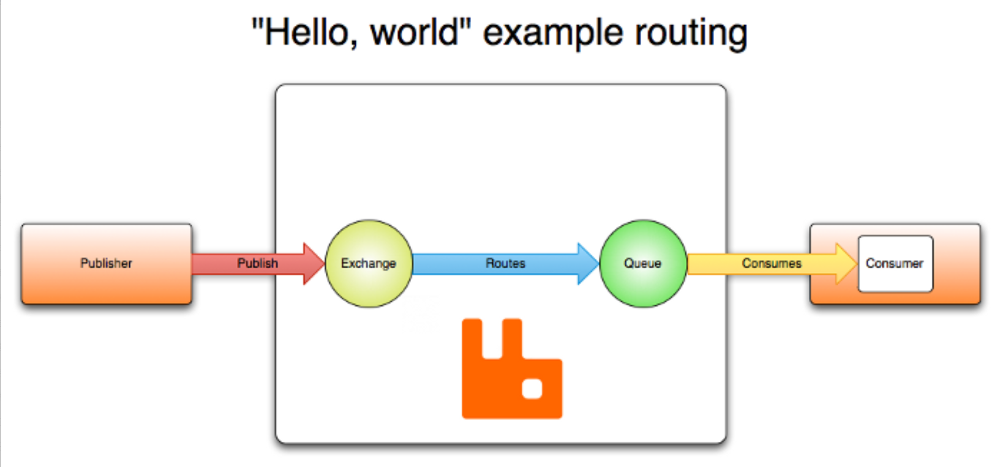


##### 安装
快速开始：https://www.rabbitmq.com/#getstarted
windows 安装：https://www.rabbitmq.com/install-windows.html

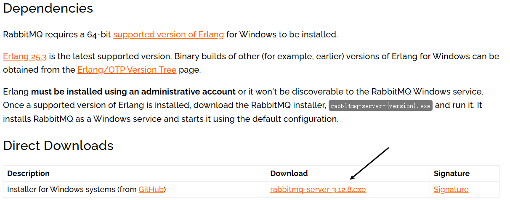

先安装 erlang 25.3.2（因为 RabbitMQ ä¾èµ– erlang），这个语言的性能é常高。
erlang 下载：https://www.erlang.org/patches/otp-25.3.2

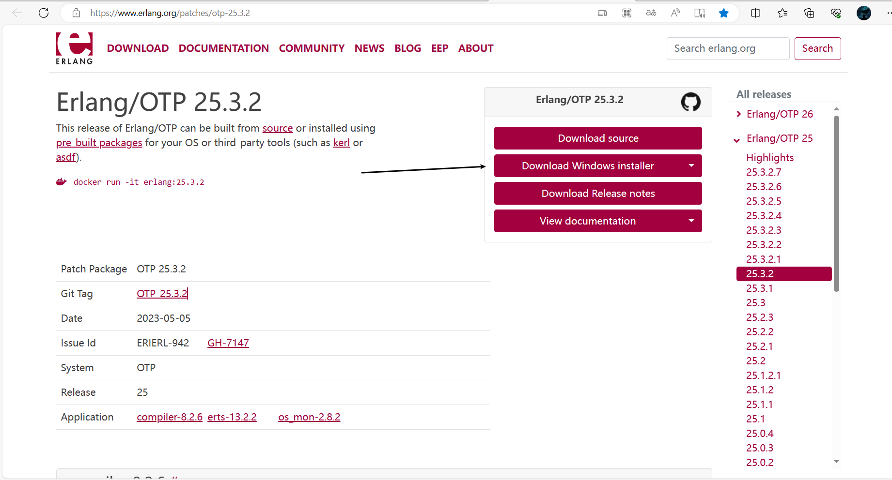

安装完 erlang å，安装 rabbitmq å³å¯ã€‚

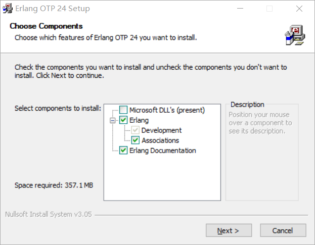

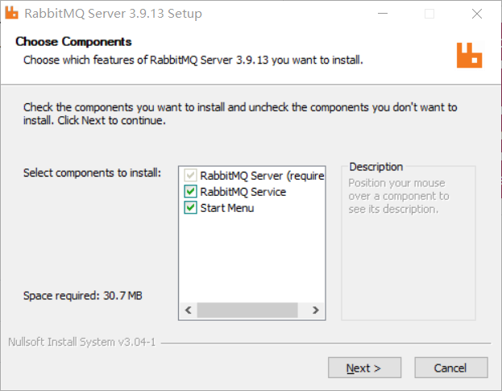

win+ r 输入 services.msc打开æœåŠ¡èœå•ï¼ŒæŸ¥çœ‹ rabbitmq æœåŠ¡æ˜¯å¦å·²å¯åŠ¨ï¼š

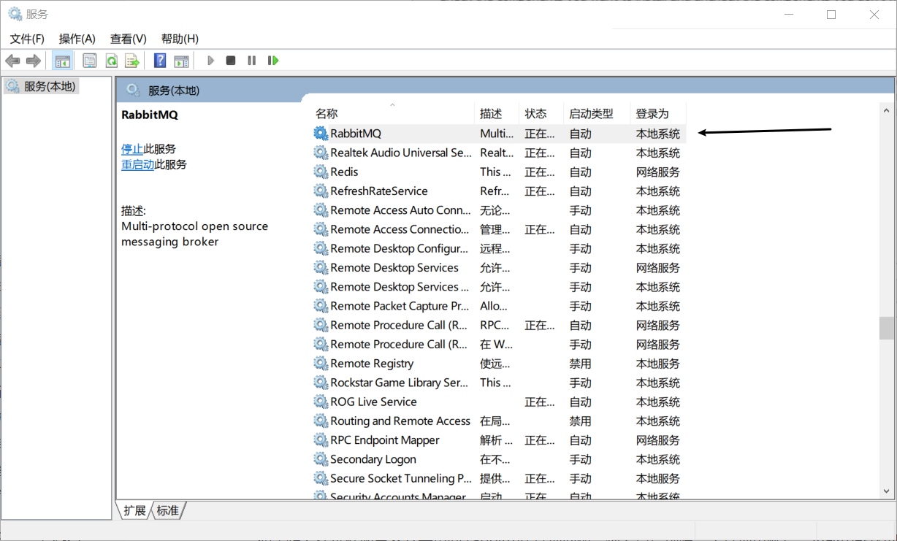

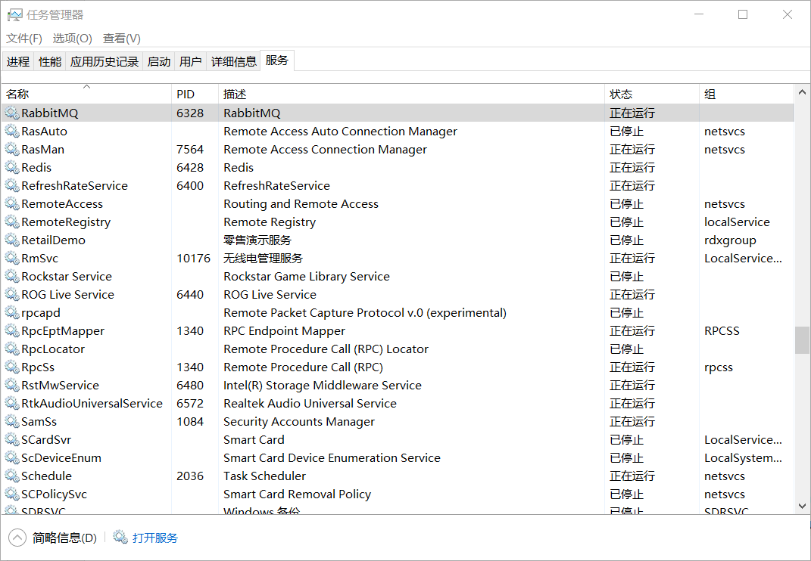

安装 rabbitmq 监æ§é¢æ¿ï¼šhttps://www.rabbitmq.com/rabbitmq-plugins.8.html

在 rabbitmq 安装目录的 sbin 中执行下述脚本：

```sh
rabbitmq-plugins enable rabbitmq_shovel rabbitmq_management
```

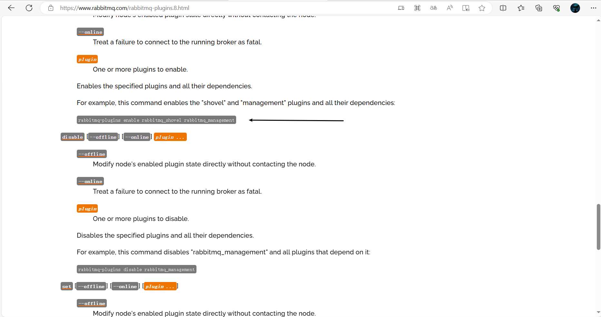

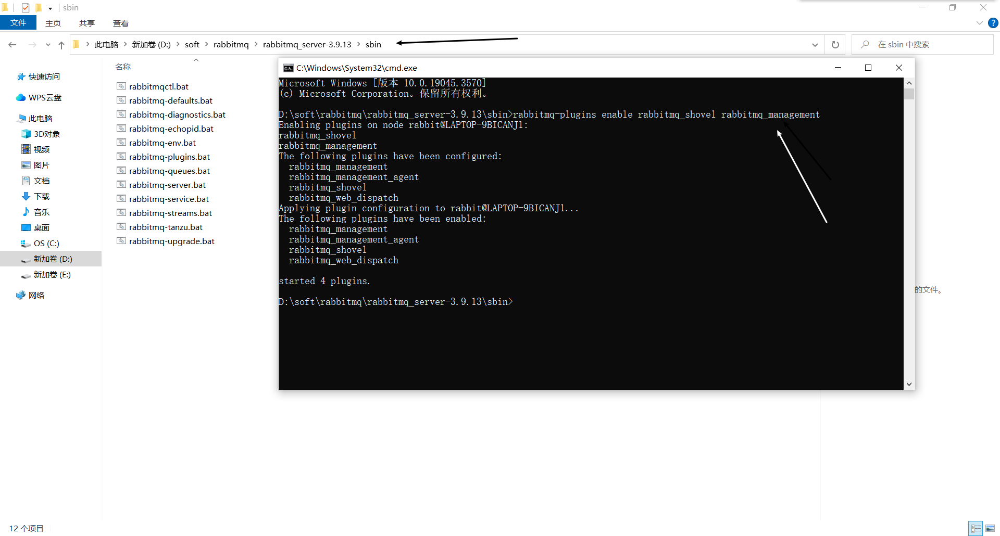

输入以下信æ¯ï¼š

访问：http://localhost:15672，用户å密ç éƒ½æ˜¯ guest

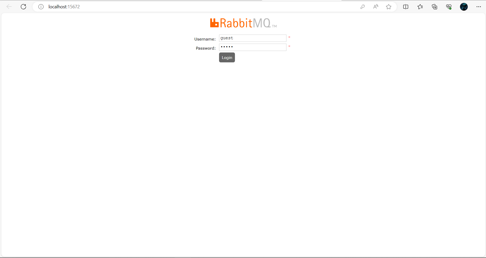

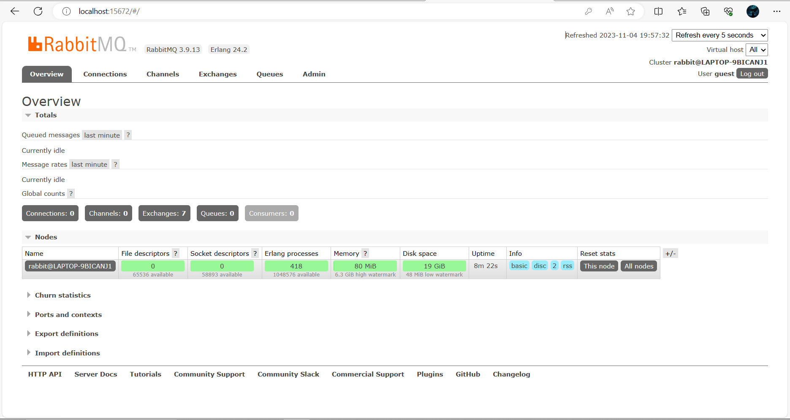

如æœæƒ³è¦åœ¨è¿œç¨‹æœåŠ¡å™¨å®‰è£…访问 rabbitmq 管ç†é¢æ¿ï¼Œä½ è¦è‡ªå·±åˆ›å»ºä¸€ä¸ªç®¡ç†å‘˜è´¦å·ï¼Œä¸èƒ½ç”¨é»˜è®¤çš„ guest，å¦åˆ™ä¼šè¢«æ‹¦æˆªï¼ˆå®˜æ–¹å‡ºäºå®‰å…¨è€ƒè™‘）。

如æœè¢«æ‹¦æˆªï¼Œå¯ä»¥è‡ªå·±åˆ›å»ºç®¡ç†å‘˜ç”¨æˆ·ï¼š
å‚考文档的 Adding a User：https://www.rabbitmq.com/access-control.html

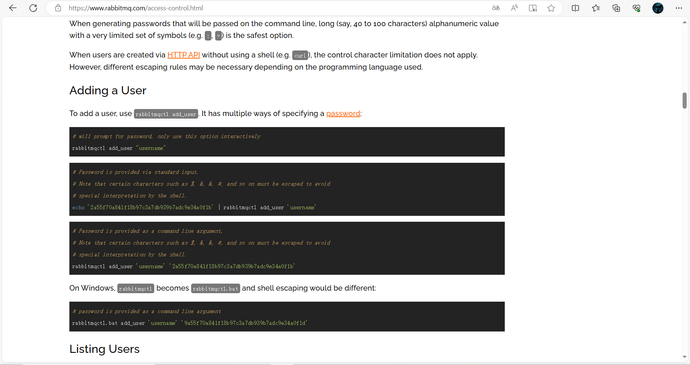

rabbitmq 端å£å ç”¨ï¼š
5672：程åºè¿æ¥çš„端å£
15672：webUI
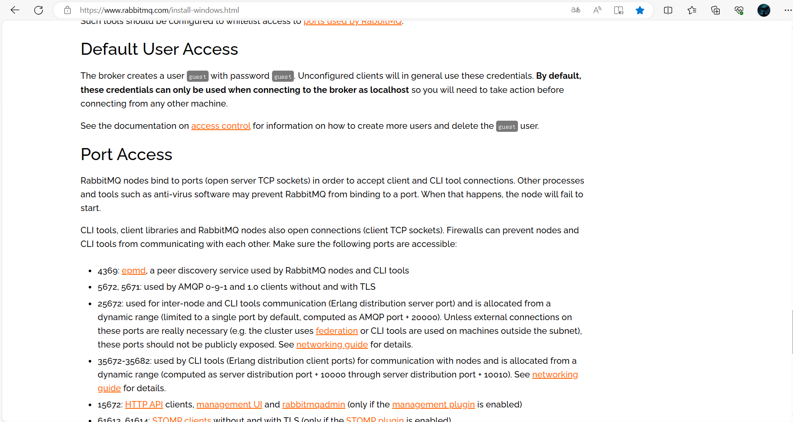

##### 快速入门

MQ 官方教程：https://www.rabbitmq.com/getstarted.html

###### **å•å‘å‘é€**
Hello World
文档：https://www.rabbitmq.com/tutorials/tutorial-one-java.html

一个生产者给一个队列å‘消æ¯ï¼Œä¸€ä¸ªæ¶ˆè´¹è€…ä»è¿™ä¸ªé˜Ÿåˆ—å–消æ¯ã€‚1 对 1。
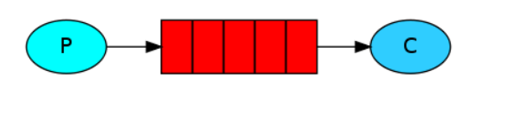

1ã€å¼•å…¥æ¶ˆæ¯é˜Ÿåˆ— Java 客户端：

```xml
<!-- https://mvnrepository.com/artifact/com.rabbitmq/amqp-client -->
<dependency>
    <groupId>com.rabbitmq</groupId>
    <artifactId>amqp-client</artifactId>
    <version>5.17.0</version>
</dependency>
```

2ã€ç”Ÿäº§è€…代ç ï¼šhttps://github.com/rabbitmq/rabbitmq-tutorials/blob/main/java/Send.java

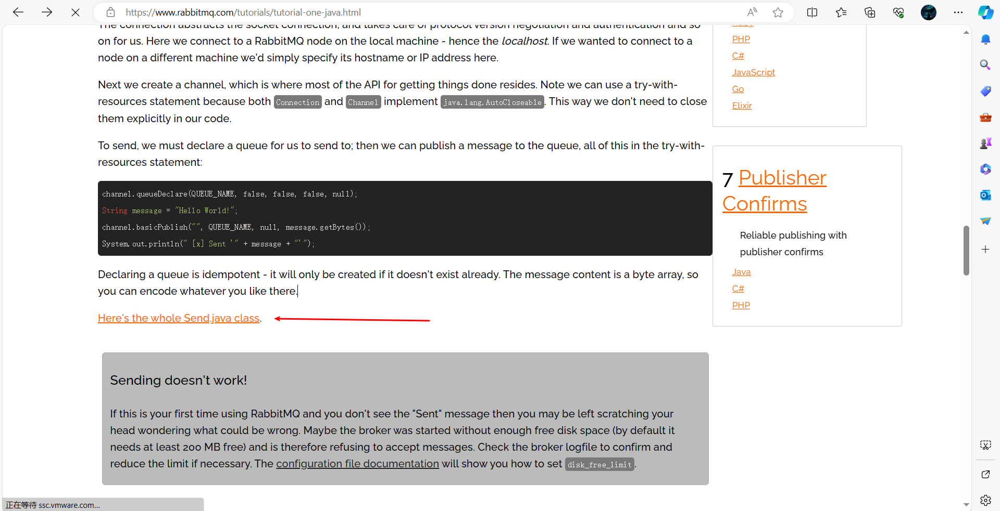

```java
public class SingleProducer {

    private final static String QUEUE_NAME = "hello";

    public static void main(String[] argv) throws Exception {
        // 创建è¿æ¥å·¥å‚
        ConnectionFactory factory = new ConnectionFactory();
        factory.setHost("localhost");
        /*//ä¸è®¾ç½®ç”¨æˆ·å密ç ï¼Œé»˜è®¤å°±æ˜¯guest，端å£é»˜è®¤5672
        factory.setUsername();
        factory.setPassword();
        factory.setPort();*/
        // 建立è¿æ¥ï¼Œåˆ›å»ºé¢‘é“
        try (Connection connection = factory.newConnection();
             Channel channel = connection.createChannel()) {
            // 创建消æ¯é˜Ÿåˆ—
            channel.queueDeclare(QUEUE_NAME, false, false, false, null);
            // å‘é€æ¶ˆæ¯
            String message = "Hello World!";
            channel.basicPublish("", QUEUE_NAME, null, message.getBytes(StandardCharsets.UTF_8));
            System.out.println(" [x] Sent '" + message + "'");
        }
    }
}
```

Channel 频é“：ç†è§£ä¸ºæ“作消æ¯é˜Ÿåˆ—çš„ client（比如 jdbcClientã€redisClient），æ供了和消æ¯é˜Ÿåˆ— server 建立通信的传输方法（为了å¤ç”¨è¿æ¥ï¼Œæ高传输效ç‡ï¼‰ã€‚程åºé€šè¿‡ channel æ“作 rabbitmq（收å‘消æ¯ï¼‰

创建消æ¯é˜Ÿåˆ—å‚数：

```
Queue.DeclareOk queueDeclare(String queue, boolean durable, boolean exclusive, boolean autoDelete,
                             Map<String, Object> arguments) throws IOException;
```

queue：消æ¯é˜Ÿåˆ—å称（注æ„，åŒå称的消æ¯é˜Ÿåˆ—，åªèƒ½ç”¨åŒæ ·çš„å‚数创建一次）
durabale：消æ¯é˜Ÿåˆ—é‡å¯å，消æ¯æ˜¯å¦ä¸¢å¤±
exclusive：是å¦åªå…许当å‰è¿™ä¸ªåˆ›å»ºæ¶ˆæ¯é˜Ÿåˆ—çš„è¿æ¥æ“作消æ¯é˜Ÿåˆ—
autoDelete：没有人用队列å，是å¦è¦åˆ é™¤é˜Ÿåˆ—

arguments：有需è¦æ‰ä¼ 

执行程åºå，å¯ä»¥çœ‹åˆ°æœ‰ 1 æ¡æ¶ˆæ¯ï¼š

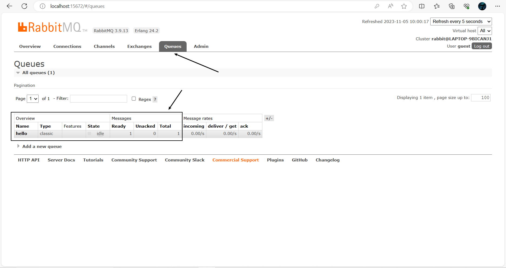

3ã€æ¶ˆè´¹è€…代ç ï¼šhttps://github.com/rabbitmq/rabbitmq-tutorials/blob/main/java/Recv.java

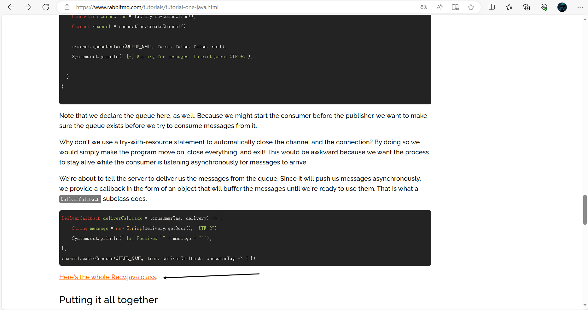

```java
public class SingleConsumer {

    private final static String QUEUE_NAME = "hello";

    public static void main(String[] argv) throws Exception {
        // 创建è¿æ¥å·¥å‚
        ConnectionFactory factory = new ConnectionFactory();
        factory.setHost("localhost");
        // 建立è¿æ¥ï¼Œåˆ›å»ºé¢‘é“
        Connection connection = factory.newConnection();
        Channel channel = connection.createChannel();
        // 创建消æ¯é˜Ÿåˆ—
        channel.queueDeclare(QUEUE_NAME, false, false, false, null);
        System.out.println(" [*] Waiting for messages. To exit press CTRL+C");
        // 定义了如何处ç†æ¶ˆæ¯
        DeliverCallback deliverCallback = (consumerTag, delivery) -> {
            String message = new String(delivery.getBody(), StandardCharsets.UTF_8);
            System.out.println(" [x] Received '" + message + "'");
        };
        // 消费消æ¯ï¼Œä¼šæŒç»­é˜»å¡
        channel.basicConsume(QUEUE_NAME, true, deliverCallback, consumerTag -> { });
    }
}
```

å¯åŠ¨æ¶ˆè´¹è€…å，å¯ä»¥çœ‹åˆ°æ¶ˆæ¯è¢«æ¶ˆè´¹äº†ï¼š
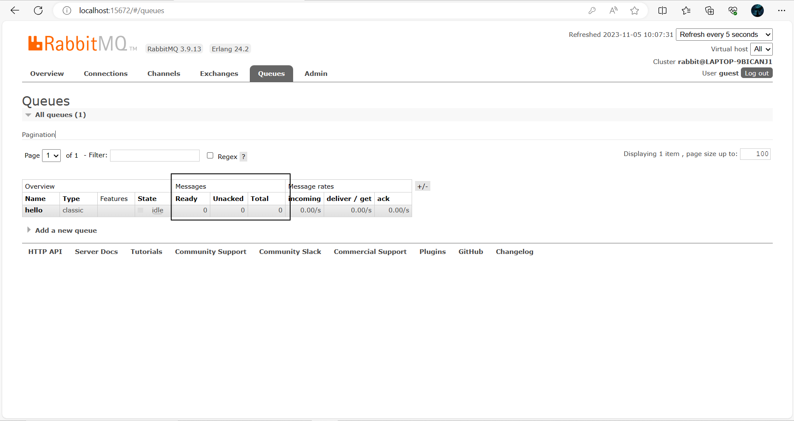

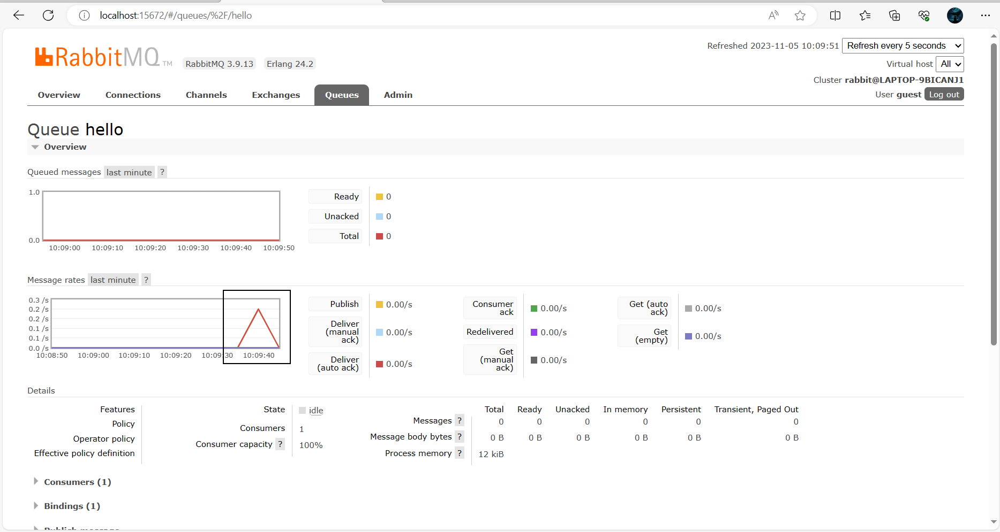


###### **多消费者**
官方教程：https://www.rabbitmq.com/tutorials/tutorial-two-java.html
场景：多个机器åŒæ—¶å»æ¥å—并处ç†ä»»åŠ¡ï¼ˆå°¤å…¶æ˜¯æ¯ä¸ªæœºå™¨çš„处ç†èƒ½åŠ›æœ‰é™ï¼‰
一个生产者给一个队列å‘消æ¯ï¼Œå¤šä¸ªæ¶ˆè´¹è€… ä»è¿™ä¸ªé˜Ÿåˆ—å–消æ¯ã€‚1 对多。
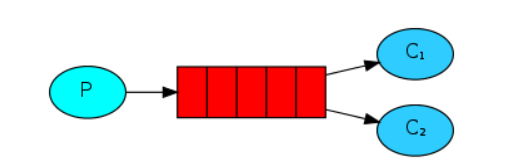

1）队列æŒä¹…化
durable å‚数设置为 true，æœåŠ¡å™¨é‡å¯å队列ä¸ä¸¢å¤±ï¼š

```java
channel.queueDeclare(TASK_QUEUE_NAME, true, false, false, null);
```

2）消æ¯æŒä¹…化
指定 MessageProperties.PERSISTENT_TEXT_PLAIN å‚数：

```java
channel.basicPublish("", TASK_QUEUE_NAME,
        MessageProperties.PERSISTENT_TEXT
        message.getBytes("UTF-8"));
```

生产者代ç ï¼š
使用 Scanner æ¥å—用户输入，便äºå‘é€å¤šæ¡æ¶ˆæ¯

```java
public class MultiProducer {

    private static final String TASK_QUEUE_NAME = "multi_queue";

    public static void main(String[] argv) throws Exception {
        // 创建è¿æ¥å·¥å‚
        ConnectionFactory factory = new ConnectionFactory();
        factory.setHost("localhost");
        // 建立è¿æ¥ï¼Œåˆ›å»ºé¢‘é“
        try (Connection connection = factory.newConnection();
             Channel channel = connection.createChannel()) {
            // 创建消æ¯é˜Ÿåˆ—
            channel.queueDeclare(TASK_QUEUE_NAME, true, false, false, null);
            // å‘é€æ¶ˆæ¯
            Scanner sc = new Scanner(System.in);
            while (sc.hasNext()) {
                String message = sc.nextLine();
                channel.basicPublish("", TASK_QUEUE_NAME,
                        MessageProperties.PERSISTENT_TEXT_PLAIN,
                        message.getBytes("UTF-8"));
                System.out.println(" [x] Sent '" + message + "'");
            }
        }
    }
}
```

æ§åˆ¶å•ä¸ªæ¶ˆè´¹è€…的处ç†ä»»åŠ¡ç§¯å‹æ•°ï¼š
æ¯ä¸ªæ¶ˆè´¹è€…最多åŒæ—¶å¤„ç† 1 个任务

```java
channel.basicQos(1);
```

消æ¯ç¡®è®¤æœºåˆ¶ï¼š
为了ä¿è¯æ¶ˆæ¯æˆåŠŸè¢«æ¶ˆè´¹ï¼ˆå¿«é€’æˆåŠŸè¢«å–走），rabbitmq æ供了消æ¯ç¡®è®¤æœºåˆ¶ï¼Œå½“消费者æ¥æ”¶åˆ°æ¶ˆæ¯å，比如è¦ç»™ä¸€ä¸ªå馈：

- ack：消费æˆåŠŸ
- nack：消费失败
- reject：拒ç»

如æœå‘Šè¯‰ rabbitmq æœåŠ¡å™¨æ¶ˆè´¹æˆåŠŸï¼ŒæœåŠ¡å™¨æ‰ä¼šæ”¾å¿ƒåœ°ç§»é™¤æ¶ˆæ¯ã€‚
支æŒé…ç½® autoack，会自动执行 ack 命令，æ¥æ”¶åˆ°æ¶ˆæ¯ç«‹åˆ»å°±æˆåŠŸäº†ã€‚

```java
channel.basicConsume(TASK_QUEUE_NAME, false, deliverCallback, consumerTag -> {});
```

建议 autoack 改为 false，根æ®å®é™…情况，å»æ‰‹åŠ¨ç¡®è®¤ã€‚ 
指定确认æŸæ¡æ¶ˆæ¯ï¼š
第二个å‚æ•° multiple 批é‡ç¡®è®¤ï¼šæ˜¯æŒ‡æ˜¯å¦è¦ä¸€æ¬¡æ€§ç¡®è®¤æ‰€æœ‰çš„å†å²æ¶ˆæ¯ç›´åˆ°å½“å‰è¿™æ¡

```java
 channel.basicAck(delivery.getEnvelope().getDeliveryTag(),false);
```

指定拒ç»æŸæ¡æ¶ˆæ¯ï¼š
第 3 个å‚数表示是å¦é‡æ–°å…¥é˜Ÿï¼Œå¯ç”¨äºé‡è¯•

```java
channel.basicNack(delivery.getEnvelope().getDeliveryTag(),false,false );
```

消费者代ç ï¼š

```java
public class MultiConsumer {

    private static final String TASK_QUEUE_NAME = "multi_queue";

    public static void main(String[] argv) throws Exception {
        // 创建è¿æ¥å·¥å‚
        ConnectionFactory factory = new ConnectionFactory();
        factory.setHost("localhost");
        // 建立è¿æ¥ï¼Œåˆ›å»ºé¢‘é“
        final Connection connection = factory.newConnection();
        for (int i = 0; i < 2; i++) {
            final Channel channel = connection.createChannel();
            // 创建消æ¯é˜Ÿåˆ—
            channel.queueDeclare(TASK_QUEUE_NAME, true, false, false, null);
            System.out.println(" [*] Waiting for messages. To exit press CTRL+C");
            // æ§åˆ¶æ¯ä¸ªæ¶ˆè´¹è€…最多åŒæ—¶å¤„ç† 1 个任务
            channel.basicQos(1);
            // 定义了如何处ç†æ¶ˆæ¯
            int finalI = i;
            DeliverCallback deliverCallback = (consumerTag, delivery) -> {
                String message = new String(delivery.getBody(), "UTF-8");
                try {
                    // 处ç†é€»è¾‘
                    System.out.println(" [x] Received ç¼–å·" + finalI + "'" + message + "'");
                    //ç¡20秒，模拟工人æ¯20秒处ç†ä¸€æ¡æ¶ˆæ¯ï¼Œå¤„ç†èƒ½åŠ›æœ‰é™
                    Thread.sleep(20000);
                    // 确认消æ¯
                    channel.basicAck(delivery.getEnvelope().getDeliveryTag(),false);
                } catch (Exception e) {
                    e.printStackTrace();
                    // æ‹’ç»æ¶ˆæ¯
                    channel.basicNack(delivery.getEnvelope().getDeliveryTag(),false,false );
                } finally {
                    System.out.println(" [x] Done");
                }
            };
            // 消费消æ¯ï¼Œä¼šæŒç»­é˜»å¡
            channel.basicConsume(TASK_QUEUE_NAME, false, deliverCallback, consumerTag -> {
            });
        }
    }
}
```

2 个å°æŠ€å·§ï¼š

1. 使用 Scanner æ¥å—用户输入，便äºå¿«é€Ÿå‘é€å¤šæ¡æ¶ˆæ¯
2. 使用 for 循ç¯åˆ›å»ºå¤šä¸ªæ¶ˆè´¹è€…，便äºå¿«é€ŸéªŒè¯é˜Ÿåˆ—模å‹å·¥ä½œæœºåˆ¶

###### 交æ¢æœº

教程：https://www.rabbitmq.com/tutorials/tutorial-three-java.html

一个生产者给 多个 队列å‘消æ¯ï¼Œ1 个生产者对多个队列。
交æ¢æœºçš„作用：æ供消æ¯è½¬å‘功能，类似äºç½‘络路由器
è¦è§£å†³çš„问题：æ€ä¹ˆæŠŠæ¶ˆæ¯è½¬å‘到ä¸åŒçš„队列上，好让消费者ä»ä¸åŒçš„队列消费。

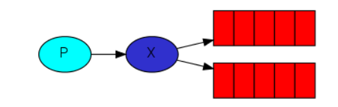

绑定：交æ¢æœºå’Œé˜Ÿåˆ—å…³è”èµ·æ¥ï¼Œä¹Ÿå¯ä»¥å«è·¯ç”±ï¼Œç®—是一个算法或转å‘ç­–ç•¥
绑定代ç ï¼š

```java
channel.queueBind(queueName, EXCHANGE_NAME, "routingkey");
```

交æ¢æœºæœ‰å¤šç§ç±»åˆ«ï¼šfanoutã€direct, topic, headers

`fanout`
扇出ã€å¹¿æ’­
特点：消æ¯ä¼šè¢«è½¬å‘到所有绑定到该交æ¢æœºçš„队列
场景：很适用äºå‘布订阅的场景。比如写日志，å¯ä»¥å¤šä¸ªç³»ç»Ÿé—´å…±äº«

示例场景：
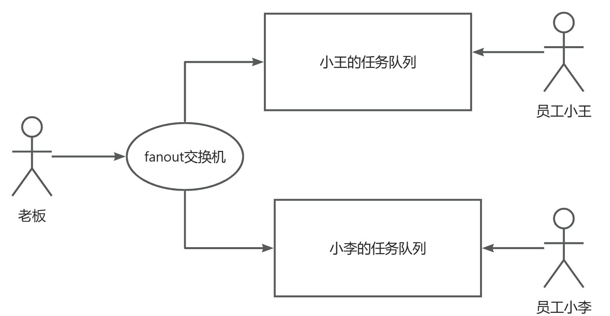


生产者代ç ï¼š

```java
public class FanoutProducer {

    private static final String EXCHANGE_NAME = "fanout-exchange";

    public static void main(String[] argv) throws Exception {
        // 创建è¿æ¥å·¥å‚
        ConnectionFactory factory = new ConnectionFactory();
        factory.setHost("localhost");
        // 建立è¿æ¥ï¼Œåˆ›å»ºé¢‘é“
        try (Connection connection = factory.newConnection();
             Channel channel = connection.createChannel()) {
            // 创建交æ¢æœº
            channel.exchangeDeclare(EXCHANGE_NAME, "fanout");
            Scanner sc = new Scanner(System.in);
            while (sc.hasNext()) {
                String message = sc.nextLine();
                // å‘交æ¢æœºå‘消æ¯
                channel.basicPublish(EXCHANGE_NAME, "", null, message.getBytes("UTF-8"));
                System.out.println(" [x] Sent '" + message + "'");
            }
        }
    }
}
```

消费者代ç ï¼š

```java
public class FanoutConsumer {
    private static final String EXCHANGE_NAME = "fanout-exchange";

    public static void main(String[] argv) throws Exception {
        // 创建è¿æ¥å·¥å‚
        ConnectionFactory factory = new ConnectionFactory();
        factory.setHost("localhost");
        // 建立è¿æ¥ï¼Œåˆ›å»ºé¢‘é“
        Connection connection = factory.newConnection();
        Channel channel1 = connection.createChannel();
        Channel channel2 = connection.createChannel();
        //创建交æ¢æœº
        channel1.exchangeDeclare(EXCHANGE_NAME, "fanout");
        // 创建队列
        String queueName1 = "å°ç‹çš„工作队列";
        String queueName2 = "å°æ的工作队列";
        channel1.queueDeclare(queueName1, true, false, false, null);
        channel2.queueDeclare(queueName2, true, false, false, null);
        //绑定交æ¢æœº
        channel1.queueBind(queueName1, EXCHANGE_NAME, "");
        channel2.queueBind(queueName2, EXCHANGE_NAME, "");

        System.out.println(" [*] Waiting for messages. To exit press CTRL+C");
        // 定义了å°ç‹å¦‚何处ç†æ¶ˆæ¯
        DeliverCallback deliverCallback1 = (consumerTag, delivery) -> {
            String message = new String(delivery.getBody(), "UTF-8");
            System.out.println(" [å°ç‹] Received '" + message + "'");
        };
        // 定义了å°æ如何处ç†æ¶ˆæ¯
        DeliverCallback deliverCallback2 = (consumerTag, delivery) -> {
            String message = new String(delivery.getBody(), "UTF-8");
            System.out.println(" [å°æ] Received '" + message + "'");
        };
        // 消费消æ¯
        channel1.basicConsume(queueName1, true, deliverCallback1, consumerTag -> {
        });
        channel2.basicConsume(queueName2, true, deliverCallback2, consumerTag -> {
        });
    }
}
```

注æ„：

1. 消费者和生产者è¦ç»‘定åŒä¸€ä¸ªäº¤æ¢æœº
2. è¦å…ˆåˆ›å»ºé˜Ÿåˆ—，æ‰èƒ½ç»‘定

效æœï¼šæ‰€æœ‰æ¶ˆè´¹è€…都能收到消æ¯

`Direct 交æ¢æœº`
官方教程：https://www.rabbitmq.com/tutorials/tutorial-four-java.html
绑定：å¯ä»¥è®©äº¤æ¢æœºå’Œé˜Ÿåˆ—进行关è”，å¯ä»¥æŒ‡å®šè®©äº¤äº’机把什么样的消æ¯å‘é€ç»™å“ªä¸ªé˜Ÿåˆ—
routingKey：路由键，æ§åˆ¶æ¶ˆæ¯è¦è½¬å‘给哪个队列（相当äºIP 地å€ï¼‰ï¼Œä¹Ÿä»£è¡¨äº†é˜Ÿåˆ—订阅的消æ¯ç±»å‹

特点：消æ¯ä¼šæ ¹æ®è·¯ç”±é”®è½¬å‘到指定的队列
场景：特定的消æ¯åªäº¤ç»™ç‰¹å®šçš„系统（程åºï¼‰æ¥å¤„ç†
绑定关系：完全匹é…字符串
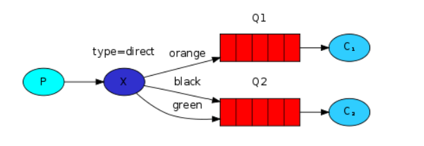

å¯ä»¥ç»‘定åŒæ ·çš„路由键。

比如å‘日志的场景，希望用独立的程åºæ¥å¤„ç†ä¸åŒçº§åˆ«çš„日志，比如 C1 ç³»ç»Ÿå¤„ç† error 日志，C2 系统处ç†å…¶ä»–级别的日志


示例场景：

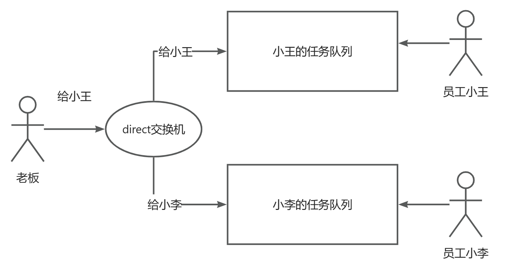

生产者代ç ï¼š

```java
public class DirectProducer {

    private static final String EXCHANGE_NAME = "direct-exchange";

    public static void main(String[] argv) throws Exception {
        // 创建è¿æ¥å·¥å‚
        ConnectionFactory factory = new ConnectionFactory();
        factory.setHost("localhost");
        // 建立è¿æ¥ï¼Œåˆ›å»ºé¢‘é“
        try (Connection connection = factory.newConnection();
             Channel channel = connection.createChannel()) {
            // 创建交æ¢æœº
            channel.exchangeDeclare(EXCHANGE_NAME, "direct");
            Scanner sc = new Scanner(System.in);
            while (sc.hasNext()) {
                String userInput = sc.nextLine();
                String[] strings = userInput.split(" ");
                if (strings.length < 1) {
                    continue;
                }
                String message = strings[0];
                // ä»è¾“å…¥è·å–路由键
                String routingKey = strings[1];
                // å‘交æ¢æœºå‘消æ¯
                channel.basicPublish(EXCHANGE_NAME, routingKey, null, message.getBytes("UTF-8"));
                System.out.println(" [x] Sent '" + message + "' with routing:" + routingKey);
            }
        }
    }
}
```

消费者代ç ï¼š

```java
public class DirectConsumer {

    private static final String EXCHANGE_NAME = "direct-exchange";

    public static void main(String[] argv) throws Exception {
        // 创建è¿æ¥å·¥å‚
        ConnectionFactory factory = new ConnectionFactory();
        factory.setHost("localhost");
        // 建立è¿æ¥ï¼Œåˆ›å»ºé¢‘é“
        Connection connection = factory.newConnection();
        Channel channel1 = connection.createChannel();
        Channel channel2 = connection.createChannel();
        // 创建交æ¢æœº
        channel1.exchangeDeclare(EXCHANGE_NAME, "direct");
        // 创建队列
        String queueName1 = "å°è½çš„工作队列";
        String queueName2 = "å°æ¨±çš„工作队列";
        channel1.queueDeclare(queueName1, true, false, false, null);
        channel2.queueDeclare(queueName2, true, false, false, null);
        // 绑定交æ¢æœºï¼ŒæŒ‡å®šè·¯ç”±é”®
        channel1.queueBind(queueName1, EXCHANGE_NAME, "xiaoluo");
        channel2.queueBind(queueName2, EXCHANGE_NAME, "xiaoying");
        System.out.println(" [*] Waiting for messages. To exit press CTRL+C");

        // 定义了å°è½å¦‚何处ç†æ¶ˆæ¯
        DeliverCallback deliverCallback1 = (consumerTag, delivery) -> {
            String message = new String(delivery.getBody(), "UTF-8");
            System.out.println(" [å°è½] Received '" +
                    delivery.getEnvelope().getRoutingKey() + "':'" + message + "'");
        };
        // 定义了å°æ¨±å¦‚何处ç†æ¶ˆæ¯
        DeliverCallback deliverCallback2 = (consumerTag, delivery) -> {
            String message = new String(delivery.getBody(), "UTF-8");
            System.out.println(" [å°æ¨±] Received '" +
                    delivery.getEnvelope().getRoutingKey() + "':'" + message + "'");
        };
        // 消费消æ¯
        channel1.basicConsume(queueName1, true, deliverCallback1, consumerTag -> {
        });
        channel2.basicConsume(queueName2, true, deliverCallback2, consumerTag -> {
        });
    }
}
```

`topic 交æ¢æœº`
官方教程：https://www.rabbitmq.com/tutorials/tutorial-five-java.html
特点：消æ¯ä¼šæ ¹æ®ä¸€ä¸ª 模糊的 路由键转å‘到指定的队列
场景：特定的一类消æ¯å¯ä»¥äº¤ç»™ç‰¹å®šçš„一类系统（程åºï¼‰æ¥å¤„ç†
绑定关系：å¯ä»¥æ¨¡ç³ŠåŒ¹é…多个绑定

- *：匹é…一个å•è¯ï¼Œæ¯”如 *.orange，那么 a.orangeã€b.orange 都能匹é…
- #ï¼šåŒ¹é… 0 个或多个å•è¯ï¼Œæ¯”如 a.#，那么 aã€a.aã€a.bã€a.a.a 都能匹é…

注æ„，这里的匹é…å’Œ MySQL çš„like çš„ % ä¸ä¸€æ ·ï¼Œåªèƒ½æŒ‰ç…§å•è¯æ¥åŒ¹é…，æ¯ä¸ª '.' 分隔å•è¯

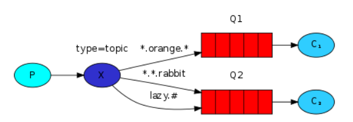

应用场景：
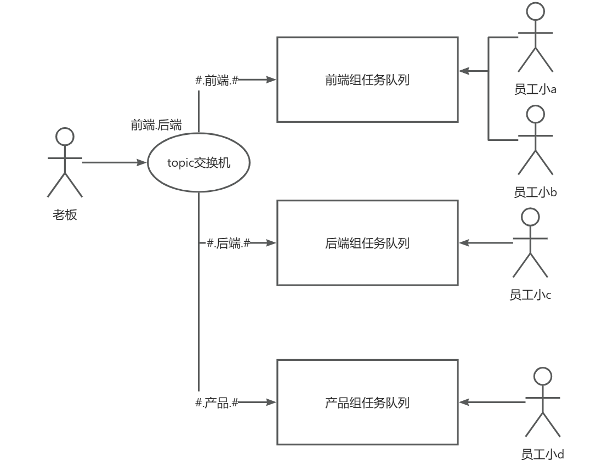

生产者代ç ï¼š

```java
public class TopicProducer {

    private static final String EXCHANGE_NAME = "topic-exchange";

    public static void main(String[] argv) throws Exception {
        // 创建è¿æ¥å·¥å‚
        ConnectionFactory factory = new ConnectionFactory();
        factory.setHost("localhost");
        // 建立è¿æ¥ï¼Œåˆ›å»ºé¢‘é“
        try (Connection connection = factory.newConnection();
             Channel channel = connection.createChannel()) {
            // 创建交æ¢æœº
            channel.exchangeDeclare(EXCHANGE_NAME, "topic");
            Scanner sc = new Scanner(System.in);
            while (sc.hasNext()) {
                String userInput = sc.nextLine();
                String[] strings = userInput.split(" ");
                if (strings.length < 1) {
                    continue;
                }
                String message = strings[0];
                // ä»è¾“å…¥è·å–路由键
                String routingKey = strings[1];
                // å‘交æ¢æœºå‘消æ¯
                channel.basicPublish(EXCHANGE_NAME, routingKey, null, message.getBytes("UTF-8"));
                System.out.println(" [x] Sent '" + message + "' with routing:" + routingKey);
            }
        }
    }
}
```

消费者代ç ï¼š

```java
public class TopicConsumer {

    private static final String EXCHANGE_NAME = "topic-exchange";

    public static void main(String[] argv) throws Exception {
        // 创建è¿æ¥å·¥å‚
        ConnectionFactory factory = new ConnectionFactory();
        factory.setHost("localhost");
        // 建立è¿æ¥ï¼Œåˆ›å»ºé¢‘é“
        Connection connection = factory.newConnection();
        Channel channel1 = connection.createChannel();
        Channel channel2 = connection.createChannel();
        Channel channel3 = connection.createChannel();
        // 创建交æ¢æœº
        channel1.exchangeDeclare(EXCHANGE_NAME, "topic");
        // 创建队列
        String queueName1 = "å‰ç«¯çš„工作队列";
        String queueName2 = "å端的工作队列";
        String queueName3 = "产å“的工作队列";
        channel1.queueDeclare(queueName1, true, false, false, null);
        channel2.queueDeclare(queueName2, true, false, false, null);
        channel3.queueDeclare(queueName3, true, false, false, null);
        // 绑定交æ¢æœºï¼ŒæŒ‡å®šè·¯ç”±é”®
        channel1.queueBind(queueName1, EXCHANGE_NAME, "#.å‰ç«¯.#");
        channel2.queueBind(queueName2, EXCHANGE_NAME, "#.å端.#");
        channel3.queueBind(queueName3, EXCHANGE_NAME, "#.产å“.#");
        System.out.println(" [*] Waiting for messages. To exit press CTRL+C");
        // 定义了å‰ç«¯å¦‚何处ç†æ¶ˆæ¯
        DeliverCallback deliverCallback1 = (consumerTag, delivery) -> {
            String message = new String(delivery.getBody(), "UTF-8");
            System.out.println(" [å‰ç«¯] Received '" +
                    delivery.getEnvelope().getRoutingKey() + "':'" + message + "'");
        };
        // 定义了å端如何处ç†æ¶ˆæ¯
        DeliverCallback deliverCallback2 = (consumerTag, delivery) -> {
            String message = new String(delivery.getBody(), "UTF-8");
            System.out.println(" [å端] Received '" +
                    delivery.getEnvelope().getRoutingKey() + "':'" + message + "'");
        };
        // 定义了产å“如何处ç†æ¶ˆæ¯
        DeliverCallback deliverCallback3 = (consumerTag, delivery) -> {
            String message = new String(delivery.getBody(), "UTF-8");
            System.out.println(" [产å“] Received '" +
                    delivery.getEnvelope().getRoutingKey() + "':'" + message + "'");
        };
        // 消费消æ¯
        channel1.basicConsume(queueName1, true, deliverCallback1, consumerTag -> {
        });
        channel2.basicConsume(queueName2, true, deliverCallback2, consumerTag -> {
        });
        channel3.basicConsume(queueName3, true, deliverCallback3, consumerTag -> {
        });
    }
}
```

`Headers 交æ¢æœº`
类似主题和直æ¥äº¤æ¢æœºï¼Œå¯ä»¥æ ¹æ® headers 中的内容æ¥æŒ‡å®šå‘é€åˆ°å“ªä¸ªé˜Ÿåˆ—
ç”±äºæ€§èƒ½å·®ã€æ¯”较å¤æ‚，一般ä¸æ¨è使用。

AI 学习è¿ç¯é—®ï¼šHeaders 交æ¢æœºæ˜¯ä»€ä¹ˆï¼Ÿæœ‰ä»€ä¹ˆç”¨ï¼Ÿä»€ä¹ˆåœºæ™¯ä¸‹ä¼šç”¨ï¼Ÿæœ‰ä»€ä¹ˆä¼˜ç¼ºç‚¹ï¼Ÿæœ‰æ²¡æœ‰ç¤ºä¾‹ä»£ç ï¼Ÿ

1. RabbitMQ中的Headers交æ¢æœºæ˜¯ä¸€ç§ç‰¹æ®Šçš„交æ¢æœºï¼Œå®ƒå…许你在å‘é€æ¶ˆæ¯æ—¶æ·»åŠ è‡ªå®šä¹‰çš„headers。Headers交æ¢æœºçš„主è¦ä½œç”¨æ˜¯æ供一ç§æ›´çµæ´»çš„消æ¯è·¯ç”±æ–¹å¼ï¼Œå®ƒå…许你根æ®æ¶ˆæ¯çš„headers字段æ¥è·¯ç”±æ¶ˆæ¯ï¼Œè€Œä¸æ˜¯ä¾èµ–传统的队列或交æ¢æœºçš„pattern匹é…。这ç§æ–¹å¼åœ¨ä¸€äº›å¤æ‚的场景下é常有用，例如消æ¯çš„过滤ã€åˆ†ç»„ã€ä¼˜å…ˆçº§å¤„ç†ç­‰ã€‚

   使用Headers交æ¢æœºçš„一个常è§åœºæ™¯æ˜¯åœ¨å¾®æœåŠ¡æ¶æ„中，当需è¦å°†æ¶ˆæ¯è·¯ç”±åˆ°ä¸åŒçš„æœåŠ¡æ—¶ã€‚通过在å‘é€æ¶ˆæ¯æ—¶æ·»åŠ headers，我们å¯ä»¥ä¼ é€’é¢å¤–çš„ä¿¡æ¯ï¼Œå¦‚æœåŠ¡çš„å称ã€ä¼˜å…ˆçº§ã€æ¶ˆæ¯çš„æ¥æºç­‰ã€‚这样，æ¯ä¸ªæœåŠ¡å¯ä»¥æ ¹æ®å…¶éœ€è¦è¯»å–和处ç†è¿™äº›headers，ä»è€Œå®ç°æ›´ç»†ç²’度的æ§åˆ¶å’Œæ›´çµæ´»çš„消æ¯è·¯ç”±ã€‚

   Headers交æ¢æœºçš„优点主è¦æœ‰ï¼š

   1. 更加çµæ´»çš„消æ¯è·¯ç”±ï¼šHeaders交æ¢æœºå…许你根æ®æ¶ˆæ¯çš„headers字段进行路由，而ä¸ä»…仅是基äºä¼ ç»Ÿçš„队列或交æ¢å™¨çš„pattern匹é…。
   2. 高级别的抽象：Headers交æ¢æœºæ供了一ç§é«˜çº§åˆ«çš„抽象，使得消æ¯çš„路由和传递更加çµæ´»å’Œæ˜“äºç®¡ç†ã€‚
   3. 适用äºå¤æ‚的业务场景：在一些å¤æ‚的业务场景下，如消æ¯è¿‡æ»¤ã€åˆ†ç»„ã€ä¼˜å…ˆçº§å¤„ç†ç­‰ï¼ŒHeaders交æ¢æœºå¯ä»¥æ供更好的支æŒã€‚

   然而，Headers交æ¢æœºä¹Ÿæœ‰ä¸€äº›ç¼ºç‚¹ï¼š

   1. 性能影å“：由äºHeaders交æ¢æœºéœ€è¦å¯¹æ¯ä¸ªæ¶ˆæ¯è¿›è¡Œé¢å¤–的处ç†ï¼ˆå¦‚解æheaders），因此å¯èƒ½ä¼šå¯¹æ€§èƒ½äº§ç”Ÿä¸€å®šçš„å½±å“。
   2. 兼容性问题：ä¸æ˜¯æ‰€æœ‰çš„消æ¯é˜Ÿåˆ—系统都支æŒHeaders交æ¢æœºã€‚在使用Headers交æ¢æœºä¹‹å‰ï¼Œä½ éœ€è¦ç¡®ä¿ä½ çš„RabbitMQæœåŠ¡å™¨å’Œå®¢æˆ·ç«¯åº“都支æŒè¿™ä¸ªç‰¹æ€§ã€‚

`RPC`
支æŒç”¨æ¶ˆæ¯é˜Ÿåˆ—æ¥æ¨¡æ‹Ÿ RPC 的调用，但是一般没必è¦ï¼Œç›´æ¥ç”¨ Dubboã€GRPC ç­‰ RPC 框æ¶å°±å¥½äº†ã€‚

å®ç°ä¸€ä¸ªåœºæ™¯æ€»æœ‰æ›´åˆé€‚çš„ã€æ›´ä¸“注的技术

##### 核心特性
###### 消æ¯è¿‡æœŸæœºåˆ¶
官方文档：https://www.rabbitmq.com/ttl.html
å¯ä»¥ç»™æ¯æ¡æ¶ˆæ¯æŒ‡å®šä¸€ä¸ªæœ‰æ•ˆæœŸï¼Œä¸€æ®µæ—¶é—´å†…未被消费者处ç†ï¼Œå°±è¿‡æœŸäº†ã€‚
ç¤ºä¾‹åœºæ™¯ï¼šæ¶ˆè´¹è€…ï¼ˆåº“å­˜ç³»ç»Ÿï¼‰æŒ‚äº†ï¼Œä¸€ä¸ªè®¢å• 15 分钟还没被库存系统处ç†ï¼Œè¿™ä¸ªè®¢å•å…¶å®å·²ç»å¤±æ•ˆäº†ï¼Œå“ªæ€•åº“存系统å†æ¢å¤ï¼Œå…¶å®ä¹Ÿä¸ç”¨æ‰£å‡åº“存。
适用场景：清ç†è¿‡æœŸæ¶ˆæ¯ã€æ¨¡æ‹Ÿå»¶è¿Ÿé˜Ÿåˆ—çš„å®ç°ï¼ˆä¸å¼€ä¼šå‘˜å°±æ…¢é€Ÿï¼‰ã€ä¸“门让æŸä¸ªç¨‹åºå¤„ç†è¿‡æœŸè¯·æ±‚

1）给队列中的所有消æ¯æŒ‡å®šè¿‡æœŸæ—¶é—´

```java
Map<String, Object> args = new HashMap<String, Object>();
args.put("x-message-ttl", 60000);
channel.queueDeclare("myqueue", false, false, false, args);
```

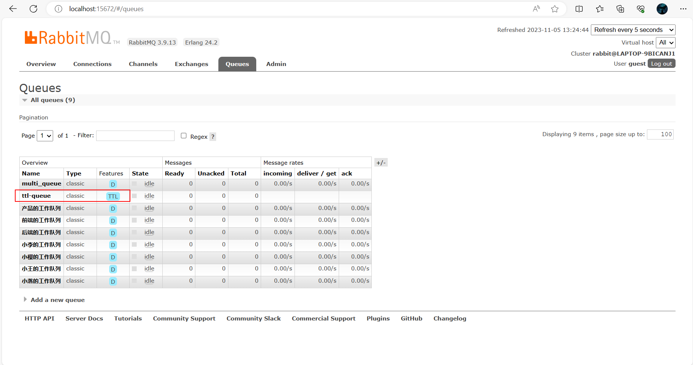
如æœåœ¨è¿‡æœŸæ—¶é—´å†…，还没有消费者æ¥æ”¶åˆ°æ¶ˆæ¯ï¼Œæ¶ˆæ¯æ‰ä¼šè¿‡æœŸã€‚
注æ„，如æœæ¶ˆæ¯å·²ç»è¢«æ¶ˆè´¹è€…æ¥æ”¶åˆ°ï¼Œä½†æ˜¯æ¶ˆè´¹è€…没确认ack，是ä¸ä¼šè¿‡æœŸçš„。
如æœæ¶ˆæ¯å¤„äºå¾…消费状æ€å¹¶ä¸”过期时间到达å，消æ¯å°†è¢«æ ‡è®°ä¸ºè¿‡æœŸã€‚但是，如æœæ¶ˆæ¯å·²ç»è¢«æ¶ˆè´¹è€…消费，并且正在处ç†è¿‡ç¨‹ä¸­ï¼Œå³ä½¿è¿‡æœŸæ—¶é—´åˆ°è¾¾ï¼Œæ¶ˆæ¯ä»ç„¶ä¼šè¢«æ­£å¸¸å¤„ç†ã€‚

生产者代ç ï¼š

```java
public class AllTTLProducer {

    private final static String QUEUE_NAME = "all-ttl-queue";

    public static void main(String[] argv) throws Exception {
        // 创建è¿æ¥å·¥å‚
        ConnectionFactory factory = new ConnectionFactory();
        factory.setHost("localhost");
        // 建立è¿æ¥ï¼Œåˆ›å»ºé¢‘é“
        try (Connection connection = factory.newConnection();
             Channel channel = connection.createChannel()) {
            // 创建消æ¯é˜Ÿåˆ—，给队列中的所有消æ¯æŒ‡å®šè¿‡æœŸæ—¶é—´
            Map<String, Object> args = new HashMap<String, Object>();
            args.put("x-message-ttl", 6000);
            channel.queueDeclare(QUEUE_NAME, false, false, false, args);
            // å‘é€æ¶ˆæ¯
            String message = "Hello World!";
            channel.basicPublish("", QUEUE_NAME, null, message.getBytes(StandardCharsets.UTF_8));
            System.out.println(" [x] Sent '" + message + "'");
        }
    }
}
```

消费者代ç ï¼š

```java
public class AllTTLConsumer {

    private final static String QUEUE_NAME = "all-ttl-queue";

    public static void main(String[] argv) throws Exception {
        // 创建è¿æ¥å·¥å‚
        ConnectionFactory factory = new ConnectionFactory();
        factory.setHost("localhost");
        // 建立è¿æ¥ï¼Œåˆ›å»ºé¢‘é“
        Connection connection = factory.newConnection();
        Channel channel = connection.createChannel();
        // 创建消æ¯é˜Ÿåˆ—，指定消æ¯è¿‡æœŸå‚æ•°
        Map<String, Object> args = new HashMap<String, Object>();
        args.put("x-message-ttl", 6000);
        channel.queueDeclare(QUEUE_NAME, false, false, false, args);
        System.out.println(" [*] Waiting for messages. To exit press CTRL+C");
        // 定义了如何处ç†æ¶ˆæ¯
        DeliverCallback deliverCallback = (consumerTag, delivery) -> {
            String message = new String(delivery.getBody(), StandardCharsets.UTF_8);
            System.out.println(" [x] Received '" + message + "'");
        };
        // 消费消æ¯ï¼Œä¼šæŒç»­é˜»å¡
        channel.basicConsume(QUEUE_NAME, false, deliverCallback, consumerTag -> {
        });
    }
}
```


2）给æŸæ¡æ¶ˆæ¯æŒ‡å®šè¿‡æœŸæ—¶é—´

语法：

```java
AMQP.BasicProperties properties = new AMQP.BasicProperties.Builder()
                                   .expiration("60000")
                                   .build();
channel.basicPublish("my-exchange", "routing-key", properties, messageBodyBytes);
```

生产者代ç ï¼š

```java
public class PerTTLProducer {

    private final static String QUEUE_NAME = "per-ttl-queue";

    public static void main(String[] argv) throws Exception {
        // 创建è¿æ¥å·¥å‚
        ConnectionFactory factory = new ConnectionFactory();
        factory.setHost("localhost");
        // 建立è¿æ¥ï¼Œåˆ›å»ºé¢‘é“
        try (Connection connection = factory.newConnection();
             Channel channel = connection.createChannel()) {
            // 创建消æ¯é˜Ÿåˆ—
            channel.queueDeclare(QUEUE_NAME, false, false, false, null);
            // å‘é€æ¶ˆæ¯
            String message = "Hello World!";
            // ç»™å•æ¡æ¶ˆæ¯æŒ‡å®šè¿‡æœŸæ—¶é—´
            AMQP.BasicProperties properties = new AMQP.BasicProperties.Builder()
                    .expiration("6000")
                    .build();
            channel.basicPublish("", QUEUE_NAME, properties, message.getBytes(StandardCharsets.UTF_8));
            System.out.println(" [x] Sent '" + message + "'");
        }
    }
}
```

消费者代ç :

```java
public class PerTTLConsumer {

    private final static String QUEUE_NAME = "per-ttl-queue";

    public static void main(String[] argv) throws Exception {
        // 创建è¿æ¥å·¥å‚
        ConnectionFactory factory = new ConnectionFactory();
        factory.setHost("localhost");
        // 建立è¿æ¥ï¼Œåˆ›å»ºé¢‘é“
        Connection connection = factory.newConnection();
        Channel channel = connection.createChannel();
        // 创建消æ¯é˜Ÿåˆ—
        channel.queueDeclare(QUEUE_NAME, false, false, false, null);
        System.out.println(" [*] Waiting for messages. To exit press CTRL+C");
        // 定义了如何处ç†æ¶ˆæ¯
        DeliverCallback deliverCallback = (consumerTag, delivery) -> {
            String message = new String(delivery.getBody(), StandardCharsets.UTF_8);
            System.out.println(" [x] Received '" + message + "'");
        };
        // 消费消æ¯ï¼Œä¼šæŒç»­é˜»å¡
        channel.basicConsume(QUEUE_NAME, false, deliverCallback, consumerTag -> {
        });
    }
}
```


###### 消æ¯ç¡®è®¤æœºåˆ¶
官方文档：https://www.rabbitmq.com/confirms.html
为了ä¿è¯æ¶ˆæ¯æˆåŠŸè¢«æ¶ˆè´¹ï¼ˆå¿«é€’æˆåŠŸè¢«å–走），rabbitmq æ供了消æ¯ç¡®è®¤æœºåˆ¶ï¼Œå½“消费者æ¥æ”¶åˆ°æ¶ˆæ¯å，比如è¦ç»™ä¸€ä¸ªå馈：

- ack：消费æˆåŠŸ
- nack：消费失败
- reject：拒ç»

如æœå‘Šè¯‰ rabbitmq æœåŠ¡å™¨æ¶ˆè´¹æˆåŠŸï¼ŒæœåŠ¡å™¨æ‰ä¼šæ”¾å¿ƒåœ°ç§»é™¤æ¶ˆæ¯ã€‚
支æŒé…ç½® autoack，会自动执行 ack 命令，æ¥æ”¶åˆ°æ¶ˆæ¯ç«‹åˆ»å°±æˆåŠŸäº†ã€‚

```java
channel.basicConsume(TASK_QUEUE_NAME, false, deliverCallback, consumerTag -> {});
```

建议 autoack 改为 false，根æ®å®é™…情况，å»æ‰‹åŠ¨ç¡®è®¤ã€‚ 
指定确认æŸæ¡æ¶ˆæ¯ï¼š
第二个å‚æ•° multiple 批é‡ç¡®è®¤ï¼šæ˜¯æŒ‡æ˜¯å¦è¦ä¸€æ¬¡æ€§ç¡®è®¤æ‰€æœ‰çš„å†å²æ¶ˆæ¯ç›´åˆ°å½“å‰è¿™æ¡

```java
 channel.basicAck(delivery.getEnvelope().getDeliveryTag(),false);
```

指定拒ç»æŸæ¡æ¶ˆæ¯ï¼š
第 3 个å‚数表示是å¦é‡æ–°å…¥é˜Ÿï¼Œå¯ç”¨äºé‡è¯•

```java
channel.basicNack(delivery.getEnvelope().getDeliveryTag(),false,false );
```

###### 死信队列
官方文档：https://www.rabbitmq.com/dlx.html
为了ä¿è¯æ¶ˆæ¯çš„å¯é æ€§ï¼Œæ¯”如让æ¯æ¡æ¶ˆæ¯éƒ½æˆåŠŸæ¶ˆè´¹ï¼Œéœ€è¦æ供一个容错机制，å³ï¼šå¤±è´¥çš„消æ¯æ€ä¹ˆå¤„ç†ï¼Ÿ
死信：过期的消æ¯ã€æ‹’收的消æ¯ã€æ¶ˆæ¯é˜Ÿåˆ—满了ã€å¤„ç†å¤±è´¥çš„消æ¯çš„统称
死信队列：专门处ç†æ­»ä¿¡çš„队列（注æ„，它就是一个普通队列，åªä¸è¿‡æ˜¯ä¸“门用æ¥å¤„ç†æ­»ä¿¡çš„，你甚至å¯ä»¥ç†è§£è¿™ä¸ªé˜Ÿåˆ—çš„åç§°å« â€œæ­»ä¿¡é˜Ÿåˆ—â€ï¼‰
死信交æ¢æœºï¼šä¸“门给死信队列转å‘消æ¯çš„交æ¢æœºï¼ˆæ³¨æ„，它就是一个普通交æ¢æœºï¼Œåªä¸è¿‡æ˜¯ä¸“门给死信队列å‘消æ¯è€Œå·²ï¼Œç†è§£ä¸ºè¿™ä¸ªäº¤æ¢æœºçš„åç§°å°±å« â€œæ­»ä¿¡äº¤æ¢æœºâ€ï¼‰ã€‚也存在路由绑定
死信å¯ä»¥é€šè¿‡æ­»ä¿¡äº¤æ¢æœºç»‘定到死信队列。

示例场景：
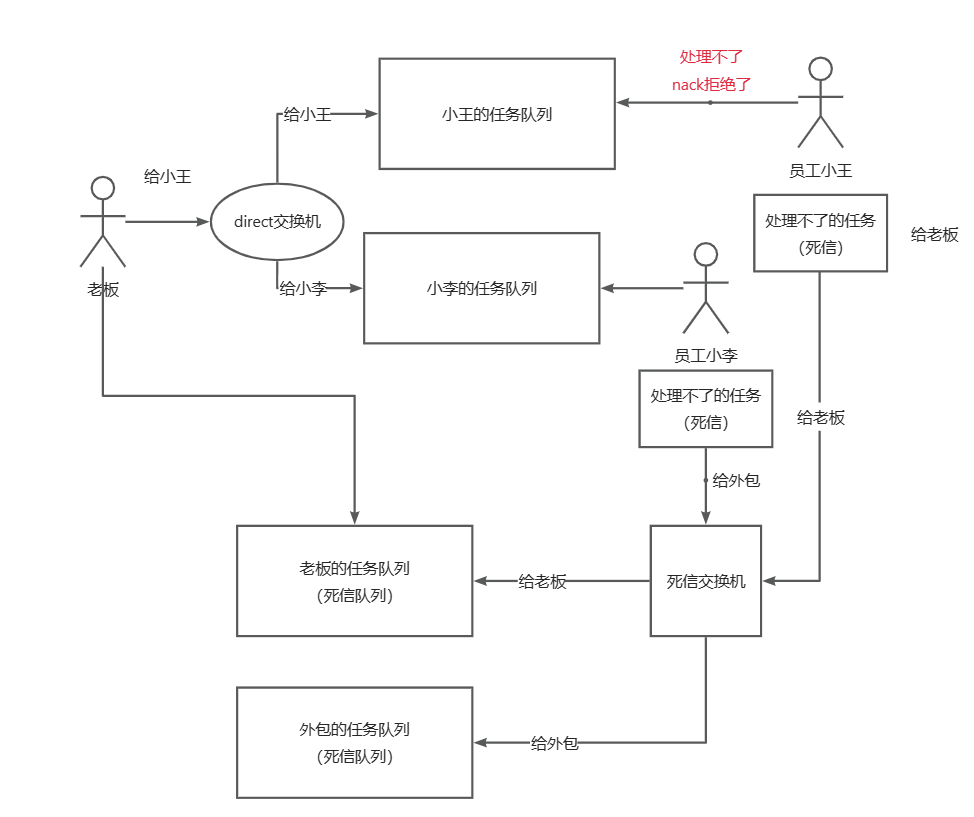

æµç¨‹ï¼š

è€æ¿æˆ–外包 ç»™ å°çŒ«æˆ–å°ç‹— å‘消æ¯ï¼Œå°çŒ«æˆ–å°ç‹— æ‹’ç»æ¶ˆæ¯ï¼Œæ¶ˆæ¯æˆä¸ºæ­»ä¿¡ï¼Œæ­»ä¿¡å›åˆ° è€æ¿æˆ–外包 的死信队列，有è€æ¿æˆ–外包å»å¤„ç†

生产者代ç ï¼š

```java
public class DlxDirectProducer {

    private static final String DEAD_EXCHANGE_NAME = "dlx-direct-exchange";
    private static final String WORK_EXCHANGE_NAME = "direct-exchange2";

    public static void main(String[] argv) throws Exception {
        // 创建è¿æ¥å·¥å‚
        ConnectionFactory factory = new ConnectionFactory();
        factory.setHost("localhost");
        // 建立è¿æ¥ï¼Œåˆ›å»ºé¢‘é“
        try (Connection connection = factory.newConnection();
             Channel channel1 = connection.createChannel();
             Channel channel2 = connection.createChannel();
        ) {
            // 创建死信交æ¢æœº
            channel1.exchangeDeclare(DEAD_EXCHANGE_NAME, "direct");
            // 创建死信队列
            String queueName1 = "è€æ¿çš„死信队列";
            String queueName2 = "外包的死信队列";
            channel1.queueDeclare(queueName1, true, false, false, null);
            channel2.queueDeclare(queueName2, true, false, false, null);
            // 绑定死信交æ¢æœºï¼ŒæŒ‡å®šè·¯ç”±é”®
            channel1.queueBind(queueName1, DEAD_EXCHANGE_NAME, "è€æ¿");
            channel2.queueBind(queueName2, DEAD_EXCHANGE_NAME, "外包");
            System.out.println(" [*] Waiting for messages. To exit press CTRL+C");
            // 定义了è€æ¿å¦‚何处ç†æ­»ä¿¡
            DeliverCallback deliverCallback1 = (consumerTag, delivery) -> {
                String message = new String(delivery.getBody(), "UTF-8");
                System.out.println(" [è€æ¿] Received 死信 '" +
                        delivery.getEnvelope().getRoutingKey() + "':'" + message + "'");
                channel1.basicAck(delivery.getEnvelope().getDeliveryTag(), false);
            };
            // 定义了外包如何处ç†æ­»ä¿¡
            DeliverCallback deliverCallback2 = (consumerTag, delivery) -> {
                String message = new String(delivery.getBody(), "UTF-8");
                System.out.println(" [外包] Received 死信 '" +
                        delivery.getEnvelope().getRoutingKey() + "':'" + message + "'");
                channel2.basicAck(delivery.getEnvelope().getDeliveryTag(), false);
            };
            // 消费消æ¯
            channel1.basicConsume(queueName1, false, deliverCallback1, consumerTag -> {
            });
            channel2.basicConsume(queueName2, false, deliverCallback2, consumerTag -> {
            });

            Scanner sc = new Scanner(System.in);
            while (sc.hasNext()) {
                String userInput = sc.nextLine();
                String[] strings = userInput.split(" ");
                if (strings.length < 1) {
                    continue;
                }
                String message = strings[0];
                // ä»è¾“å…¥è·å–路由键
                String routingKey = strings[1];
                // è€æ¿å’Œå¤–包å‘工作交æ¢æœºå‘消æ¯
                channel1.basicPublish(WORK_EXCHANGE_NAME, routingKey, null, message.getBytes("UTF-8"));
                System.out.println(" [x] Sent '" + message + "' with routing:" + routingKey);
            }
        }
    }
}
```

消费者代ç ï¼š

```java
public class DlxDirectConsumer {

    private static final String DEAD_EXCHANGE_NAME = "dlx-direct-exchange";
    private static final String WORK_EXCHANGE_NAME = "direct-exchange2";

    public static void main(String[] argv) throws Exception {
        // 创建è¿æ¥å·¥å‚
        ConnectionFactory factory = new ConnectionFactory();
        factory.setHost("localhost");
        // 建立è¿æ¥ï¼Œåˆ›å»ºé¢‘é“
        Connection connection = factory.newConnection();
        Channel channel1 = connection.createChannel();
        Channel channel2 = connection.createChannel();
        // 指定死信å‚æ•°
        Map<String, Object> args1 = new HashMap<String, Object>();
        Map<String, Object> args2= new HashMap<String, Object>();
        // 指定死信交æ¢æœº
        args1.put("x-dead-letter-exchange", DEAD_EXCHANGE_NAME);
        args2.put("x-dead-letter-exchange", DEAD_EXCHANGE_NAME);
        // 指定死信è¦è½¬å‘到哪个队列
        args1.put("x-dead-letter-routing-key", "è€æ¿");
        args2.put("x-dead-letter-routing-key", "外包");

        // 创建工作交æ¢æœº
        channel1.exchangeDeclare(WORK_EXCHANGE_NAME, "direct");
        // 创建员工队列
        String queueName1 = "å°çŒ«çš„工作队列";
        String queueName2 = "å°ç‹—的工作队列";
        channel1.queueDeclare(queueName1, true, false, false, args1);
        channel2.queueDeclare(queueName2, true, false, false, args2);
        // 绑定工作交æ¢æœºï¼ŒæŒ‡å®šè·¯ç”±é”®
        channel1.queueBind(queueName1, WORK_EXCHANGE_NAME, "å°çŒ«");
        channel2.queueBind(queueName2, WORK_EXCHANGE_NAME, "å°ç‹—");
        System.out.println(" [*] Waiting for messages. To exit press CTRL+C");

        // 定义了å°çŒ«å¦‚何处ç†æ¶ˆæ¯
        DeliverCallback deliverCallback1 = (consumerTag, delivery) -> {
            String message = new String(delivery.getBody(), "UTF-8");
            //æ‹’ç»æ¶ˆæ¯
            System.out.println(" [å°çŒ«] Received '" +
                    delivery.getEnvelope().getRoutingKey() + "':'" + message + "'");
            channel1.basicNack(delivery.getEnvelope().getDeliveryTag(),false,false);
        };
        // 定义了å°ç‹—如何处ç†æ¶ˆæ¯
        DeliverCallback deliverCallback2 = (consumerTag, delivery) -> {
            String message = new String(delivery.getBody(), "UTF-8");
            //æ‹’ç»æ¶ˆæ¯
            System.out.println(" [å°ç‹—] Received '" +
                    delivery.getEnvelope().getRoutingKey() + "':'" + message + "'");
            channel2.basicNack(delivery.getEnvelope().getDeliveryTag(),false,false);
        };
        // 消费消æ¯
        channel1.basicConsume(queueName1, false, deliverCallback1, consumerTag -> {
        });
        channel2.basicConsume(queueName2, false, deliverCallback2, consumerTag -> {
        });
    }
}
```

##### RabbitMQ é‡ç‚¹çŸ¥è¯†

也是é¢è¯•è€ƒç‚¹

1. 消æ¯é˜Ÿåˆ—的概念ã€æ¨¡å‹ã€åº”用场景
2. 交æ¢æœºçš„类别ã€è·¯ç”±ç»‘定的关系
3. 消æ¯å¯é æ€§
   1. 消æ¯ç¡®è®¤æœºåˆ¶ï¼ˆackã€nackã€reject）
   2. 消æ¯æŒä¹…化（durable）
   3. 消æ¯è¿‡æœŸæœºåˆ¶
   4. 死信队列
4. 延迟队列（类似死信队列，消æ¯åœ¨å·¥ä½œé˜Ÿåˆ—中ç¡ä¸Š5分钟，然åæ‹’ç»æ¶ˆæ¯ï¼Œæ¶ˆæ¯æˆä¸ºæ­»ä¿¡è¿›å…¥æ­»ä¿¡é˜Ÿåˆ—，然ååƒå¤„ç†æ­£å¸¸æ¶ˆæ¯ä¸€æ ·å¤„ç†æ­»ä¿¡ï¼Œå°±è¾¾åˆ°äº†å»¶è¿Ÿæ•ˆæœï¼‰
5. 顺åºæ¶ˆè´¹ã€æ¶ˆè´¹å¹‚等性（本次ä¸è®²ï¼‰
6. å¯æ‰©å±•æ€§ï¼ˆä»…作了解）
   - 集群
   - 故障的æ¢å¤æœºåˆ¶
   - é•œåƒ
7. è¿ç»´ç›‘æ§å‘Šè­¦ï¼ˆä»…作了解）

相关资æºæ¨è
https://juejin.cn/post/7225474899480526885
https://t.zsxq.com/0fq7F1WAa

#### RabbitMQ 项目å®æˆ˜

##### 选择客户端
æ€ä¹ˆåœ¨é¡¹ç›®ä¸­ä½¿ç”¨ RabbitMQ？
1ã€ä½¿ç”¨å®˜æ–¹çš„客户端。
优点：兼容性好，æ¢è¯­è¨€æˆæœ¬ä½ï¼Œæ¯”较çµæ´»ï¼ˆç±»ä¼¼JDBC）
缺点：太çµæ´»ï¼Œè¦è‡ªå·±å»å¤„ç†ä¸€äº›äº‹æƒ…。比如è¦è‡ªå·±ç»´æŠ¤ç®¡ç†é“¾æ¥ï¼Œå¾ˆéº»çƒ¦ã€‚

2ã€ä½¿ç”¨å°è£…好的客户端，比如 Spring Boot RabbitMQ Starter
优点：简å•æ˜“用，直æ¥é…置直æ¥ç”¨ï¼Œæ›´æ–¹ä¾¿åœ°å»ç®¡ç†è¿æ¥ï¼ˆç±»ä¼¼MyBatis）
缺点：å°è£…的太好了，你没学过的è¯å而ä¸çŸ¥é“æ€ä¹ˆç”¨ã€‚ä¸å¤Ÿçµæ´»ï¼Œè¢«æ¡†æ¶é™åˆ¶ã€‚

本次使用 Spring Boot RabbitMQ Starter

建议看官方文档，ä¸è¦çœ‹è¿‡æœŸåšå®¢ï¼
https://spring.io/guides/gs/messaging-rabbitmq/

##### 基础å®æˆ˜

1ã€å¼•å…¥ä¾èµ–
注æ„，使用的版本一定è¦å’Œä½ çš„ springboot 版本一致ï¼ï¼ï¼ï¼ï¼ï¼ï¼

```xml
<!-- https://mvnrepository.com/artifact/org.springframework.boot/spring-boot-starter-amqp -->
<dependency>
    <groupId>org.springframework.boot</groupId>
    <artifactId>spring-boot-starter-amqp</artifactId>
    <version>2.7.2</version>
</dependency>
```

2ã€åœ¨ yml 中引入é…ç½®

```yml
spring:
  rabbitmq:
    host: localhost
    port: 5672
    username: guest
    password: guest
```

3ã€åˆ›å»ºäº¤æ¢æœºå’Œé˜Ÿåˆ—

```java
/**
 * 用äºåˆ›å»ºæµ‹è¯•ç”¨åˆ°çš„交æ¢æœºå’Œé˜Ÿåˆ—（åªåœ¨ä¸»ç¨‹åºå¯åŠ¨å‰æ‰§è¡Œä¸€æ¬¡ï¼‰
 */
public class MQInit {
    public static void main(String[] args) throws Exception {
        // 创建è¿æ¥å·¥å‚
        ConnectionFactory factory = new ConnectionFactory();
        factory.setHost("localhost");
        // 建立è¿æ¥ï¼Œåˆ›å»ºé¢‘é“
        Connection connection = factory.newConnection();
        Channel channel = connection.createChannel();
        // 创建交æ¢æœº
        String EXCHANGE_NAME = "code-exchange";
        channel.exchangeDeclare(EXCHANGE_NAME,"direct");
        // 创建队列
        String queueName = "code-queue";
        channel.queueDeclare(queueName, true, false, false, null);
        // 绑定交æ¢æœºï¼ŒæŒ‡å®šè·¯ç”±é”®
        channel.queueBind(queueName, EXCHANGE_NAME, "code-key");
    }
}
```

4ã€ç”Ÿäº§è€…代ç 

```java
@Component
public class MyMessageProducer {
    @Resource
    private RabbitTemplate rabbitTemplate;

    public void sendMessage(String exchange,String routingKey,String messgae){
        rabbitTemplate.convertAndSend(exchange,routingKey,messgae);
    }
}
```

5ã€æ¶ˆè´¹è€…代ç 

```java
@Component
@Slf4j
public class MyMessageConsumer {
    @Resource
    private RabbitTemplate rabbitTemplate;

    //指定程åºç›‘å¬çš„消æ¯é˜Ÿåˆ—和确认机制
    @RabbitListener(queues = {"code-queue"}, ackMode = "MANUAL")
    public void receiveMessage(String message, Channel channel, @Header(AmqpHeaders.DELIVERY_TAG) long deliveryTag)
            throws IOException {
        log.info("receiveMessage message={}", message);
        channel.basicAck(deliveryTag, false);
    }
}
```

6ã€å•å…ƒæµ‹è¯•æ‰§è¡Œ

```java
@SpringBootTest
class MyMessageProducerTest {
    @Resource
    private MyMessageProducer myMessageProducer;

    /**
     * å…ˆå¯åŠ¨SpringBoot项目，å†æ‰§è¡Œè¯¥æµ‹è¯•
     */
    @Test
    void sendMessage() {
        myMessageProducer.sendMessage("code-exchange", "code-key", "你好");
    }
}
```

##### BI 项目改造
以å‰æ˜¯æŠŠä»»åŠ¡æ交到线程池，然å在线程池æ交中编写处ç†ç¨‹åºçš„代ç ï¼Œçº¿ç¨‹æ± å†…æ’队。
如æœä¸»ç¨‹åºä¸­æ–­äº†ï¼Œä»»åŠ¡å°±æ²¡äº†ï¼Œå°±ä¸¢äº†ã€‚

`改造åçš„æµç¨‹ï¼š`

1. 把任务æ交改为å‘队列å‘é€æ¶ˆæ¯
2. 写一个专门的æ¥å—消æ¯çš„程åºï¼Œå¤„ç†ä»»åŠ¡
3. 如æœç¨‹åºä¸­æ–­äº†ï¼Œæ¶ˆæ¯æœªè¢«ç¡®è®¤ï¼Œè¿˜ä¼šé‡å‘
4. ç°åœ¨ï¼Œæ¶ˆæ¯å…¨éƒ¨é›†ä¸­å‘到消æ¯é˜Ÿåˆ—，你å¯ä»¥éƒ¨ç½²å¤šä¸ªå端，都ä»åŒä¸€ä¸ªåœ°æ–¹å–任务，ä»è€Œå®ç°äº†åˆ†å¸ƒå¼è´Ÿè½½å‡è¡¡

`å®ç°æ­¥éª¤`
1）创建交æ¢æœºå’Œé˜Ÿåˆ—
2）将线程池中的执行代ç ç§»åˆ°æ¶ˆè´¹è€…类中
3）根æ®æ¶ˆè´¹è€…的需求æ¥ç¡®è®¤æ¶ˆæ¯çš„æ ¼å¼ï¼ˆchartId）
4）将æ交线程池改造为å‘é€æ¶ˆæ¯åˆ°é˜Ÿåˆ—

```java
public class BIMQConstant {
    public static final String BI_EXCHANGE_NAME = "bi-exchange";

    public static final String BI_QUEUE_NAME = "bi-queue";

    public static final String BI_ROUTING_KEY = "bi-key";
}
```

```java
/**
 * 用äºåˆ›å»ºæµ‹è¯•ç”¨åˆ°çš„交æ¢æœºå’Œé˜Ÿåˆ—（åªåœ¨ä¸»ç¨‹åºå¯åŠ¨å‰æ‰§è¡Œä¸€æ¬¡ï¼‰
 */
public class BIMQInit {
    public static void main(String[] args) throws Exception {
        // 创建è¿æ¥å·¥å‚
        ConnectionFactory factory = new ConnectionFactory();
        factory.setHost("localhost");
        // 建立è¿æ¥ï¼Œåˆ›å»ºé¢‘é“
        Connection connection = factory.newConnection();
        Channel channel = connection.createChannel();
        // 创建交æ¢æœº
        String EXCHANGE_NAME = BIMQConstant.BI_EXCHANGE_NAME;
        channel.exchangeDeclare(EXCHANGE_NAME,"direct");
        // 创建队列
        String queueName = BIMQConstant.BI_QUEUE_NAME;
        channel.queueDeclare(queueName, true, false, false, null);
        // 绑定交æ¢æœºï¼ŒæŒ‡å®šè·¯ç”±é”®
        channel.queueBind(queueName, EXCHANGE_NAME, BIMQConstant.BI_ROUTING_KEY);
    }
}
```

```java
@Component
public class BIMessageProducer {
    @Resource
    private RabbitTemplate rabbitTemplate;

    /**
     * å‘é€æ¶ˆæ¯
     * @param messgae
     */
    public void sendMessage(String messgae){
        rabbitTemplate.convertAndSend(BIMQConstant.BI_EXCHANGE_NAME,BIMQConstant.BI_ROUTING_KEY,messgae);
    }
}
```

```java
@Component
@Slf4j
public class BIMessageConsumer {

    @Resource
    private ChartService chartService;

    @Resource
    private AIManager aiManager;

    //指定程åºç›‘å¬çš„消æ¯é˜Ÿåˆ—和确认机制
    @RabbitListener(queues = {BIMQConstant.BI_QUEUE_NAME}, ackMode = "MANUAL")
    public void receiveMessage(String message, Channel channel, @Header(AmqpHeaders.DELIVERY_TAG) long deliveryTag)
            throws IOException {
        if (StringUtils.isBlank(message)){
            channel.basicNack(deliveryTag,false,false);
            throw new BusinessException(ErrorCode.SYSTEM_ERROR,"消æ¯ä¸ºç©º");

        }
        long chartId = Long.parseLong(message);
        Chart chart = chartService.getById(chartId);
        if (chart==null){
            channel.basicNack(deliveryTag,false,false);
            throw new BusinessException(ErrorCode.SYSTEM_ERROR,"消æ¯ä¸ºç©º");
        }
        //先修改图表的任务状æ€ä¸ºâ€œæ‰§è¡Œä¸­â€ï¼›ç­‰æ‰§è¡ŒæˆåŠŸå，修改为“已完æˆâ€ï¼Œä¿å­˜æ‰§è¡Œç»“æœï¼›æ‰§è¡Œå¤±è´¥å，修改为失败，记录失败信æ¯
        //修改任务状æ€ä¸ºæ‰§è¡Œä¸­ï¼Œå‡å°‘é‡å¤æ‰§è¡Œçš„é£é™©ã€åŒæ—¶è®©ç”¨æˆ·çŸ¥æ™“执行状æ€
        Chart updateChart = new Chart();
        updateChart.setId(chart.getId());
        updateChart.setStatus("running");
        boolean result = chartService.updateById(updateChart);
        if (!result) {
            channel.basicNack(deliveryTag,false,false);
            handleChartUpdateError(chart.getId(), "更新图表执行中状æ€å¤±è´¥");
            return;
        }
        // 调用鱼èªæ˜SDK，得到å“应

        String answer = aiManager.doChat(CommonConstant.BI_MODEL_ID, buildUserInput(chart));
        // ä»AIå“应结æœä¸­ï¼Œå–出需è¦çš„æ•°æ®
        String[] splits = answer.split("ã€ã€ã€ã€ã€");
        if (splits.length < 3) {
            channel.basicNack(deliveryTag,false,false);
            handleChartUpdateError(chart.getId(), "AI生æˆé”™è¯¯");
            return;
        }
        String genChart = splits[1].trim();
        String genSummary = splits[2].trim();
        //执行æˆåŠŸ
        Chart updateChartResult = new Chart();
        updateChartResult.setId(chart.getId());
        //todo 建议定义状æ€ä¸ºæšä¸¾å€¼
        updateChartResult.setStatus("succeeded");
        updateChartResult.setGenChart(genChart);
        updateChartResult.setGenSummary(genSummary);
        result = chartService.updateById(updateChartResult);
        if (!result) {
            channel.basicNack(deliveryTag,false,false);
            handleChartUpdateError(chart.getId(), "更新图表已完æˆçŠ¶æ€å¤±è´¥");
            return;
        }
        //确认消æ¯
        channel.basicAck(deliveryTag, false);
    }

    private void handleChartUpdateError(long chartId, String execMessage) {
        Chart updateChart = new Chart();
        updateChart.setId(chartId);
        updateChart.setStatus("failed");
        updateChart.setExecMessage(execMessage);
        boolean result = chartService.updateById(updateChart);
        if (!result) {
            log.error("更新图表失败状æ€å¤±è´¥ï¼Œ" + chartId + "，" + execMessage);
        }
    }
    /**
     * æ„造用户请求
     * @param chart
     * @return
     */	
    private String buildUserInput(Chart chart) {
        String goal = chart.getGoal();
        String data = chart.getRawData();
        // æ„造用户请求（分æ目标，图表å称，图表类å‹ï¼Œcsvæ•°æ®ï¼‰
        StringBuilder userInput = new StringBuilder();
        userInput.append("分æ需求：").append("\n");
        userInput.append(goal).append("\n");
        userInput.append("åŸå§‹æ•°æ®ï¼š").append("\n");
        userInput.append(data).append("\n");
        return userInput.toString();
    }
}
```

```java
/**
 * 智能分æ（异步&消æ¯é˜Ÿåˆ—）
 *
 * @param multipartFile
 * @param genChartRequest
 * @param request
 * @return
 */
@PostMapping("/gen")
public BaseResponse<BIResponse> genChartByAI(@RequestPart("file") MultipartFile multipartFile,
                                             GenChartRequest genChartRequest, HttpServletRequest request) {
    String goal = genChartRequest.getGoal();
    String chartType = genChartRequest.getChartType();
    String chartName = genChartRequest.getChartName();
    // 拼æ¥åˆ†æ目标
    if (StringUtils.isNotBlank(chartType)) {
        goal = goal + "，请使用" + chartType;
    }
    // 校验å‚æ•°
    ThrowUtils.throwIf(StringUtils.isBlank(goal), ErrorCode.PARAMS_ERROR, "分æ目标为空");
    ThrowUtils.throwIf(StringUtils.isNotBlank(chartName) && chartName.length() > 128, ErrorCode.PARAMS_ERROR, "图表å称过长");
    // 校验文件
    long size = multipartFile.getSize();
    String originalFilename = multipartFile.getOriginalFilename();
    // 校验文件大å°
    final long ONE_MB = 1024 * 1024L;
    ThrowUtils.throwIf(size > ONE_MB, ErrorCode.PARAMS_ERROR, "文件大å°è¶…过 1M");
    // 校验文件åç¼€
    String suffix = FileUtil.getSuffix(originalFilename);
    final List<String> validFileSuffix = Arrays.asList("xlsx");
    ThrowUtils.throwIf(!validFileSuffix.contains(suffix), ErrorCode.PARAMS_ERROR, "文件åç¼€ä¸ç¬¦åˆè¦æ±‚");
    // è·å–登录用户
    User loginUser = userService.getLoginUser(request);
    // é™æµ,æ¯ä¸ªç”¨æˆ·ä¸€ä¸ªé™æµå™¨
    redisLimiterManager.doRateLimit("genChartByAI_" + loginUser.getId().toString());
    // å‹ç¼©åŸå§‹æ•°æ®
    String data = ExcelUtils.excelToCsv(multipartFile);
    // æ’入数æ®åº“
    Chart chart = new Chart();
    chart.setGoal(goal);
    chart.setRawData(data);
    chart.setChartType(chartType);
    chart.setChartName(chartName);
    chart.setUserId(loginUser.getId());
    chart.setStatus("wait");
    boolean save = chartService.save(chart);
    ThrowUtils.throwIf(!save, ErrorCode.SYSTEM_ERROR, "图表ä¿å­˜å¤±è´¥");
    // todo 处ç†ä»»åŠ¡é˜Ÿåˆ—满了å，抛异常的情况
    // å‘é€æ¶ˆæ¯ï¼ˆå›¾è¡¨id）,主è¦æ˜¯æ³¨æ„到调用ai需è¦çš„æ•°æ®éƒ½ä¿å­˜åˆ°å›¾è¡¨æ•°æ®åº“了
    biMessageProducer.sendMessage(String.valueOf(chart.getId()));
    // è¿”å›ç»™å‰ç«¯
    BIResponse biResponse = new BIResponse();
    biResponse.setChartId(chart.getId());
    return ResultUtils.success(biResponse);
}
```

`验è¯`
验è¯å‘ç°ï¼Œå¦‚æœç¨‹åºä¸­æ–­äº†ï¼Œæ²¡æœ‰ ackã€ä¹Ÿæ²¡æœ‰ nack（æœåŠ¡ä¸­æ–­ï¼Œæ²¡æœ‰ä»»ä½•å“应），那么这æ¡æ¶ˆæ¯ä¼šè¢«é‡æ–°æ”¾åˆ°æ¶ˆæ¯é˜Ÿåˆ—中，ä»è€Œå®ç°äº†æ¯ä¸ªä»»åŠ¡éƒ½ä¼šæ‰§è¡Œã€‚

`展示`

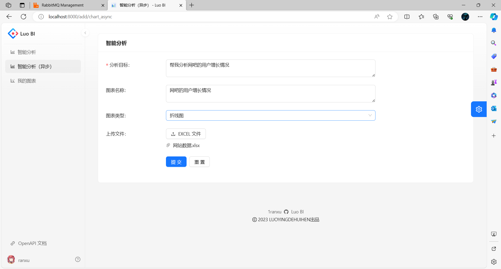

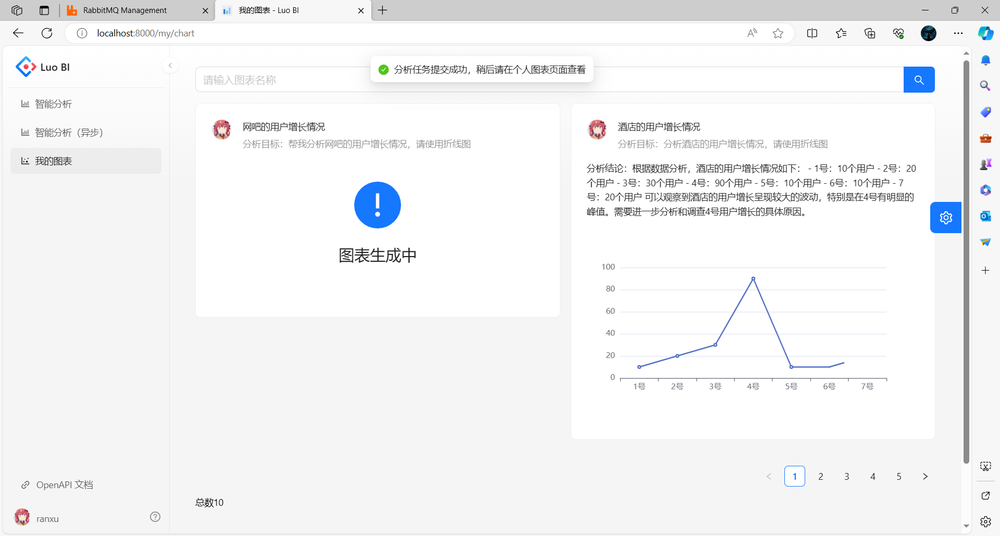

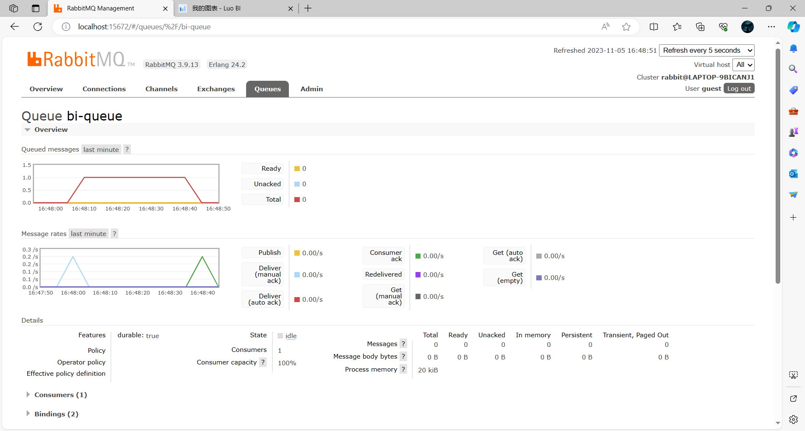

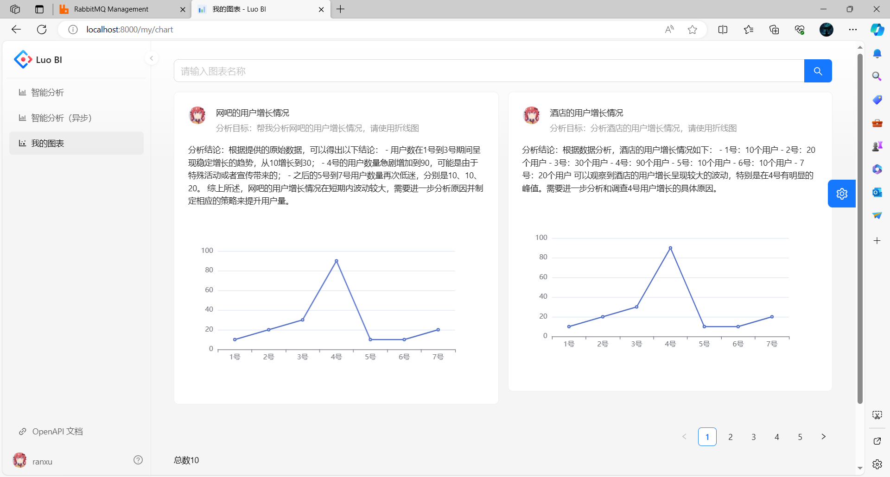

##### 项目扩展

优化点

1. 给任务的执行å¢åŠ  guava Retrying é‡è¯•æœºåˆ¶ï¼Œä¿è¯ç³»ç»Ÿå¯é æ€§ã€‚
2. æå‰è€ƒè™‘到 AI 生æˆé”™è¯¯çš„情况，在å端进行异常处ç†ï¼ˆæ¯”如 AI 说了多余的è¯ï¼Œæå–正确的字符串）
3. 如æœè¯´ä»»åŠ¡æ ¹æœ¬æ²¡æ交到队列中（或者队列满了），是ä¸æ˜¯å¯ä»¥ç”¨å®šæ—¶ä»»åŠ¡æŠŠå¤±è´¥çŠ¶æ€çš„图表放到队列中（补å¿ï¼‰
4. 建议给任务的执行å¢åŠ ä¸€ä¸ªè¶…时时间，超时自动标记为失败（超时æ§åˆ¶ï¼‰
5. åå‘å‹åŠ›ï¼šhttps://zhuanlan.zhihu.com/p/404993753，通过调用的æœåŠ¡çŠ¶æ€æ¥é€‰æ‹©å½“å‰ç³»ç»Ÿçš„ç­–ç•¥ï¼ˆæ¯”å¦‚æ ¹æ® AI æœåŠ¡çš„当å‰ä»»åŠ¡é˜Ÿåˆ—æ•°æ¥æ§åˆ¶å’±ä»¬ç³»ç»Ÿçš„核心线程数），ä»è€Œæœ€å¤§åŒ–利用系统资æºã€‚
6. 我的图表页é¢å¢åŠ ä¸€ä¸ªåˆ·æ–°ã€å®šæ—¶è‡ªåŠ¨åˆ·æ–°çš„按钮，ä¿è¯è·å–到图表的最新状æ€ï¼ˆå‰ç«¯è½®è¯¢ï¼‰
7. 任务执行æˆåŠŸæˆ–失败，给用户å‘é€å®æ—¶æ¶ˆæ¯é€šçŸ¥ï¼ˆå®æ—¶ï¼šwebsocketã€server side event）

更多优化点

1. 支æŒç”¨æˆ·æŸ¥çœ‹å›¾è¡¨åŸå§‹æ•°æ®
2. 图表数æ®åˆ†è¡¨å­˜å‚¨ï¼Œæ高查询çµæ´»æ€§å’Œæ€§èƒ½
3. 支æŒåˆ†ç»„（分标签）查看和检索图表
4. å¢åŠ æ›´å¤šå¯é€‰å‚æ•°æ¥æ§åˆ¶å›¾è¡¨çš„生æˆï¼Œæ¯”如图表é…色等
5. 支æŒç”¨æˆ·å¯¹å¤±è´¥çš„图表进行手动é‡è¯•
6. é™åˆ¶ç”¨æˆ·åŒæ—¶ç”Ÿæˆå›¾è¡¨çš„æ•°é‡ï¼Œé˜²æ­¢å•ç”¨æˆ·æŠ¢å ç³»ç»Ÿèµ„æº
7. 统计用户生æˆå›¾è¡¨çš„次数，甚至å¯ä»¥æ·»åŠ ç§¯åˆ†ç³»ç»Ÿï¼Œæ¶ˆè€—积分æ¥æ™ºèƒ½åˆ†æ
8. 支æŒç¼–辑生æˆå的图表的信æ¯ã€‚比如å¯ä»¥ä½¿ç”¨ä»£ç ç¼–辑器æ¥ç¼–辑 Echarts 图表é…置代ç 
9. ç”±äºå›¾è¡¨æ•°æ®æ˜¯é™æ€çš„，很适åˆä½¿ç”¨ç¼“å­˜æ¥æ高加载速度。
10. 使用死信队列æ¥å¤„ç†å¼‚常情况，将图表生æˆä»»åŠ¡ç½®ä¸ºå¤±è´¥
11. 补充传统 BI 拥有的功能，把智能分æ作为其中一个å­æ¨¡å—。


## å‰ç«¯

### 自动生æˆå端调用代ç 


### 修改requestErrorConfig


### 登录注册页é¢

#### 登录页é¢

1. **修改页é¢**


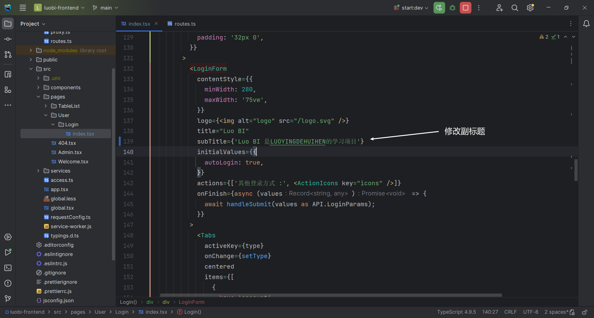


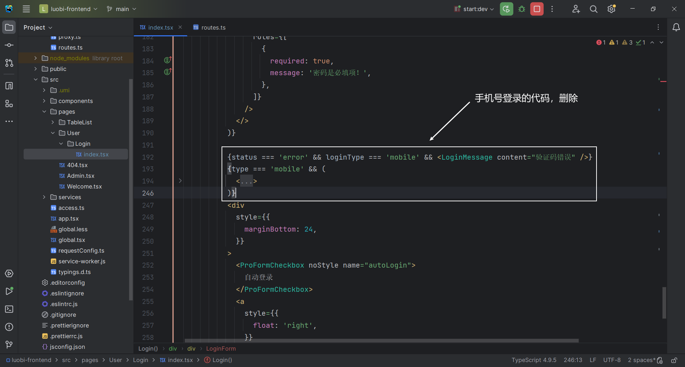


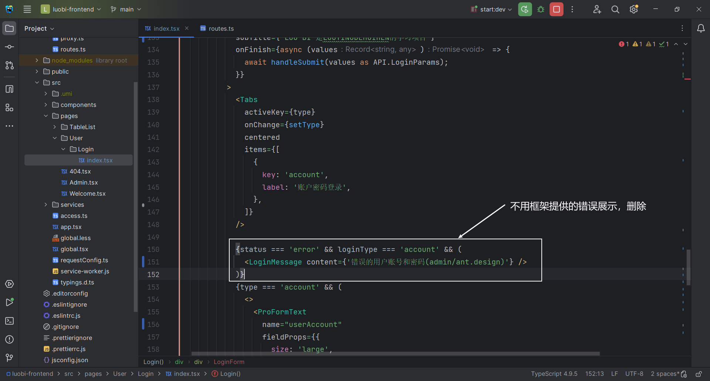


2. **å‘å端å‘起登录请求**


[在ant-design中如何利用代ç è‡ªåŠ¨åˆ·æ–°å½“å‰é¡µé¢_antd pro中页é¢åˆ·æ–°çš„api-CSDNåšå®¢](https://blog.csdn.net/qq_40372395/article/details/80893453)


3. **修改app.tsx文件**

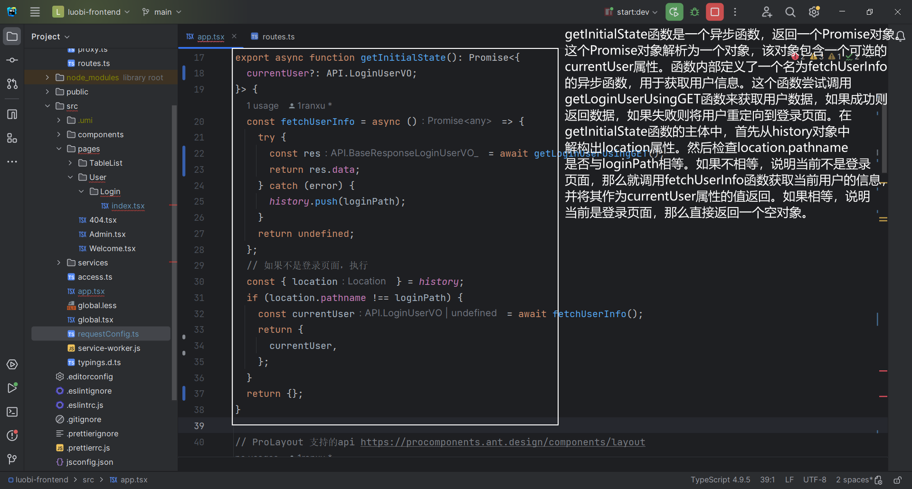


#### 注册页é¢

å¤åˆ¶ç™»é™†é¡µé¢ä¿®æ”¹ï¼Œå†æ·»åŠ æ³¨å†Œé¡µé¢çš„路由


#### 退出登录


### 智能图表分æ页é¢

1. 用户输入
   1. 分æ目标
   2. 上传åŸå§‹æ•°æ®ï¼ˆexcel）
   3. 更精细化的æ§åˆ¶å›¾è¡¨ï¼šæ¯”如图表类å‹ï¼Œå›¾è¡¨å称等
2. 展示
   1. 展示ä»å端è·å¾—的图表和结论

**1ã€è‡ªåŠ¨ç”Ÿæˆå端调用代ç **

**2ã€åˆ›å»ºé¡µé¢**


**3ã€æ·»åŠ è·¯ç”±**


**4ã€ç”¨æˆ·è¾“å…¥**

1. 选择组件


2. 引入组件


**4ã€å›¾è¡¨å±•ç¤º** https://github.com/hustcc/echarts-for-react  https://git.hust.cc/echarts-for-react/


### 个人图表页é¢

**1.创建页é¢**


**2ã€æ·»åŠ è·¯ç”±**


**3ã€è·å–æ•°æ®ï¼Œå®šä¹‰ state å˜é‡æ¥å­˜å‚¨æ•°æ®ï¼Œç”¨äºç»™é¡µé¢å±•ç¤º**


**4ã€é€‰æ‹©ç»„件**


**5ã€å¼•å…¥ç»„件**


**6ã€æ·»åŠ åˆ†é¡µ**


**7ã€æ·»åŠ æœç´¢æ¡†**


**8ã€è®¾ç½®loading**


**9ã€åŸå­åŒ–æ ·å¼**


**10ã€å±•ç¤º**


**11ã€æ‰©å±•ç‚¹**

支æŒç”¨æˆ·æŸ¥çœ‹åŸå§‹æ•°æ®

支æŒè·³è½¬åˆ°i图表编辑页，å»ç¼–辑图表

**12ã€ä¿®æ”¹é¡µé¢ï¼Œè¡¥å……错误处ç†**


### 智能图表异步分æ页é¢

**添加路由**


**创建页é¢**


**修改页é¢**


## Ant Design Pro踩å‘

1. 页é¢å¦‚æœä¸€ç›´åŠ è½½ï¼Œåˆ æ‰no de_modules，é‡æ–°å®‰è£…ä¾èµ–

2. nodejs版本建议16

3. æƒé™ä¸å¤Ÿå°±åˆ‡ç®¡ç†å‘˜

4. æ交代ç 

   ```
   git commit --no-verify -m 'your message'
   ```


## Windows命令

```sh
#查看Windows Hyper-V 虚拟化平å°å ç”¨äº†å“ªäº›èŒƒå›´å†…的端å£
netsh interface ipv4 show excludedportrange protocol=tcp
```


