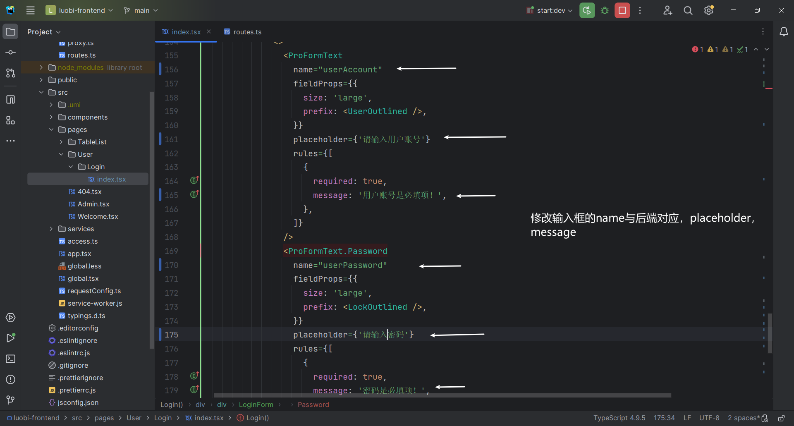
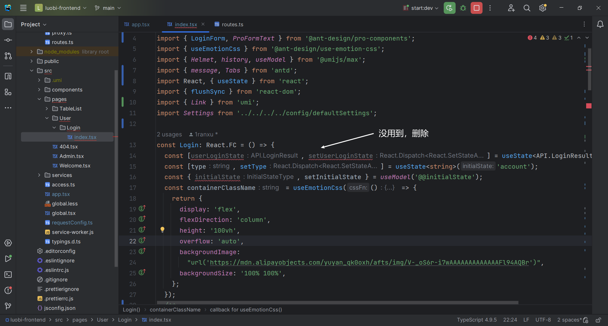
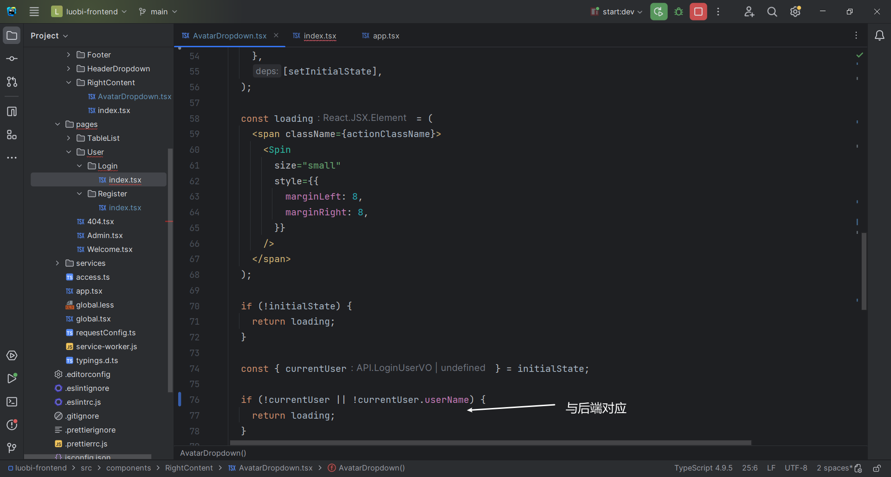

# LuoBI

## 项目介绍

**BI（商业智能）：**数据可视化，报表可视化系统

**主流BI：**

- 帆软BI https://www.finebi.com
- 小马BI https://bi.zhls.qq.com
- PowerBI https://powerbi.microsoft.com/zh-cn 

**传统BI：**

https://chartcube.alipay.com

1. 需要人工上传数据
2. 需要人工选择数据的行和列进行分析（数据分析师）
3. 需要人工选择图表类型（数据分析师）
4. 生成图表（保存配置）

**智能BI平台：**

1. 用户（数据分析者）只需要导入原始数据，输入想要分析的目标（比如”帮我分析以下网站的用户增长趋势“），就能利用AI自动生成一个符合要求的图表以及结论
2. 不会数据分析的用户，也能通过输入目标快速完成数据分析，大幅节约人力成本

## 需求分析

1. 智能分析：用户输入目标，原始数据和其他参数（如图表类型），可以自动生成图表和结论
2. 图表管理
3. 图表生成的异步化（消息队列 ）
4. 对接 AI 

## 架构图


## 技术选择

**前端：**

- React
- Ant Design Pro
- Umi
- ECharts 可视化开发库
- umi openapi 代码生成（自动生成后端调用代码）

**后端：**

- Spring Boot（万用 Java 后端项目模板）
- MySQL
- MyBatis Plus
- RabbitMQ
- AI 能力（Open AI 接口开发/ 使用现成的 AI 接口）
- EasyExcel（Excel 的上传和数据的解析）
- Swagger + Knife4j
- Hutool

## 计划

**初始化**

- 前端
- 后端

**后端**

- 数据库表设计
- 自动生成增删改查代码
- 图表管理
- 智能图表分析
- 系统优化

**前端**

- 自动生成后端调用代码
- 修改requestErrorConfig

- 登录注册页面
- 智能图表分析页面
- 个人图表页面

## 初始化

### 前端

#### 初始化

https://pro.ant.design/

1. 创建项目

```sh
# 使用 npm，
npm i @ant-design/pro-cli -g
pro create luobi-frontend
```


2. 安装依赖

```
yarn
```


3. 去除国际化


[🐛 [BUG\] 执行删除国际化命令报错 · Issue #10452 · ant-design/ant-design-pro (github.com)](https://github.com/ant-design/ant-design-pro/issues/10452)


```sh
yarn add eslint-config-prettier --dev yarn add eslint-plugin-unicorn --dev 
```


再次执行去除国际化就能成功了


#### 结构介绍

- .husky：提交代码时，检查是否规范
- config
  - config.ts：核心配置文件
  - defaultSettings.ts：主页页面的排版和颜色等设置
  - openapi.json：只是示例数据，无用可删除
  - proxy.ts：代理
  - routes.ts：路由
- mock：模拟数据，无用可删除
- public
  - icons：图标logo，无用可删除
  - scripts：不知道
  - CNAME：不用管
  - favicon.ico：网站左上角小图标 https://www.iconfont.cn
  - logo.svg：替换成自己的logohttps://www.iconfont.cn
  - pro_icon.svg：无用删除
- src
  - .umi：带点的是隐藏文件，框架自动生成的，不用管
  - components：需要开发的组件
  - locales：国际化，无用可删除
  - pages：需要开发的页面
    - User
      - Login
        - __snapshots__：多余可删除
        - login.test.tsx：多余可删除
    - TableList：暂时未用到，删除
  - services
    - ant-design-pro：有很多框架自定义的函数和类型，不用删，可能会引起连锁效应
    - luobi：我们自己使用openapi生成的函数和类型
    - swagger：无用可删除
  - access.ts：控制页面访问
  - app.tsx：整个框架的入口文件
  - global.less：全局样式
  - global.tsx：全局的js文件，不要删改
  - manifest.json：开发app或H5网页时指定的配置：比如声明项目的名称，图标的尺寸，打包时用。可删
  - requestErrorConfig：前端发请求的一些配置，比如请求响应拦截器，请求前缀
  - service-workers.js：为了优化离线H5页面的体验
  - typings.d.ts：不知道，不能删
- tests：测试文件，无用可删除
- types：无用可删除
- .editorconfig、.eslintrc.js、.prettierrc.js：用来保证前端代码规范
- jest.config.ts：单元测试框架，不用UI测试可删除
- jsconfig.json：控制代码语法
- README.md：项目的介绍文档

#### 替换logo

**favicon.ico：**网站左上角小图标 https://www.iconfont.cn


png 转favicon https://www.gaituba.com/favicon


**logo.svg：**替换成自己的logohttps://www.iconfont.cn


#### prettier美化配置


#### 替换网站标题

全局替换 Ant Design Pro 和 Ant Design


#### 替换底部的版权信息

直接搜索底部关键字，去对应文件修改


### 后端

1. 使用后端项目模板

复制模板，修改目录名为项目名

2. 连接数据库

   

3. 修改数据库名


4. 修改项目名


5. 开启分布式session


6. 修改端口


7. 启动并访问接口文档


## 后端

### 数据库表设计

**用户表：**

```sql
create table if not exists user
(
    id           bigint auto_increment comment 'id' primary key,
    userAccount  varchar(256)                           not null comment '账号',
    userPassword varchar(512)                           not null comment '密码',
    userName     varchar(256)                           null comment '用户昵称',
    userAvatar   varchar(1024)                          null comment '用户头像',
    userProfile  varchar(512)                           null comment '用户简介',
    userRole     varchar(256) default 'user'            not null comment '用户角色：user/admin/ban',
    gender       tinyint                                null comment '性别',
    createTime   datetime     default CURRENT_TIMESTAMP not null comment '创建时间',
    updateTime   datetime     default CURRENT_TIMESTAMP not null on update CURRENT_TIMESTAMP comment '更新时间',
    isDelete     tinyint      default 0                 not null comment '是否删除',
    index idx_userAccount (userAccount)
) comment '用户' collate = utf8mb4_unicode_ci;
```

**图表信息表：**

```sql
create table if not exists chart
(
    id          bigint auto_increment comment 'id' primary key,
    goal        text                                   null comment '分析目标',
    rawData     text                                   null comment '原始数据',
    chartType   varchar(128)                           null comment '图表类型',
    chartName   varchar(128)                           null comment '图表名称',
    genChart    text                                   null comment 'AI生成的图表数据',
    genSummary  text                                   null comment 'AI生成的分析总结',
    userId      bigint                                 null comment '创建人id',
    status      varchar(128) default 'wait'            not null comment 'wait,succeeded,failed,running',
    execMessage text                                   null comment '执行信息',
    createTime  datetime     default CURRENT_TIMESTAMP not null comment '创建时间',
    updateTime  datetime     default CURRENT_TIMESTAMP not null on update CURRENT_TIMESTAMP comment '更新时间',
    isDelete    tinyint      default 0                 not null comment '是否删除'
) comment '图表信息' collate = utf8mb4_unicode_ci;
```

### 自动生成增删改查代码


1. 生成的UserService和UserServiceImpl不用替换原来的

2. 修改字段的注解

   

   

   

   

3. 删掉UserService和UserServiceImpl和UserController中用不到的方法

   

   

   

4. 删掉微信公众号开发包

   

5. 删掉WxMPController

   

### 图表管理

1. 复制PostController修改成ChartController

   

   

     

2. 创建关于Chart的DTO类

   

3. 剪裁ChartController并为ChartService提供getQueryWrapper方法

   ```java
   /**
    * @author 落樱的悔恨
    * @description 针对表【chart(图表信息表)】的数据库操作Service实现
    * @createDate 2023-10-31 14:16:29
    */
   @Service
   public class ChartServiceImpl extends ServiceImpl<ChartMapper, Chart>
           implements ChartService {
   
       /**
        * 获取查询包装类
        *
        * @param chartQueryRequest
        * @return
        */
       @Override
       public QueryWrapper<Chart> getQueryWrapper(ChartQueryRequest chartQueryRequest) {
           QueryWrapper<Chart> queryWrapper = new QueryWrapper<>();
           if (chartQueryRequest == null) {
               return queryWrapper;
           }
           Long id = chartQueryRequest.getId();
           Long userId = chartQueryRequest.getUserId();
           String goal = chartQueryRequest.getGoal();
           String chartType = chartQueryRequest.getChartType();
           String chartName = chartQueryRequest.getChartName();
           String sortField = chartQueryRequest.getSortField();
           String sortOrder = chartQueryRequest.getSortOrder();
           // 拼接查询条件
           queryWrapper.eq(id != null && id > 0, "id", id);
           queryWrapper.eq(ObjectUtils.isNotEmpty(userId), "userId", userId);
           queryWrapper.like(StringUtils.isNotBlank(goal), "goal", goal);
           queryWrapper.like(StringUtils.isNotBlank(chartType), "chartType", chartType);
           queryWrapper.like(StringUtils.isNotBlank(chartName), "chartName", chartName);
           queryWrapper.eq("isDelete", false);
           queryWrapper.orderBy(SqlUtils.validSortField(sortField), sortOrder.equals(CommonConstant.SORT_ORDER_ASC),
                   sortField);
           return queryWrapper;
       }
   }
   ```


### 智能图表分析

#### **AI调用的几种方式**

**1、直接调用 OpenAI 或者其他 AI 原始大模型官网的接口**

官方文档：https://platform.openai.com/docs/api-reference

优点：不经封装，最灵活，最原始

缺点：要钱

使用方式：

1）在请求头中指定OPENAI_API_KEY

```
Authorization: Bearer OPENAI_API_KEY
```

2）找到要使用的接口 https://platform.openai.com/docs/api-reference/chat/create

3）按照接口文档的示例，构造 HTTP 请求

```
curl https://api.openai.com/v1/chat/completions \
  -H "Content-Type: application/json" \
  -H "Authorization: Bearer $OPENAI_API_KEY" \
  -d '{
    "model": "gpt-3.5-turbo",
    "messages": [
      {
        "role": "system",
        "content": "You are a helpful assistant."
      },
      {
        "role": "user",
        "content": "Hello!"
      }
    ]
  }'

```

```java
import cn.hutool.http.HttpRequest;
import cn.hutool.json.JSONUtil;

import java.util.*;

public class OpenAIAPI {
    public static void main(String[] args) {
        String url = "https://api.openai.com/v1/chat/completions";

        LinkedHashMap<String,Object> map =new LinkedHashMap<>();
        List<LinkedHashMap<String,Object>> messageList =new ArrayList<>();

        LinkedHashMap<String,Object> messageMap =new LinkedHashMap<>();
        messageMap.put("role","system");
        messageMap.put("content","You are a helpful assistant.");

        messageList.add(messageMap);

        map.put("model","gpt-3.5-turbo");
        map.put("message",messageList);

        String requestBody = JSONUtil.toJsonStr(map);
        HttpRequest.post(url)
                .header("Authorization","Bearer OPENAI_API_KEY")
                .header("Content-Type","application/json")
                .body(requestBody)
                .execute()
                .body();
    }
}
```


**2、使用云服务商提供的，封装后的 AI 接口**

比如：Azure云

优点：本地能用

缺点：要钱

**3、利用鱼聪明 AI 提供的开放 SDK** https://github.com/liyupi/yucongming-java-sdk

优点：目前不要钱，有很多现成的模型

缺点：不够灵活

1）引入依赖

```xml
<dependency>
    <groupId>com.yucongming</groupId>
    <artifactId>yucongming-java-sdk</artifactId>
    <version>0.0.3</version>
</dependency>
```

2）修改配置

```yml
yuapi:
  client:
    access-key: c34re67to6v7yu2qf4nzawr8ultmy0a2
    secret-key: i6cnztxw6scfmrtykndjd5apitqcrejv
```

3）调用接口

```java
@Component
public class AIManager {
    @Resource
    private YuCongMingClient yuCongMingClient;

    /**
     *
     * @param modelId
     * @param message
     * @return
     */
    public String doChat(long modelId,String message){
        DevChatRequest devChatRequest = new DevChatRequest();
        devChatRequest.setModelId(modelId);
        devChatRequest.setMessage(message);
        BaseResponse<DevChatResponse> response = yuCongMingClient.doChat(devChatRequest);
        if (response==null){
            throw new BusinessException(ErrorCode.SYSTEM_ERROR,"AI响应错误");
        }
        return response.getData().getContent();
    }
}
```

#### 业务流程

1. 校验参数
2. 压缩原始数据：AI接口普遍都有输入字数限制，尽可能压缩数据，能够多传一些数据
3. 构造用户请求（分析目标，图表名称，图表类型，csv数据）
4. 调用鱼聪明SDK，得到响应（图表信息，结论文本）
5. 从AI响应结果中，取出需要的数据（图表信息：Echarts V5 的 options 配置对象js代码；结论文本）
6. 保存到数据库
7. 返回图表信息，结论文本，图表ID给前端

**模型预设**

```
你是一个数据分析师和前端开发专家，接下来我会按照以下固定格式给你提供内容：
分析需求：
{数据分析的需求或者目标}
原始数据：
{csv格式的原始数据，用,作为分隔符}
请根据这两部分内容，按照以下指定格式生成内容（此外不要输出任何多余的开头、结尾、注释）
【【【【【
{前端 Echarts V5 的 option 配置对象json代码，合理地将数据进行可视化，不要生成任何多余的内容，比如注释}
【【【【【
{明确的数据分析结论、越详细越好，不要生成多余的注释}
```


```java
@Data
public class GenChartRequest implements Serializable {

    /**
     * 分析目标
     */
    private String goal;

    /**
     * 图表类型
     */
    private String chartType;

    /**
     * 图表名称
     */
    private String chartName;

    private static final long serialVersionUID = 1L;
}
```

```java
/**
 * BI的返回结果
 */
@Data
public class BIResponse {
    private String genChart;

    private String genSummary;

    private Long chartId;
}
```

```java
@Slf4j
public class ExcelUtils {
    public static String excelToCsv(MultipartFile multipartFile) {
        /*File file = null;
        try {
            file = ResourceUtils.getFile("classpath:网站数据.xlsx");
        } catch (FileNotFoundException e) {
            e.printStackTrace();
        }*/
        // 1. 从文件读取出数据
        List<Map<Integer, String>> list = null;
        try {
            list = EasyExcel.read(multipartFile.getInputStream())
                    .excelType(ExcelTypeEnum.XLSX)
                    .sheet()
                    .headRowNumber(0)
                    .doReadSync();
        } catch (IOException e) {
            log.error("表格处理错误",e);
        }
        if (CollectionUtil.isEmpty(list)) {
            return "";
        }
        // 2. 转换为csv
        StringBuilder stringBuilder = new StringBuilder();
        // 2.1 读取表头
        LinkedHashMap<Integer, String> headerMap = (LinkedHashMap) list.get(0);
        List<String> headerList =headerMap.values().stream().filter(ObjectUtils::isNotEmpty).collect(Collectors.toList());
        stringBuilder.append(StringUtils.join(headerList, ",")).append("\n");
        // 2.1 读取数据行
        for (int i = 1; i < list.size(); i++) {
            LinkedHashMap<Integer, String> dataMap = (LinkedHashMap) list.get(i);
            List<String> dataList = dataMap.values().stream().filter(ObjectUtils::isNotEmpty).collect(Collectors.toList());
            stringBuilder.append(StringUtils.join(dataList, ",")).append("\n");
        }
        return stringBuilder.toString();
    }
}
```

```java
@Service
public class AIManager {
    @Resource
    private YuCongMingClient yuCongMingClient;

    /**
     *
     * @param modelId
     * @param message
     * @return
     */
    public String doChat(long modelId,String message){
        DevChatRequest devChatRequest = new DevChatRequest();
        devChatRequest.setModelId(modelId);
        devChatRequest.setMessage(message);
        BaseResponse<DevChatResponse> response = yuCongMingClient.doChat(devChatRequest);
        if (response==null){
            throw new BusinessException(ErrorCode.SYSTEM_ERROR,"AI响应错误");
        }
        return response.getData().getContent();
    }
}
```

```java
/**
 * 智能分析
 *
 * @param multipartFile
 * @param genChartRequest
 * @param request
 * @return
 */
@PostMapping("/gen")
public BaseResponse<BIResponse> genChartByAI(@RequestPart("file") MultipartFile multipartFile,
                                             GenChartRequest genChartRequest, HttpServletRequest request) {
    String goal = genChartRequest.getGoal();
    String chartType = genChartRequest.getChartType();
    String chartName = genChartRequest.getChartName();
    // 拼接分析目标
    if (StringUtils.isNotBlank(chartType)) {
        goal = goal + "，请使用" + chartType;
    }
    // 校验参数
    ThrowUtils.throwIf(StringUtils.isBlank(goal), ErrorCode.PARAMS_ERROR, "分析目标为空");
    ThrowUtils.throwIf(StringUtils.isNotBlank(chartName) && chartName.length() > 128, ErrorCode.PARAMS_ERROR, "图表名称过长");
    // 获取登录用户
    User loginUser = userService.getLoginUser(request);
    // 压缩原始数据
    String data = ExcelUtils.excelToCsv(multipartFile);
    // 构造用户请求（分析目标，图表名称，图表类型，csv数据）
    StringBuilder userInput = new StringBuilder();
    userInput.append("分析需求：").append("\n");
    userInput.append(goal).append("\n");
    userInput.append("原始数据：").append("\n");
    userInput.append(data).append("\n");
    // 调用鱼聪明SDK，得到响应
    long biModelId = 1719916921023344642L;
    String answer = aiManager.doChat(biModelId, userInput.toString());
    // 从AI响应结果中，取出需要的数据
    String[] splits = answer.split("【【【【【");
    if (splits.length < 3) {
        throw new BusinessException(ErrorCode.SYSTEM_ERROR, "AI生成错误");
    }
    String genChart = splits[1].trim();
    String genSummary = splits[2].trim();
    // 插入数据库
    Chart chart = new Chart();
    chart.setGoal(goal);
    chart.setRawData(data);
    chart.setChartType(chartType);
    chart.setChartName(chartName);
    chart.setGenChart(genChart);
    chart.setGenSummary(genSummary);
    chart.setUserId(loginUser.getId());
    boolean save = chartService.save(chart);
    ThrowUtils.throwIf(!save, ErrorCode.SYSTEM_ERROR, "图表保存失败");
    // 返回给前端
    BIResponse biResponse = new BIResponse();
    biResponse.setGenChart(genChart);
    biResponse.setGenSummary(genSummary);
    biResponse.setChartId(chart.getId());
    return ResultUtils.success(biResponse);
}
```


### 系统优化

#### 安全性

**问题：**如果用户上传一个超大的文件怎么办？比如1000G

**解决：**只要涉及到用户自主上传的操作，一定要校验文件

- 文件的大小
- 文件的后缀
- 文件的内容（成本高一些）
- 文件的合法性（不能有敏感的内容，建议用第三方的审核功能，不要自己写）

```java
// 校验文件
long size = multipartFile.getSize();
String originalFilename = multipartFile.getOriginalFilename();
// 校验文件大小
final long ONE_MB = 1024 * 1024L;
ThrowUtils.throwIf(size > ONE_MB, ErrorCode.PARAMS_ERROR, "文件大小超过 1M");
// 校验文件后缀
String suffix = FileUtil.getSuffix(originalFilename);
final List<String> validFileSuffix = Arrays.asList("xlsx");
ThrowUtils.throwIf(!validFileSuffix.contains(suffix), ErrorCode.PARAMS_ERROR, "文件后缀不符合要求");
```

**扩展点：**

接入腾讯云的图片万象数据审核（COS对象存储的审核功能）


#### 数据存储

**现状：**我们把每个图表的原始数据存放在了同一个数据表（chart表）的字段里

**问题：**

1. 如果用户日益增多，那么图表数也会增多，再如果用户上传的图表原始数据量很大，就会造成单表体积很大，查询也会变慢
2. 对于 BI 平台，用户是有查看原始数据，对原始数据进行简单查询的需求的。现在如果把所有数据存放在一个字段中，查询时，只能取这个字段的所有数据

**解决：**

1. 把每个图表对应的原始数据单独保存为一个新的数据表，而不是都存在一个字段里


**好处：**

1. 存储时，分开存储，互不影响（也能增加安全性，防止恶意用户上传大文件，影响其他用户体验）
2. 查询时，可以使用sql语句灵活取出需要的字段，查询性能更快

**实现：**

分开存储：

1. 存储图表信息时，不把图表数据存储在一个字段，而是新建一个 chart_{图表id} 的数据表

通过图表id，数据列名，数据类型等字段，生成以下sql语句，并且执行即可

```sql
create table chart_1720380873253691394
(
    日期  varchar(128) null,
    用户数 int          null
);
```

分开查询：

1. 以前直接查询图表，取chartData字段；现在改为读取chart_{图表id}的数据表

```sql
select * from chart_1720380873253691394
```

**具体实现：Mybatis的动态SQL**

1、想清楚哪些是需要动态替换的，比如查询的数据表名chart_1720380873253691394 

2、在mapper.xml中定义sql语句

该方式最灵活，但需要小心sql注入

```sql
<select id="queryChartData" parameterType="string" resultType="map">
    ${querySql}
</select>
```

3、在mapper类中添加方法

```java
public interface ChartMapper extends BaseMapper<Chart> {
    List<Map<String, Object>> queryChartData(@Param("querySql") String querySql);
}
```

4、测试调用

```java
@SpringBootTest
class ChartMapperTest {
    @Resource
    private ChartMapper chartMapper;

    @Test
    void queryChartData() {
        long chartId = 1720380873253691394L;
        String querySql = String.format("select * from chart_%s", chartId);
        List<Map<String, Object>> resultData = chartMapper.queryChartData(querySql);
        System.out.println(resultData);

    }
}
```

5、结果


**分库分表：**

1. 水平分表 （根据一定的规则，把一张表的数据划分到不同的物理存储位置上）
2. 垂直分库 （根据业务，比如订单数据库，商品数据库）

#### 限流

**问题：**使用系统是需要消耗成本的，用户有可能疯狂刷量，让你破产

**解决：**

1、限制用户调用总次数，控制成本

2、用户在短时间内疯狂使用，导致服务器资源被占满，其他用户无法使用 => 限流，限制单位时间内请求数

**思考限流阈值：**

1. 参考正常用户的使用频率，比如单个用户每秒只能调用一次

**限流的几种算法：**[面试必备：4种经典限流算法讲解 - 掘金 (juejin.cn)](https://juejin.cn/post/6967742960540581918)

**1、固定窗口限流**

单位时间内允许部分操作：比如1小时只允许10个用户操作

优点：简单

缺点：可能出现流量突刺，比如前59分钟没有一个操作，第59分钟来了10个操作，第1小时01分钟来了10个操作。相当于2分钟执行了20个操作，服务器可能承受不住就崩了

**2、滑动窗口限流**

单位时间内允许部分操作，但是这个单位时间是滑动的，需要指定一个滑动单位，即多少单位时间滑动一次

比如滑动单位：1min

0h      1h         2h

过了1min

1min  - 1h1min

优点：能够解决上述流量突刺问题，因为第59分钟时，限流窗口是59分 -  1小时59分，这个窗口内只能接受10次请求，只要还在这个窗口内，更多的操作就会被拒绝

缺点：实现相对复杂，限流效果和滑动单位有关，滑动单位越小，限流效果越好，但往往很难选取到一个合适的滑动单位

**3、漏桶限流**（推荐）

以固定的速率处理请求，当请求通满了，拒绝请求

假设桶的容量是10，每秒能处理10个请求，每0.1秒固定处理一次请求，如果1秒内来了10个请求，可以处理完。但1秒内来了11个请求，最后哪个请求会溢出桶，被拒绝

优点：能够一定程度上应对流量突刺，固定速率处理请求，保证服务器的安全

缺点：没有办法迅速处理	一批请求，只能一个一个按顺序来处理

**4、令牌桶限流**（推荐）

管理员生成一批令牌，每秒生成10个令牌；用户操作前，先去拿到一个令牌，有令牌的人就有资格执行操作，能同时执行操作。拿不到令牌就等着

优点：能够并发处理同时的请求

需要考虑的问题：还是存在时间单位选取问题

**限流粒度：**

1. 针对某个方法限流，即单位时间内最多允许同时 xx 个操作使用该方法
2. 针对某个用户限流，即单位时间内最多执行 xx 个操作
3. 针对某个用户某个方法限流，

**限流实现：**

**1、本地限流（单机限流）**

一般适用于只有一个服务器的项目（单体项目），如果有多台服务器，会存在服务器之间统计数据不一致的问题，比如调用次数不一致

第三方库：Guava RateLimiter


**2、分布式限流（多机限流，微服务项目）**

1、把用户使用频率等数据放到一个集中存储去统计，比如使用Redis，这样无论用户请求落到哪台服务器，都已集中存储中的数据为准(Redisson)

2、在网关集中进行限流和统计（Sentinel，Spring Cloud Gateway)

**Redisson限流实现**     https://github.com/redisson/redisson#quick-start

Redisson内置了一个限流工具类，可以帮助你利用Redis来存储，统计

1. 引入依赖

```xml
<dependency>
   <groupId>org.redisson</groupId>
   <artifactId>redisson</artifactId>
   <version>3.24.3</version>
</dependency>  
```

2. 创建客户端

```java
@Configuration
@ConfigurationProperties(prefix = "spring.redis")
@Data
public class RedissonConfig {
    private Integer dataBase;
    private String host;
    private Integer port;
    private String password;

    @Bean
    public RedissonClient redissonClient() {
        Config config = new Config();
        config.useSingleServer()
                .setDatabase(dataBase)
                .setAddress("redis://"+host+":"+port)
                .setPassword(password);
        RedissonClient redisson = Redisson.create(config);
        return redisson;
    }
}
```

3. RedisLimiterManager

   什么是Manager?专门提供RedisLimiter 限流基础服务的（提供了通用的能力）

```java
@Service
public class RedisLimiterManager {
    @Resource
    private RedissonClient redissonClient;

    /**
     * 限流操作
     * @param key 区分不同的限流器，比如不同的用户Id，应该分别统计
     */
    public void doRateLimit(String key){
        RRateLimiter rateLimiter = redissonClient.getRateLimiter(key);
        rateLimiter.trySetRate(RateType.OVERALL,2, 1,RateIntervalUnit.SECONDS);
        //每当一个操作来了后，请求一个令牌
        boolean canOp = rateLimiter.tryAcquire(1);
        if(!canOp) {
            throw new BusinessException(ErrorCode.TOO_MANY_REQUEST);
        }
    }
}
```

看不到方法参数怎么办？


1、看文档

2、下载源码：点进任意一个包的代码，点击download source下载


4. 测试调用

```java
@SpringBootTest
class RedisLimiterManagerTest {
    @Resource
    private RedisLimiterManager redisLimiterManager;

    @Test
    void doRateLimit() {
        String userId = "1";
        //一秒请求5次	
        for (int i = 0; i < 5; i++) {
            redisLimiterManager.doRateLimit(userId);
            System.out.println("成功");
        }
    }
}
```


```java
@SpringBootTest
class RedisLimiterManagerTest {
    @Resource
    private RedisLimiterManager redisLimiterManager;

    @Test
    void doRateLimit() throws InterruptedException {
        String userId = "1";
        for (int i = 0; i < 2; i++) {
            redisLimiterManager.doRateLimit(userId);
            System.out.println("成功");
        }
        Thread.sleep(1000);
        for (int i = 0; i < 5; i++) {
            redisLimiterManager.doRateLimit(userId);
            System.out.println("成功");
        }
    }
}
```


5. 应用

```java
// 限流,每个用户一个限流器
redisLimiterManager.doRateLimit("genChartByAI_"+loginUser.getId().toString());
```

#### 异步化

**应用场景：**调用的服务处理能力有限，或者处理时间比较长，就应该考虑异步化。

**问题分析：**

1. 用户等待AI生成的时间有点长
2. 服务器可能会有很多请求需要处理，导致系统资源紧张，严重时导致服务器宕机或者无法处理新的请求
3. 第三方服务（AI能力）的处理能力是有限的，比如每3秒处理1个请求，过多的请求会导致AI处理不过来，严重时 AI 可能会拒绝为后台系统提供服务

**异步：**不用等一件事做完，就可以做另一件事。等第一件事做完，可以收到一个通知，告诉你这件事做完了，你可以再进行后续处理。

**业务流程分析：**

1、标准异步化的业务流程

1. 当用户要进行耗时很长的操作时，点击提交后，不需要在界面干等，而是应该把这个任务保存到数据库，然后添加到任务队列中

2. 添加任务到任务队列时，会有以下情况

   a.有空闲线程，立刻进行该任务

   b.没有空闲线程且任务队列没有满，加入任务队列

   c.没有空闲线程且任务队列已经满

   ​	i . 拒绝任务

   ​	ii . 在有空闲线程或者空闲队列位置时，从数据库中把任务捞出，再去执行

3. 程序（线程）从任务队列取出任务依次执行，每完成一件事情要修改一下任务的状态。

4. 用户可以查询任务的执行状态，或者在任务执行成功或失败时能够得到通知（发邮件，系统消息提示，短信），从而优化体验

5. 如果要执行的任务非常复杂，包含很多环节，在每一个环节完成时，要在程序（数据库）记录一下该环节的执行状态。从而给用户展示任务进度

2、本项目异步化的业务流程

1. 用户点击智能分析页的提交按钮，先把图表立刻保存到数据库中
2. 用户可以在个人图表页面查看所有图表（已生成，生成中，生成失败）的信息和状态
3. 用户可以修改生成失败的图表信息，然后点击重新生成

**问题：**

1. 任务队列的最大容量应该设置为多少？
2. 程序怎么从任务队列中取出任务去执行？
3. 任务队列的流程怎么实现
4. 怎么保证程序最多同时执行x个任务

##### **线程池**

`为什么需要线程池？`

1. 线程的管理比较复杂（比如什么时候新增线程，什么时候减少空闲线程）
2. 任务存取比较复杂（什么时侯比较复杂，什么时候拒绝任务，怎么保证各个线程不抢到用一个任务）

`线程池作用：`帮助你轻松管理线程，协调任务的执行过程

`线程池实现：`

1. 在Spring中，可以用 ThreadPoolTaskExecutor ，配合 @Async 注解来实现（不太建议）
2. 在Java中，可以使用 JUC 并发编程包中的 ThreadPoolExecutor 来实现非常灵活地自定义线程池

`线程池参数：`

```java
public ThreadPoolExecutor(int corePoolSize,
                          int maximumPoolSize,
                          long keepAliveTime,
                          TimeUnit unit,
                          BlockingQueue<Runnable> workQueue,
                          ThreadFactory threadFactory,
                          RejectedExecutionHandler handler) 
```

corePoolSize（核心线程数 ）：正常情况下，我们的系统应该能同时工作的线程数（随时就绪的状态）
maximumPoolSize（最大线程数 ）：极限情况下，我们的线程池最多有多少个线程？
keepAliveTime（空闲线程存活时间）：非核心线程在没有任务的情况下，过多久要删除（理解为开除临时工），从而释放无用的线程资源。
TimeUnit unit（空闲线程存活时间的单位）：分钟、秒
workQueue（工作队列）：用于存放给线程执行的任务，存在一个队列的长度（一定要设置，不要说队列长度无限，因为也会占用资源）
threadFactory（线程工厂）：控制每个线程的生成、线程的属性（比如线程名）
RejectedExecutionHandler（拒绝策略）：任务队列满的时候，我们采取什么措施，比如抛异常、不抛异常、自定义策略

资源隔离策略：比如重要的任务（VIP 任务）一个队列，普通任务一个队列，保证这两个队列互不干扰。

`线程池工作机制`

1. 刚开始没有任何的线程，也没有任何的任务


2. 来了一个任务，发现我们的员工还没有达到正式员工数（corePoolSize = 2），来一个员工直接处理这个任务


3. 又来了一个任务，发现我们的员工还没有达到正式员工数（corePoolSize = 2），再来一个员工直接处理这个任务


4. 又来了一个任务，但是我们正式员工数已经满了（当前线程数 = corePoolSize = 2），任务放到队列（最大长度 workQueue.size = 2）里等待，而不是再加新员工。


5. 又来了一个任务，但是我们的任务队列已经满了（当前线程数 > corePoolSize = 2，已有任务数 = 最大长度 workQueue.size = 2），新增线程（maximumPoolSize = 4）来处理新任务，而不是丢弃任务


6. 已经到了任务 7，但是我们的任务队列已经满了、临时工也招满了（当前线程数 = maximumPoolSize = 4，已有任务数 = 最大长度 workQueue.size = 2），调用 RejectedExecutionHandler 拒绝策略来处理多余的任务。


7. 如果当前线程数超过 corePoolSize（正式员工数），又没有新的任务给他，那么等 keepAliveTime 时间达到后，就可以把这个线程释放。

`线程池参数如何设置？`

结合实际情况（实际业务场景和系统资源）来测试调整，不断优化。 

回归到我们的业务，要考虑系统最脆弱的环节（木桶效应）在哪？

现有条件：假设AI能力的并发是只允许 4 个线程同时去执行，只允许20个任务排队

corePoolSize（核心线程数 => 正式员工数）：正常情况下，可以设置为 2 - 4 
maximumPoolSize：设置为极限情况，设置为 <= 4
keepAliveTime（空闲线程存活时间）：一般设置为秒级或者分钟级
TimeUnit unit（空闲线程存活时间的单位）：分钟、秒
workQueue（工作队列）：结合实际请况去设置，可以设置为 20
threadFactory（线程工厂）：控制每个线程的生成、线程的属性（比如线程名）
RejectedExecutionHandler（拒绝策略）：抛异常，标记数据库的任务状态为 “任务满了已拒绝”

一般情况下，任务分为 IO 密集型和计算密集型两种。
计算密集型：吃 CPU，比如音视频处理、图像处理、数学计算等，一般是设置 corePoolSize 为 CPU 的核数 + 1（空余线程），可以让每个线程都能利用好 CPU 的每个核，而且线程之间不用频繁切换（减少打架、减少开销）
IO 密集型：吃带宽/内存/硬盘的读写资源，corePoolSize 可以设置大一点，一般经验值是 2n 左右，但是建议以 IO 的能力为主。

考虑导入百万数据到数据库，属于 IO 密集型任务、还是计算密集型任务？

`自定义线程池`

```java
@Configuration
public class ThreadPoolExecutorConfig {


    @Bean
    public ThreadPoolExecutor threadPoolExecutor() {
        ThreadFactory threadFactory = new ThreadFactory() {
            private int count = 1;

            @Override
            public Thread newThread(@NotNull Runnable r) {
                Thread thread = new Thread(r);
                thread.setName("线程" + count);
                count++;
                return thread;
            }
        };
        return new ThreadPoolExecutor(2, 4, 100, TimeUnit.SECONDS,
                new ArrayBlockingQueue<>(4), threadFactory, new ThreadPoolExecutor.AbortPolicy());
    }
}
```

`提交任务&查看线程池信息`

```java
/**
 * 任务队列模拟
 */
@RestController
@RequestMapping("/queue")
@Slf4j
@Profile({"dev","local"})
public class QueueController {
    @Resource
    private ThreadPoolExecutor threadPoolExecutor;
    
    //提交任务
    @GetMapping("/add")
    public void add(String name) {
        CompletableFuture.runAsync(() -> {
            System.out.println("任务执行中：" + name+",执行人："+Thread.currentThread().getName());
            try {
                Thread.sleep(600000);
            } catch (InterruptedException e) {
                e.printStackTrace();
            }
        }, threadPoolExecutor);
    }
    
    //查看线程池信息
    @GetMapping("/get")
    public Map<String, Object> get(){
        Map<String,Object> map = new HashMap<>();
        int size = threadPoolExecutor.getQueue().size();
        long taskCount = threadPoolExecutor.getTaskCount();
        long completedTaskCount = threadPoolExecutor.getCompletedTaskCount();
        long activeCount = threadPoolExecutor.getActiveCount();
        map.put("队列长度",size);
        map.put("任务总数",taskCount);
        map.put("已成功执行的任务数",taskCount);
        map.put("正在工作的线程数",activeCount);
        return map;
    }
}
```

使用接口文档提交任务&查看线程池信息来理解线程池的工作机制

##### 开发

`实现工作流程`

1. 给chart表新增任务状态字段（比如排队中，已完成，执行中，失败）、执行信息字段（可以记录任务失败的原因等）

```sql
create table if not exists chart
(
    id          bigint auto_increment comment 'id' primary key,
    goal        text                                   null comment '分析目标',
    rawData     text                                   null comment '原始数据',
    chartType   varchar(128)                           null comment '图表类型',
    chartName   varchar(128)                           null comment '图表名称',
    genChart    text                                   null comment 'AI生成的图表数据',
    genSummary  text                                   null comment 'AI生成的分析总结',
    userId      bigint                                 null comment '创建人id',
    status      varchar(128) default 'wait'            not null comment 'wait,succeeded,failed,running',
    execMessage text                                   null comment '执行信息',
    createTime  datetime     default CURRENT_TIMESTAMP not null comment '创建时间',
    updateTime  datetime     default CURRENT_TIMESTAMP not null on update CURRENT_TIMESTAMP comment '更新时间',
    isDelete    tinyint      default 0                 not null comment '是否删除'
) comment '图表信息' collate = utf8mb4_unicode_ci;
```

2. 用户点击智能分析页的提交按钮，先把图表立刻保存到数据库中，然后提交任务

3. 任务：先修改图表的任务状态为“执行中”；等执行成功后，修改为“已完成”，保存执行结果；执行失败后，修改为失败，记录失败信息

```java
/**
 * 智能分析（异步）
 *
 * @param multipartFile
 * @param genChartRequest
 * @param request
 * @return
 */
@PostMapping("/gen")
public BaseResponse<BIResponse> genChartByAI(@RequestPart("file") MultipartFile multipartFile,
                                             GenChartRequest genChartRequest, HttpServletRequest request) {
    String goal = genChartRequest.getGoal();
    String chartType = genChartRequest.getChartType();
    String chartName = genChartRequest.getChartName();
    // 拼接分析目标
    if (StringUtils.isNotBlank(chartType)) {
        goal = goal + "，请使用" + chartType;
    }
    // 校验参数
    ThrowUtils.throwIf(StringUtils.isBlank(goal), ErrorCode.PARAMS_ERROR, "分析目标为空");
    ThrowUtils.throwIf(StringUtils.isNotBlank(chartName) && chartName.length() > 128, ErrorCode.PARAMS_ERROR, "图表名称过长");
    // 校验文件
    long size = multipartFile.getSize();
    String originalFilename = multipartFile.getOriginalFilename();
    // 校验文件大小
    final long ONE_MB = 1024 * 1024L;
    ThrowUtils.throwIf(size > ONE_MB, ErrorCode.PARAMS_ERROR, "文件大小超过 1M");
    // 校验文件后缀
    String suffix = FileUtil.getSuffix(originalFilename);
    final List<String> validFileSuffix = Arrays.asList("xlsx");
    ThrowUtils.throwIf(!validFileSuffix.contains(suffix), ErrorCode.PARAMS_ERROR, "文件后缀不符合要求");
    // 获取登录用户
    User loginUser = userService.getLoginUser(request);
    // 限流,每个用户一个限流器
    redisLimiterManager.doRateLimit("genChartByAI_" + loginUser.getId().toString());
    // 压缩原始数据
    String data = ExcelUtils.excelToCsv(multipartFile);
    // 构造用户请求（分析目标，图表名称，图表类型，csv数据）
    StringBuilder userInput = new StringBuilder();
    userInput.append("分析需求：").append("\n");
    userInput.append(goal).append("\n");
    userInput.append("原始数据：").append("\n");
    userInput.append(data).append("\n");
    // 插入数据库
    Chart chart = new Chart();
    chart.setGoal(goal);
    chart.setRawData(data);
    chart.setChartType(chartType);
    chart.setChartName(chartName);
    chart.setUserId(loginUser.getId());
    chart.setStatus("wait");
    boolean save = chartService.save(chart);
    ThrowUtils.throwIf(!save, ErrorCode.SYSTEM_ERROR, "图表保存失败");
    //todo 处理任务队列满了后，抛异常的情况
    CompletableFuture.runAsync(() -> {
        //先修改图表的任务状态为“执行中”；等执行成功后，修改为“已完成”，保存执行结果；执行失败后，修改为失败，记录失败信息
        //修改任务状态为执行中，减少重复执行的风险、同时让用户知晓执行状态
        Chart updateChart = new Chart();
        updateChart.setId(chart.getId());
        updateChart.setStatus("running");
        boolean result = chartService.updateById(updateChart);
        if (!result) {
            handleChartUpdateError(chart.getId(),"更新图表执行中状态失败");
            return;
        }
        // 调用鱼聪明SDK，得到响应
        long biModelId = 1719916921023344642L;
        String answer = aiManager.doChat(biModelId, userInput.toString());
        // 从AI响应结果中，取出需要的数据
        String[] splits = answer.split("【【【【【");
        if (splits.length < 3) {
            handleChartUpdateError(chart.getId(),"AI生成错误");
            return;
        }
        String genChart = splits[1].trim();
        String genSummary = splits[2].trim();
        //执行成功
        Chart updateChartResult = new Chart();
        updateChartResult.setId(chart.getId());
        //todo 建议定义状态为枚举值
        updateChartResult.setStatus("succeeded");
        updateChartResult.setGenChart(genChart);
        updateChartResult.setGenSummary(genSummary);
        result = chartService.updateById(updateChartResult);
        if (!result) {
            handleChartUpdateError(chart.getId(),"更新图表已完成状态失败");
            return;
        }
    },threadPoolExecutor);
    // 返回给前端
    BIResponse biResponse = new BIResponse();
    biResponse.setChartId(chart.getId());
    return ResultUtils.success(biResponse);
}
private void handleChartUpdateError(long chartId, String execMessage) {
    Chart updateChart = new Chart();
    updateChart.setId(chartId);
    updateChart.setStatus("failed");
    updateChart.setExecMessage(execMessage);
    boolean result = chartService.updateById(updateChart);
    if (!result) {
        log.error("更新图表失败状态失败，" + chartId + "，" + execMessage);
    }
}
```

4. 用户可以在个人图表页面查看所有图表（已生成，生成中，生成失败）的信息和状态（修改个人图表页面）

5. 用户可以修改生成失败的图表信息，然后点击重新生成（暂未完成）

##### 优化点

1. guava retrying 重试
2. 提前考虑到AI生成错误的情况，在后端进行异常处理（比如AI生成了多余的内容，提取正确的内容）
3. 如果说任务根本没提交到队列中（或者队列满了），可以使用定时任务把失败状态的图表放到队列中	
4. 建议给任务的执行增加一个超时时间，超时后自动标记为失败 
5. 反向压力https://zhuanlan.zhihu.com/p/404993753 判断第三方服务的状态来选择当前系统的策略（比如根据AI服务的当前任务队列来控制我们系统的核心线程数），最大化利用系统资源
6. 个人图表页面增加一个刷新按钮或定时自动刷新，保证获取到图表的最新状态（前端轮询）
7. 任务执行成功或失败给用户发送消息通知

## 前端

### 自动生成后端调用代码


### 修改requestErrorConfig


### 登录注册页面

#### 登录页面

1. **修改页面**







2. **向后端发起登录请求**


[在ant-design中如何利用代码自动刷新当前页面_antd pro中页面刷新的api-CSDN博客](https://blog.csdn.net/qq_40372395/article/details/80893453)


3. **修改app.tsx文件**


#### 注册页面

复制登陆页面修改，再添加注册页面的路由


#### 退出登录





### 智能图表分析页面

1. 用户输入
   1. 分析目标
   2. 上传原始数据（excel）
   3. 更精细化的控制图表：比如图表类型，图表名称等
2. 展示
   1. 展示从后端获得的图表和结论

**1、自动生成后端调用代码**

**2、创建页面**


**3、添加路由**


**4、用户输入**

1. 选择组件


2. 引入组件


**4、图表展示** https://github.com/hustcc/echarts-for-react  https://git.hust.cc/echarts-for-react/


### 个人图表页面

**1.创建页面**


**2、添加路由**


**3、获取数据，定义 state 变量来存储数据，用于给页面展示**


**4、选择组件**


**5、引入组件**


**6、添加分页**


**7、添加搜索框**


**8、设置loading**


**9、原子化样式**


**10、展示**


**11、扩展点**

支持用户查看原始数据

支持跳转到i图表编辑页，去编辑图表

**12、修改页面，补充错误处理**


### 智能图表异步分析页面

**添加路由**


**创建页面**


**修改页面**


## Ant Design Pro踩坑

1. 页面如果一直加载，删掉no de_modules，重新安装依赖

2. nodejs版本建议16

3. 权限不够就切管理员

4. 提交代码

   ```
   git commit --no-verify -m 'your message'
   ```


## Windows命令

```sh
#查看Windows Hyper-V 虚拟化平台占用了哪些范围内的端口
netsh interface ipv4 show excludedportrange protocol=tcp
```


