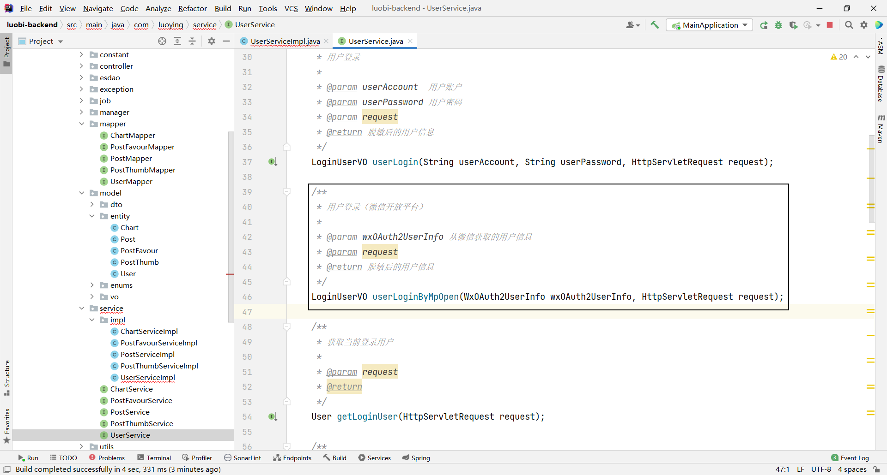

# LuoBI

## 项目介绍

**BI（商业智能）：**数据可视化，报表可视化系统

**主流BI：**

- 帆软BI https://www.finebi.com
- 小马BI https://bi.zhls.qq.com
- PowerBI https://powerbi.microsoft.com/zh-cn 

**传统BI：**

https://chartcube.alipay.com

1. 需要人工上传数据
2. 需要人工选择数据的行和列进行分析（数据分析师）
3. 需要人工选择图表类型（数据分析师）
4. 生成图表（保存配置）

**智能BI平台：**

1. 用户（数据分析者）只需要导入原始数据，输入想要分析的目标（比如”帮我分析以下网站的用户增长趋势“），就能利用AI自动生成一个符合要求的图表以及结论
2. 不会数据分析的用户，也能通过输入目标快速完成数据分析，大幅节约人力成本

## 需求分析

1. 智能分析：用户输入目标，原始数据和其他参数（如图表类型），可以自动生成图表和结论
2. 图表管理
3. 图表生成的异步化（消息队列 ）
4. 对接 AI 

## 架构图


## 技术选择

**前端：**

- React
- Ant Design Pro
- Umi
- ECharts 可视化开发库
- umi openapi 代码生成（自动生成后端调用代码）

**后端：**

- Spring Boot（万用 Java 后端项目模板）
- MySQL
- MyBatis Plus
- RabbitMQ
- AI 能力（Open AI 接口开发/ 使用现成的 AI 接口）
- EasyExcel（Excel 的上传和数据的解析）
- Swagger + Knife4j
- Hutool

## 计划

**初始化**

- 前端
- 后端

**后端**

- 数据库表设计
- 自动生成增删改查代码
- 图表管理
- 智能图表分析

**前端**

- 自动生成后端调用代码
- 修改requestErrorConfig

- 登录注册页面
- 智能图表分析页面
- 图表管理页面

## 初始化

### 前端

#### 初始化

https://pro.ant.design/

1. 创建项目

```sh
# 使用 npm，
npm i @ant-design/pro-cli -g
pro create luobi-frontend
```


2. 安装依赖

```
yarn
```


3. 去除国际化


[🐛 [BUG\] 执行删除国际化命令报错 · Issue #10452 · ant-design/ant-design-pro (github.com)](https://github.com/ant-design/ant-design-pro/issues/10452)


```sh
yarn add eslint-config-prettier --dev yarn add eslint-plugin-unicorn --dev 
```


再次执行去除国际化就能成功了


#### 结构介绍

- .husky：提交代码时，检查是否规范
- config
  - config.ts：核心配置文件
  - defaultSettings.ts：主页页面的排版和颜色等设置
  - openapi.json：只是示例数据，无用可删除
  - proxy.ts：代理
  - routes.ts：路由
- mock：模拟数据，无用可删除
- public
  - icons：图标logo，无用可删除
  - scripts：不知道
  - CNAME：不用管
  - favicon.ico：网站左上角小图标 https://www.iconfont.cn
  - logo.svg：替换成自己的logohttps://www.iconfont.cn
  - pro_icon.svg：无用删除
- src
  - .umi：带点的是隐藏文件，框架自动生成的，不用管
  - components：需要开发的组件
  - locales：国际化，无用可删除
  - pages：需要开发的页面
    - User
      - Login
        - __snapshots__：多余可删除
        - login.test.tsx：多余可删除
    - TableList：暂时未用到，删除
  - services
    - ant-design-pro：有很多框架自定义的函数和类型，不用删，可能会引起连锁效应
    - luobi：我们自己使用openapi生成的函数和类型
    - swagger：无用可删除
  - access.ts：控制页面访问
  - app.tsx：整个框架的入口文件
  - global.less：全局样式
  - global.tsx：全局的js文件，不要删改
  - manifest.json：开发app或H5网页时指定的配置：比如声明项目的名称，图标的尺寸，打包时用。可删
  - requestErrorConfig：前端发请求的一些配置，比如请求响应拦截器，请求前缀
  - service-workers.js：为了优化离线H5页面的体验
  - typings.d.ts：不知道，不能删
- tests：测试文件，无用可删除
- types：无用可删除
- .editorconfig、.eslintrc.js、.prettierrc.js：用来保证前端代码规范
- jest.config.ts：单元测试框架，不用UI测试可删除
- jsconfig.json：控制代码语法
- README.md：项目的介绍文档

#### 替换logo

**favicon.ico：**网站左上角小图标 https://www.iconfont.cn


png 转favicon https://www.gaituba.com/favicon


**logo.svg：**替换成自己的logohttps://www.iconfont.cn


#### prettier美化配置


#### 替换网站标题

全局替换 Ant Design Pro 和 Ant Design


#### 替换底部的版权信息

直接搜索底部关键字，去对应文件修改


### 后端

1. 使用后端项目模板

复制模板，修改目录名为项目名

2. 连接数据库

   

3. 修改数据库名


4. 修改项目名


5. 开启分布式session


6. 修改端口


7. 启动并访问接口文档


## 后端

### 数据库表设计

**用户表：**

```sql
create table if not exists user
(
    id           bigint auto_increment comment 'id' primary key,
    userAccount  varchar(256)                           not null comment '账号',
    userPassword varchar(512)                           not null comment '密码',
    userName     varchar(256)                           null comment '用户昵称',
    userAvatar   varchar(1024)                          null comment '用户头像',
    userProfile  varchar(512)                           null comment '用户简介',
    userRole     varchar(256) default 'user'            not null comment '用户角色：user/admin/ban',
    gender       tinyint                                null comment '性别',
    createTime   datetime     default CURRENT_TIMESTAMP not null comment '创建时间',
    updateTime   datetime     default CURRENT_TIMESTAMP not null on update CURRENT_TIMESTAMP comment '更新时间',
    isDelete     tinyint      default 0                 not null comment '是否删除',
    index idx_userAccount (userAccount)
) comment '用户' collate = utf8mb4_unicode_ci;
```

**图表信息表：**

```sql
-- 图表信息表
create table if not exists chart
(
    id         bigint auto_increment comment 'id' primary key,
    goal       text                               null comment '分析目标',
    rawData    text                               null comment '原始数据',
    chartType  varchar(128)                       null comment '图表类型',
    chartName  varchar(128)                       null comment '图表名称',
    genChart   text                               null comment 'AI生成的图表数据',
    genSummary text                               null comment 'AI生成的分析总结',
    userId     bigint                             null comment '创建人id',
    createTime datetime default CURRENT_TIMESTAMP not null comment '创建时间',
    updateTime datetime default CURRENT_TIMESTAMP not null on update CURRENT_TIMESTAMP comment '更新时间',
    isDelete   tinyint  default 0                 not null comment '是否删除'
) comment '图表信息' collate = utf8mb4_unicode_ci;
```

### 自动生成增删改查代码


1. 生成的UserService和UserServiceImpl不用替换原来的

2. 修改字段的注解

   

   

   

   

3. 删掉UserService和UserServiceImpl和UserController中用不到的方法

   

   

   

4. 删掉微信公众号开发包

   

5. 删掉WxMPController

   

### 图表管理

1. 复制PostController修改成ChartController

   

   

     

2. 创建关于Chart的DTO类

   

3. 剪裁ChartController并为ChartService提供getQueryWrapper方法

   ```java
   /**
    * @author 落樱的悔恨
    * @description 针对表【chart(图表信息表)】的数据库操作Service实现
    * @createDate 2023-10-31 14:16:29
    */
   @Service
   public class ChartServiceImpl extends ServiceImpl<ChartMapper, Chart>
           implements ChartService {
   
       /**
        * 获取查询包装类
        *
        * @param chartQueryRequest
        * @return
        */
       @Override
       public QueryWrapper<Chart> getQueryWrapper(ChartQueryRequest chartQueryRequest) {
           QueryWrapper<Chart> queryWrapper = new QueryWrapper<>();
           if (chartQueryRequest == null) {
               return queryWrapper;
           }
           Long id = chartQueryRequest.getId();
           Long userId = chartQueryRequest.getUserId();
           String goal = chartQueryRequest.getGoal();
           String chartType = chartQueryRequest.getChartType();
           String chartName = chartQueryRequest.getChartName();
           String sortField = chartQueryRequest.getSortField();
           String sortOrder = chartQueryRequest.getSortOrder();
           // 拼接查询条件
           queryWrapper.eq(id != null && id > 0, "id", id);
           queryWrapper.eq(ObjectUtils.isNotEmpty(userId), "userId", userId);
           queryWrapper.like(StringUtils.isNotBlank(goal), "goal", goal);
           queryWrapper.like(StringUtils.isNotBlank(chartType), "chartType", chartType);
           queryWrapper.like(StringUtils.isNotBlank(chartName), "chartName", chartName);
           queryWrapper.eq("isDelete", false);
           queryWrapper.orderBy(SqlUtils.validSortField(sortField), sortOrder.equals(CommonConstant.SORT_ORDER_ASC),
                   sortField);
           return queryWrapper;
       }
   }
   ```


### 智能图表分析

#### **AI调用的几种方式**

**1、直接调用 OpenAI 或者其他 AI 原始大模型官网的接口**

官方文档：https://platform.openai.com/docs/api-reference

优点：不经封装，最灵活，最原始

缺点：要钱

使用方式：

1）在请求头中指定OPENAI_API_KEY

```
Authorization: Bearer OPENAI_API_KEY
```

2）找到要使用的接口 https://platform.openai.com/docs/api-reference/chat/create

3）按照接口文档的示例，构造 HTTP 请求

```
curl https://api.openai.com/v1/chat/completions \
  -H "Content-Type: application/json" \
  -H "Authorization: Bearer $OPENAI_API_KEY" \
  -d '{
    "model": "gpt-3.5-turbo",
    "messages": [
      {
        "role": "system",
        "content": "You are a helpful assistant."
      },
      {
        "role": "user",
        "content": "Hello!"
      }
    ]
  }'

```

```java
import cn.hutool.http.HttpRequest;
import cn.hutool.json.JSONUtil;

import java.util.*;

public class OpenAIAPI {
    public static void main(String[] args) {
        String url = "https://api.openai.com/v1/chat/completions";

        LinkedHashMap<String,Object> map =new LinkedHashMap<>();
        List<LinkedHashMap<String,Object>> messageList =new ArrayList<>();

        LinkedHashMap<String,Object> messageMap =new LinkedHashMap<>();
        messageMap.put("role","system");
        messageMap.put("content","You are a helpful assistant.");

        messageList.add(messageMap);

        map.put("model","gpt-3.5-turbo");
        map.put("message",messageList);

        String requestBody = JSONUtil.toJsonStr(map);
        HttpRequest.post(url)
                .header("Authorization","Bearer OPENAI_API_KEY")
                .header("Content-Type","application/json")
                .body(requestBody)
                .execute()
                .body();
    }
}
```


**2、使用云服务商提供的，封装后的 AI 接口**

比如：Azure云

优点：本地能用

缺点：要钱

**3、利用鱼聪明 AI 提供的开放 SDK** https://github.com/liyupi/yucongming-java-sdk

优点：目前不要钱，有很多现成的模型

缺点：不够灵活

1）引入依赖

```xml
<dependency>
    <groupId>com.yucongming</groupId>
    <artifactId>yucongming-java-sdk</artifactId>
    <version>0.0.3</version>
</dependency>
```

2）修改配置

```yml
yuapi:
  client:
    access-key: c34re67to6v7yu2qf4nzawr8ultmy0a2
    secret-key: i6cnztxw6scfmrtykndjd5apitqcrejv
```

3）调用接口

```java
@Component
public class AIManager {
    @Resource
    private YuCongMingClient yuCongMingClient;

    /**
     *
     * @param modelId
     * @param message
     * @return
     */
    public String doChat(long modelId,String message){
        DevChatRequest devChatRequest = new DevChatRequest();
        devChatRequest.setModelId(modelId);
        devChatRequest.setMessage(message);
        BaseResponse<DevChatResponse> response = yuCongMingClient.doChat(devChatRequest);
        if (response==null){
            throw new BusinessException(ErrorCode.SYSTEM_ERROR,"AI响应错误");
        }
        return response.getData().getContent();
    }
}
```

#### 业务流程

1. 校验参数
2. 压缩原始数据：AI接口普遍都有输入字数限制，尽可能压缩数据，能够多传一些数据
3. 构造用户请求（分析目标，图表名称，图表类型，csv数据）
4. 调用鱼聪明SDK，得到响应（图表信息，结论文本）
5. 从AI响应结果中，取出需要的数据（图表信息：Echarts V5 的 options 配置对象js代码；结论文本）
6. 保存到数据库
7. 返回图表信息，结论文本，图表ID给前端

**模型预设**

```
你是一个数据分析师和前端开发专家，接下来我会按照以下固定格式给你提供内容：
分析需求：
{数据分析的需求或者目标}
原始数据：
{csv格式的原始数据，用,作为分隔符}
请根据这两部分内容，按照以下指定格式生成内容（此外不要输出任何多余的开头、结尾、注释）
【【【【【
{前端 Echarts V5 的 option 配置对象json代码，合理地将数据进行可视化，不要生成任何多余的内容，比如注释}
【【【【【
{明确的数据分析结论、越详细越好，不要生成多余的注释}
```


```java
@Data
public class GenChartRequest implements Serializable {

    /**
     * 分析目标
     */
    private String goal;

    /**
     * 图表类型
     */
    private String chartType;

    /**
     * 图表名称
     */
    private String chartName;

    private static final long serialVersionUID = 1L;
}
```

```java
/**
 * BI的返回结果
 */
@Data
public class BIResponse {
    private String genChart;

    private String genSummary;

    private Long chartId;
}
```

```java
@Slf4j
public class ExcelUtils {
    public static String excelToCsv(MultipartFile multipartFile) {
        /*File file = null;
        try {
            file = ResourceUtils.getFile("classpath:网站数据.xlsx");
        } catch (FileNotFoundException e) {
            e.printStackTrace();
        }*/
        // 1. 从文件读取出数据
        List<Map<Integer, String>> list = null;
        try {
            list = EasyExcel.read(multipartFile.getInputStream())
                    .excelType(ExcelTypeEnum.XLSX)
                    .sheet()
                    .headRowNumber(0)
                    .doReadSync();
        } catch (IOException e) {
            log.error("表格处理错误",e);
        }
        if (CollectionUtil.isEmpty(list)) {
            return "";
        }
        // 2. 转换为csv
        StringBuilder stringBuilder = new StringBuilder();
        // 2.1 读取表头
        LinkedHashMap<Integer, String> headerMap = (LinkedHashMap) list.get(0);
        List<String> headerList =headerMap.values().stream().filter(ObjectUtils::isNotEmpty).collect(Collectors.toList());
        stringBuilder.append(StringUtils.join(headerList, ",")).append("\n");
        // 2.1 读取数据行
        for (int i = 1; i < list.size(); i++) {
            LinkedHashMap<Integer, String> dataMap = (LinkedHashMap) list.get(i);
            List<String> dataList = dataMap.values().stream().filter(ObjectUtils::isNotEmpty).collect(Collectors.toList());
            stringBuilder.append(StringUtils.join(dataList, ",")).append("\n");
        }
        return stringBuilder.toString();
    }
}
```

```java
/**
 * 智能分析
 *
 * @param multipartFile
 * @param genChartRequest
 * @param request
 * @return
 */
@PostMapping("/gen")
public BaseResponse<BIResponse> genChartByAI(@RequestPart("file") MultipartFile multipartFile,
                                             GenChartRequest genChartRequest, HttpServletRequest request) {
    String goal = genChartRequest.getGoal();
    String chartType = genChartRequest.getChartType();
    String chartName = genChartRequest.getChartName();
    // 拼接分析目标
    if (StringUtils.isNotBlank(chartType)) {
        goal = goal + "，请使用" + chartType;
    }
    // 校验参数
    ThrowUtils.throwIf(StringUtils.isBlank(goal), ErrorCode.PARAMS_ERROR, "分析目标为空");
    ThrowUtils.throwIf(StringUtils.isNotBlank(chartName) && chartName.length() > 128, ErrorCode.PARAMS_ERROR, "图表名称过长");
    // 获取登录用户
    User loginUser = userService.getLoginUser(request);
    // 压缩原始数据
    String data = ExcelUtils.excelToCsv(multipartFile);
    // 构造用户请求（分析目标，图表名称，图表类型，csv数据）
    StringBuilder userInput = new StringBuilder();
    userInput.append("分析需求：").append("\n");
    userInput.append(goal).append("\n");
    userInput.append("原始数据：").append("\n");
    userInput.append(data).append("\n");
    // 调用鱼聪明SDK，得到响应
    long biModelId = 1719916921023344642L;
    String answer = aiManager.doChat(biModelId, userInput.toString());
    // 从AI响应结果中，取出需要的数据
    String[] splits = answer.split("【【【【【");
    if (splits.length < 3) {
        throw new BusinessException(ErrorCode.SYSTEM_ERROR, "AI生成错误");
    }
    String genChart = splits[1].trim();
    String genSummary = splits[2].trim();
    // 插入数据库
    Chart chart = new Chart();
    chart.setGoal(goal);
    chart.setRawData(data);
    chart.setChartType(chartType);
    chart.setChartName(chartName);
    chart.setGenChart(genChart);
    chart.setGenSummary(genSummary);
    chart.setUserId(loginUser.getId());
    boolean save = chartService.save(chart);
    ThrowUtils.throwIf(!save, ErrorCode.SYSTEM_ERROR, "图表保存失败");
    // 返回给前端
    BIResponse biResponse = new BIResponse();
    biResponse.setGenChart(genChart);
    biResponse.setGenSummary(genSummary);
    biResponse.setChartId(chart.getId());
    return ResultUtils.success(biResponse);
}
```


## 前端

### 自动生成后端调用代码


### 修改requestErrorConfig


### 登录注册页面

#### 登录页面

1. **修改页面**


2. **向后端发起登录请求**


[在ant-design中如何利用代码自动刷新当前页面_antd pro中页面刷新的api-CSDN博客](https://blog.csdn.net/qq_40372395/article/details/80893453)


3. **修改app.tsx文件**


#### 注册页面

复制登陆页面修改，再添加注册页面的路由


#### 退出登录


### 智能图表分析页面

1. 用户输入
   1. 分析目标
   2. 上传原始数据（excel）
   3. 更精细化的控制图表：比如图表类型，图表名称等
2. 展示
   1. 展示从后端获得的图表和结论

**1、自动生成后端调用代码**

**2、创建页面**


**3、添加路由**


**4、用户输入**

1. 选择组件


2. 引入组件


**4、图表展示** https://github.com/hustcc/echarts-for-react  https://git.hust.cc/echarts-for-react/


### 个人图表页面

**1.创建页面**


**2、添加路由**


**3、获取数据，定义 state 变量来存储数据，用于给页面展示**


**4、选择组件**


**5、引入组件**


**6、添加分页**


**7、添加搜索框**


**8、设置loading**


**9、原子化样式**


**10、展示**


**11、扩展点**

支持用户查看原始数据

支持跳转到i图表编辑页，去编辑图表

## Ant Design Pro踩坑

1. 页面如果一直加载，删掉no de_modules，重新安装依赖

2. nodejs版本建议16

3. 权限不够就切管理员

4. 提交代码

   ```
   git commit --no-verify -m 'your message'
   ```


## Windows命令

```sh
#查看Windows Hyper-V 虚拟化平台占用了哪些范围内的端口
netsh interface ipv4 show excludedportrange protocol=tcp
```


